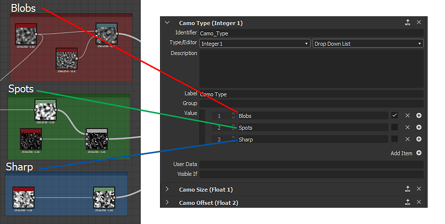

# Etiqueta de criação de gráfico

Criar gráficos grandes e complexos pode rapidamente se tornar confuso e difícil de navegar. Uma série de ferramentas podem ser usadas para aliviar esses problemas, e há alguns bons hábitos para entrar em ação, para evitar problemas mais tarde. Esta página fornece uma lista conclusiva de técnicas que recomendamos usar para gráficos limpos, eficientes e funcionais que são facilmente compartilhados e compreendidos.

## Geral

### Organização de gráfico

#### Itens gráficos

Itens de gráfico são objetos auxiliares que podem ser colocados ao lado e ao redor dos nós na [Exibição de Gráfico](../../interface/the-graph-view/the-graph-view.md). Dos três, o Quadro oferece os maiores e mais rápidos benefícios, enquanto o Fixar de comentário e navegação é mais adequado para cenários específicos.

#### Quadros

A primeira coisa que leva a gráficos mais limpos, mais fáceis de ler, é o posicionamento de Quadros em torno dos grupos principais do seu gráfico. Sem Quadros, um gráfico grande é quase ilegível e mesmo os gráficos pequenos se tornam muito mais fáceis de entender depois que os quadros são desenhados. Uma grande vantagem dos Quadros é que seus nomes <b> são sempre renderizados na mesma escala </b>, mesmo se você reduzir muito.

Quadros facilitam muito a compreensão do que se passa em um gráfico. Eles podem ajudá-lo, como autor, voltando ao seu trabalho meses depois ou outro usuário, como um colega, a encontrar o caminho ao redor de um gráfico ao qual não estão acostumados.

Use os seguintes critérios ao colocar Quadros:

* Identifique **partes de funcionalidade** (por exemplo, 8 nós que, juntos, criam um efeito de dirt) e agrupe-os usando Quadros.
* Sempre tente **usar cores diferentes** para seus Quadros: Quadros com o mesmo azul, a cor padrão não se destacam muito uns dos outros.
* Use **nomes claros e descritivos** que não sejam muito longos (veja a seção abaixo para obter mais dicas)
* Não coloque **muito ou muito pouco** em um Quadro, pois isso não ajuda na legibilidade. A quantidade exata obviamente difere entre os gráficos e a funcionalidade.
* Se necessário, **adicione texto à descrição** para ajudar a entender o que acontece em um quadro.

#### Comentários e Fixares

Comentários e fixares são apenas secundários aos Quadros e não são uma necessidade absoluta para gráficos bem-criados. Eles podem ser usados nos seguintes cenários:

* Os comentários são bons para adicionar texto além do que a descrição de uma Quadro permite. Você pode adicionar pequenos pedaços de texto por nó, principalmente para pequenas informações detalhadas. Os comentários não são bem dimensionados e não leem de um nível de zoom distante.
* Os Fixares de navegação permitem percorrer áreas específicas do gráfico usando o atalho F2. Isso pode ser útil para gráficos muito grandes nos quais é necessário saltar entre duas áreas que estão muito distantes uma da outra.

### Posicionamento de entrada e saída

As entradas e saídas devem ser colocadas nas extremidades dos gráficos: todas as saídas à direita, todas as entradas à esquerda, cada uma alinhada verticalmente. Isso facilita a localização e a identificação deles.

O exemplo acima é um caso extremo: Quadros nem sempre são necessários ou possíveis, mas deve ficar claro que o alinhamento vertical de Entradas e Saídas é muito mais claro do que o posicionamento aleatório embaralhado.

### Redirecionamento de link

Em gráficos grandes e muito longos, às vezes os vínculos são criados em uma extensão muito grande. Isso leva a fios confusos de Link atravessando o gráfico sem muito controle. O atalho “Alt + Shift arrastar” permite reorganizar esses links, redirecionando-os em um caminho diferente, subdividindo um link e adicionando uma alça extra no meio. Recomenda-se fazer uso disso em cenários onde faz sentido.

### Rótulo, identificador e uso

Qualquer gráfico destinado a compartilhamento ou publicação deve ter o cuidado adequado de inserir nos metadados adicionais que melhorem a facilidade de uso. Os seguintes pontos são importantes:

Os rótulos sugeridos padrão nunca são suficientes. Reserve um tempo e esforço para adicionar rótulos personalizados aos parâmetros expostos e suas entradas e saídas.

Tente não ter o identificador e o Rótulo diferentes demais: caso o Identificador seja usado em outro lugar (em várias Funções), pode ser muito difícil encontrar qual propriedade da interface do usuário está relacionada a qual variável.

Tente combinar seus Rótulos com os termos que você usa em Quadros (Rótulos de Quadro) e comentários. Isso facilita a localização de qual seção do gráfico está vinculada ao parâmetro exposto

### Configurações de parâmetro

Ao expor Parâmetros, mais do que apenas o Rótulo e o Identificador são importantes, os seguintes pontos devem ser considerados:

* Escolha o tipo de Editor correto. Um controle deslizante nem sempre faz sentido: um elemento de interface Ângulo ou Suspenso também são possibilidades.
* Defina valores mínimos e máximos apropriados e decida se é recomendável cortá-los.
* Escolha um valor padrão que faça sentido: padrões que retornam inúteis, os resultados de casos extremos devem ser evitados.
* Considere remapear o intervalo por meio de uma [Função](../../function-graphs/function-graphs.md)se necessário: um controle deslizante de 0,125 a 0,357 não faz sentido, você pode remapear isso facilmente com uma Interpolação linear e fazer com que o elemento da interface utilize um intervalo de 0 a 1.

## Gráficos do Substance

### Gerenciamento de cores e tons de cinza

É necessário muito cuidado ao usar dados coloridos e em Tons de Cinza, pois misturar os dois tipos não é fácil de fazer imediatamente. Devem ter-se em conta os seguintes pontos:

* Os gráficos nunca devem conter links vermelhos (erro) pontilhados.
* Não deve haver conversões desnecessárias entre cor e escala de cinza e vice-versa. Em alguns casos, o “nó de conversão de cor/escala de cinza inserido automaticamente” nas Preferências de gráfico pode levar a cadeias longas e inúteis de nós de conversão Encaixados.
* O ideal é que os dados sejam mantidos em tons de cinza o máximo possível e sejam convertidos somente quando absolutamente necessários. Isso reduz a complexidade e economiza em desempenho.
* As Entradas e Saídas devem ser criadas ou configuradas com o tipo correto em mente: por exemplo, não faz sentido ter uma entrada “máscara” definida para cor se ela for convertida em tons de cinza para uso como uma máscara binária.

### Controle de resolução

Controlar a resolução de um [gráfico de Substance](../../compositing-graphs/substance-compositing-graphs.md) pode ser confuso, portanto, é necessário cuidado adequado para fazer isso corretamente. Erros podem levar a impactos graves no desempenho ou a resultados inutilizáveis de baixa qualidade.

[Para entender totalmente esse tópico, saiba os tamanhos de saída absolutos e relativos.](../../compositing-graphs/output-size/output-size.md)

* Um gráfico deve ser definido para a resolução “Em relação ao pai” em quase todos os casos, a menos que haja uma exceção muito específica onde não seja necessário (muito raro).
* Geralmente, os nós não devem ter configurações de substituição para o Tamanho de saída. Na maioria dos casos, a resolução é melhor controlada por meio das propriedades Pai ou Gráfico.
* Para bitmaps, é necessário definir um cuidado especial para que o padrão, Tamanho de saída absoluto, não se espalhe por todo o gráfico. Ele deve ser substituído por Em relação ao pai. Esta é uma das poucas exceções à regra acima.
