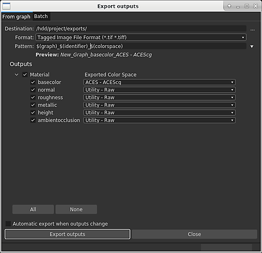

# Gerenciamento de cores

Esta página explica os recursos e as configurações de Gerenciamento de cores no Substance 3D Designer.

O Substance 3D Designer pode ser configurado para usar o [OpenColorIO](https://opencolorio.org/) (OCIO) ou o Adobe Color Engine (ACE) para o gerenciamento de cores. Isso permite que você tenha transformações de cores *consistentes* e exibição de imagens em vários aplicativos.

Nesse modo, o Designer funcionará internamente com **RGB linear** cores. Como a profundidade de bits de 8 não é normalmente suficiente para representar cores lineares, é recomendável usar a profundidade de *pelo menos* **16 bits** para texturas de cores no [gráfico](../compositing-graphs/substance-compositing-graphs.md).

>[!WARNING]
>
> Um fluxo de trabalho eficaz de Gerenciamento de cores depende do trabalho com uma exibição *calibrada* corretamente. Existem soluções de terceiros para calibrar corretamente o monitor para o seu ambiente de trabalho usando hardware especializado.
> 
> Os usuários do OpenColorIO devem usar espaços de cores correspondentes do OpenColorIO em seus monitores.\
> Os usuários do Adobe ACE devem verificar se os perfis ICC selecionados *no sistema operacional* correspondem a *seus* monitores.

## Configuração

As configurações de Gerenciamento de Cores podem ser definidas na guia [Projetos](../interface/preferences-window/project-settings/project-settings.md) da caixa de diálogo [Preferências](../interface/preferences-window/preferences-window.md). Você pode definir as seguintes configurações:

### Modo de gerenciamento de cores

|  |  |
| --- | --- |
| <b>Gerenciamento de cores</b> | Esta configuração permite selecionar os modos [Legado](../color-management/color-management.md), [OpenColorIO](#opencolorio) ou [Adobe ACE](#adobe-ace) para o Gerenciamento de Cores no Substance 3D Designer. *Padrão: herdado* |

## OpenColorIO

### Configuração do OpenColorIO

Ao usar o modo OpenColorIO para o Gerenciamento de Cores, o Designer usará as informações armazenadas em um <b>arquivo de configuração</b> (*\*.config*) para executar transformações de cores, identificar espaços de cores e definir padrões.

O Substance 3D Designer é fornecido com as seguintes configurações:

* Substance: uma configuração simples que inclui espaços de cores comuns
* [ACES 1.0.3](https://github.com/hpd/OpenColorIO-Configs/tree/master/aces_1.0.3): a configuração completa do [Academy Color Encoding System](https://www.oscars.org/science-technology/sci-tech-projects/aces) (ACES), um padrão do setor para fluxos de trabalho de gerenciamento de cores

Você pode encontrar esses arquivos de configuração na pasta <b>resources > ocio</b> dos arquivos de instalação do Designer.

|  |  |
| --- | --- |
| <b>Configuração do OpenColorIO</b> | Essa configuração permite selecionar o arquivo de configuração do OpenColorIO a ser usado no Designer. Como alternativa, você pode definir o arquivo de configuração do OpenColorIO usando a variável de ambiente OCIO.  Quando existir, o arquivo de configuração será *bloqueado* no Designer. Ainda é possível alterar os espaços de cores padrão e exibir transformações (consulte as configurações abaixo).  **Alerta:** depois de adicionar a variável de ambiente, recomendamos fechar o Designer, *sair* da sessão de usuário no sistema operacional e entrar novamente. Isso garante que a variável de ambiente esteja em vigor ao iniciar o Designer. Você também pode usar a linha de comando para criar uma variável de ambiente temporária e iniciar o Designer no ambiente de linha de comando *igual*.  *Padrão: Substance* |
| **Arquivo de Configuração Personalizado** | Se a opção **Personalizado** estiver definida na **Configuração do OpenColorIO**, você poderá selecionar o *arquivo \*.config específico *a ser usado como um arquivo de configuração neste campo.* Padrão: definido pelo arquivo de configuração do OpenColorIO ou pela variável de ambiente OCIO* |

### Padrões de espaço da cor do bitmap

|  |  |
| --- | --- |
| <b>Imagens de 8 bits</b> | Define o espaço da cor padrão para bitmaps de 8 bits. *Padrão: definido pelo arquivo de configuração do OpenColorIO* |
| <b>Imagens de 16 bits</b> | Define o espaço da cor padrão para bitmaps de 16 bits. *Padrão: definido pelo arquivo de configuração do OpenColorIO* |
| <b>Imagens de ponto flutuante</b> | Define o espaço de cor padrão para bitmaps de precisão de ponto flutuante, como imagens *HDR* nos formatos *\*.exr *ou*\*.hdr*. *Padrão: definido pelo arquivo de configuração do OpenColorIO* |
| <b>Usar nome de arquivo para detectar espaço de cores</b> | Permite que o Designer atribua um espaço de cores automaticamente se o *sufixo* de um nome de arquivo bitmap *corresponder exatamente* ao nome em minúsculas de um espaço de cores incluído na *configuração* atual do OpenColorIO. Exemplo: um recurso de bitmap *mybitmap\_aces\_acescg.png* seria definido automaticamente para o espaço de cores *ACE - ACEScg* e o transformo apropriado seria aplicado ao espaço de cores de trabalho. *Padrão: Verificado* |

### Padrão de exibição em 2D e Visualização 3D

|  |  |
| --- | --- |
| <b>Padrão de exibição de 2D e 3D</b> | Define o espaço de cores *exibição* padrão para as portas de exibição [Visualização 2D](../interface/2d-view/2d-view.md) e [3D](../interface/3d-view/3d-view.md). *Padrão: definido pelo arquivo de configuração de E/S do OpenColor* |
| <b>Miniaturas de gerenciamento de cores</b> | Permite que o Designer transforme automaticamente as *miniaturas* do nó para o espaço de cores *de trabalho* no gráfico. *Padrão: Verificado* |

## Adobe ACE

### Configurações de cores

Ao usar o modo Adobe ACE para Gerenciamento de Cores, o Substance 3D Designer usará as informações armazenadas nos <b>Perfis ICC</b> (*\*.icc / \*.icm*) para executar transformas de cores e identificar espaços de cores.

O Designer é fornecido com vários perfis ICC. Você pode encontrar os arquivos desses perfis na pasta `resources > icc` dos arquivos de instalação da Designer.\
Você pode adicionar *seus próprios* perfis ICC colocando esses arquivos no local `Adobe/Adobe Substance 3D Designer/icc` da pasta *Documentos* do usuário atual do sistema.

|  |  |
| --- | --- |
| <b>Espaço de trabalho</b> | Esta configuração permite selecionar o espaço de cores de trabalho para *executar operações de cores* no Substance 3D Designer. *Padrão: sRGB IEC61966-2.1* |
| <b>Método de renderização</b> | Esta opção permite controlar como as cores devem ser transformadas quando estiverem *fora do gamut* do espaço de cores *de trabalho*. *Padrão: Colorimétrico Relativo* |

### Padrões de espaço da cor do bitmap

|  |  |
| --- | --- |
| <b>Imagens de 8 bits</b> | Define o perfil ICC padrão a ser usado para bitmaps de 8 bits. *Padrão:* sRGB IEC61966-2.1 ** |
| <b>Imagens de 16 bits</b> | Define o perfil ICC padrão para usar bitmaps de 16 bits. **Padrão: *sRGB IEC61966-2.1*** |
| <b>Imagens de ponto flutuante</b> | Define o perfil ICC padrão a ser usado para bitmaps de precisão de ponto flutuante, como imagens *HDR* nos formatos *\*.exr *ou*\*.hdr*. *Padrão: raw (isto é, nenhum perfil aplicado)* |
| <b>Usar perfis ICC incorporados quando disponíveis</b> | Permite que o Designer use o perfil ICC incorporado em um bitmap em vez dos padrões listados acima. *Padrão: Verificado* |

### Espaço padrão de exibição em 2D e 3D

|  |  |
| --- | --- |
| <b>Padrão de exibição de 2D e 3D</b> | Define o espaço de cores *exibição* padrão para as portas de exibição [Visualização 2D](../interface/2d-view/2d-view.md) e [3D](../interface/3d-view/3d-view.md). *Padrão:*** Perfil ICC para a tela principal, recuperado do sistema operacional **** |

### Exibição do gráfico

|  |  |
| --- | --- |
| <b>Miniaturas de gerenciamento de cores</b> | Quando *marcado*, o Designer transformará as *miniaturas de nó* no *espaço de cores de trabalho* atual. *Padrão:*** Desmarcado **** |

## Modo herdado

Ao usar o modo <b>Herdado</b>, o Gerenciamento de Cores está *desabilitado* no Designer-

Nesse modo, os gráficos e as imagens se comportam exatamente da mesma maneira que nas versões anteriores. Isso significa que seu fluxo de trabalho de versões anteriores será *totalmente inalterado* se esta configuração for deixada *intacta*. Há, no entanto, algumas adições úteis:

Você pode optar por usar o <b>ACES sRGB</b> *mapeamento de tons* na <b>Exibição 3D</b> para corresponder à saída de outro software, como o *[Mecanismo Irreal](https://docs.unrealengine.com/en-US/Engine/Rendering/PostProcessEffects/ColorGrading/index.html)*.

Você pode definir um espaço de cores para *bitmaps exportados*, conforme descrito na seção [Exportando saídas](#exporting-outputs) desta página. Os espaços de cores disponíveis são os seguintes:

* sRGB
* Linear
* Raw

No modo herdado, o Designer usa o <b>espaço de cores de trabalho do RGB</b>, que pode ser reproduzido pela maioria dos monitores.

Considerando a opção &#39;Raw&#39; grava os dados da imagem *como estão* do gráfico, isto é, usando o espaço de cores de trabalho do gráfico - isso significa que as opções <b>Raw</b> e <b>sRGB</b> resultam na *mesma saída de cor*.

Por padrão, a opção &#39;sRGB&#39; será definida para saídas que contenham *informações de cores* (por exemplo, Cor Base, Emissiva), e a opção &#39;Raw&#39; será definida para saídas que contenham *dados puros* (por exemplo, Aspereza, Metálico, Height, Normal). Como explicado acima, esses padrões resultam efetivamente nas mesmas cores, e são definidos apenas para *diferenciar o uso final* de suas saídas.

A opção <b>Linear</b> é a *única* que resulta na aplicação de uma *transformação de cor* à imagem e só pode ser usada para imagens <b>Intervalo dinâmico</b> (HDR), que geralmente usam a *precisão de ponto flutuante* (por exemplo, profundidade de bits 16F ou 32F) em espaço de cores linear. Isso permite que essas imagens sejam usadas em uma ampla variedade de espaços de cores e ambientes de produção.

>[!NOTE]
>
> Para obter mais informações sobre exportações de imagens, consulte a página [Exportando bitmaps](../compositing-graphs/exporting-bitmaps/exporting-bitmaps.md) da documentação.

## Importação de bitmaps

Você pode atribuir um <b>espaço de cores</b> (OCIO) ou um <b>perfil ICC</b> (Adobe ACE) a bitmaps importados e vinculados.

Ao importar ou vincular bitmaps, um espaço de cores ou perfil ICC será definido *por padrão* como o recurso de bitmap usando as opções definidas na seção <b>Padrão de espaço de cores de bitmap</b> da guia <b>Gerenciamento de cores</b> nas [Configurações do projeto](../interface/preferences-window/project-settings/project-settings.md).

Você pode alterar o espaço de cores de um bitmap a qualquer momento. A opção está localizada nas <b>Propriedades</b> do recurso de bitmap.

>[!NOTE]
>
> **Somente OpenColorIO**
> 
> Em particular, o **nome do arquivo** pode ser usado para definir o espaço de cores apropriado *automaticamente*. Observe que o nome do espaço de cores no nome do arquivo deve *corresponder ao nome* no arquivo de configuração do OpenColorIO (por exemplo, *myImage\_utility - linear -srgb.png* será definido para o espaço de cores *Utility - Linear - sRGB*).

## Exportando saídas

Ao usar a caixa de diálogo <b>Exportar saídas</b>, é possível atribuir um <b>espaço de cores</b> (OCIO) ou anexar um <b>perfil ICC</b> (Adobe ACE) para a saída *cada*.\
O Designer *converterá* imagens nos espaços de cores especificados antes de salvar os arquivos de imagem.

{width="512px"}

Você também pode atribuir um espaço de cores (OCIO) ou anexar um perfil ICC (Adobe ACE) a imagens *salvas* da [exibição 2D](../interface/2d-view/2d-view.md).

## Visualizações 2D e 3D

### Exibir barra de ferramentas

Você pode *ativar/desativar o Gerenciamento de cores* e alterar a *transformação de exibição* para o modo de exibição a qualquer momento usando o menu suspenso na barra de ferramentas de exibição.

{width="512px"}

### Ambientes HDRI da biblioteca

Os ambientes HDRI fornecidos com o Designer estão no espaço de cores <b>sRGB</b> linear.\
Ao usar uma configuração OpenColorIO em que o espaço de cores linear da cena é *não* sRGB linear, como a configuração [ACES](https://acescentral.com/t/getting-started-with-aces/1372), o ambiente exibirá *cores incorretas*.

Nesse caso, o espaço de cores para ambientes HDRI da biblioteca deve ser definido *manualmente* nas propriedades do ambiente, disponíveis no menu <b>Ambiente</b> do painel Exibição 3D.

{width="512px"}

## Nós de conversão de cores

A [Biblioteca](../interface/the-library/the-library.md) inclui os seguintes nós para executar <b>conversões</b> de e para o espaço de cores ACEScg:

<table>
<tr style="border: 0;">
<td style="border: 0;" valign="top">

[Grafo do Substance](../compositing-graphs/substance-compositing-graphs.md)

* ACEScg para sRGB Linear
* sRGB linear para ACEScg
* ACEScg para sRGB
* sRGB para ACEScg

</td>
<td style="border: 0;" valign="top">

[Grafo de função do Substance](../function-graphs/function-graphs.md)

* ACEScg para sRGB Linear
* sRGB linear para ACEScg

</td>
</tr>
</table>

Eles são úteis ao trabalhar com gráficos criados *sem* o Gerenciamento de cores ou materiais da biblioteca [Ativos do Substance 3D](https://substance3d.adobe.com/assets).

{width="512px"}

## Limitações conhecidas

A implementação atual do gerenciamento de cores no Substance 3D Designer tem as seguintes limitações:

* O gerenciamento de cores está atualmente *não* exposto na [API Python](../scripting/scripting.md);
* [OpenColorIO](https://opencolorio.org/) *looks* *não* são suportados.
