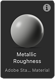

# Criação de um gráfico do Substance

A criação de texturas no Designer começa com a criação de um gráfico de Substance, a partir de um modelo pré-criado ou de um gráfico vazio.

## Criar um gráfico

Para iniciar o processo de criação de um novo gráfico de [Substance](../../compositing-graphs/substance-compositing-graphs.md), você pode usar um destes métodos:

* &#x200B;
  <table>
  <tr style="border: 0;">
  <td style="border: 0;" valign="top">

  Na tela inicial, clique no botão <b>Novo gráfico</b>.

  </td>
  <td style="border: 0;" valign="top">

  {zoomable="yes"}

  </td>
  </tr>
  </table>

* &#x200B;
  <table>
  <tr style="border: 0;">
  <td style="border: 0;" valign="top">

  Em qualquer item de pacote *existente* no [Explorer](../../interface/the-explorer-window/the-explorer-window.md), clique em <b>RMB</b> e vá para <b>Novo > Substance</b> no menu contextual.

  </td>
  <td style="border: 0;" valign="top">

  {zoomable="yes"}

  </td>
  </tr>
  </table>

* &#x200B;
  <table>
  <tr style="border: 0;">
  <td style="border: 0;" valign="top">

  Na barra de ferramentas principal, clique no botão  <b>Novo Substance</b>.

  </td>
  <td style="border: 0;" valign="top">

  {zoomable="yes"}

  </td>
  </tr>
  </table>

* &#x200B;
  <table>
  <tr style="border: 0;">
  <td style="border: 0;" valign="top">

  No menu principal, vá para <b>Arquivo > Novo > gráfico de Substance...</b>

  </td>
  <td style="border: 0;" valign="top">

  

  </td>
  </tr>
  </table>

* Pressione a tecla <b>Ctrl+N</b> (Windows) / <b>Cmd+N</b> (macOS).

Não importa o método escolhido, você verá a caixa de diálogo <b>Novo gráfico de Substance</b>.

## Modelos de gráfico

Independentemente do método usado para criar um novo gráfico de Substance, você sempre verá a caixa de diálogo <b>Novo gráfico de Substance</b>, que permite configurar o novo gráfico.

{zoomable="yes"}

### Modelos

O Designer inclui modelos de gráficos com nós pré-configurados para agilizar o seu trabalho. Eles podem incluir nós de [Saída](../../compositing-graphs/nodes-reference-for-com/atomic-nodes/output/output.md), nós simples para passar valores para essas saídas, como [Cores uniformes](../../compositing-graphs/nodes-reference-for-com/atomic-nodes/uniform-color/uniform-color.md), bem como nós de [Entrada](../../compositing-graphs/nodes-reference-for-com/atomic-nodes/input/input.md).

Clique duas vezes em um modelo na lista ou selecione-o e clique no botão <b>Criar</b> para criar um novo gráfico de Substance usando esse modelo. Por padrão, o novo gráfico é colocado em um novo pacote não salvo.

>[!TIP]
>
> Começar do zero
> 
> Para começar com um gráfico totalmente em branco, selecione o modelo <b>Vazio</b> na categoria &#39;Vazio&#39;.

>[!NOTE]
>
> Alternando modelos
> 
> Se você selecionar o modelo errado, *não poderá* alternar para um modelo diferente após criar o gráfico.
> 
> Para migrar o gráfico existente para outro modelo, você pode criar um novo gráfico usando o modelo apropriado e copiar e colar o gráfico para o novo modelo. Reconecte os nós conforme apropriado, nós de saída em particular.

<table>
<tr style="border: 0;">
<td width="100.00%" style="border: 0;" valign="top">

Cada modelo é listado por seu rótulo e subtítulo.

O subtítulo fornece mais contexto sobre o *caso de uso* do modelo: o modelo de material no qual ele se baseia, o software com o qual ele deve se integrar etc.

No modo <b>Miniaturas</b>, o subtítulo é colocado sob o rótulo em um texto menor e mais escuro.

Nos modos de exibição <b>Lista</b>, <b>Pacotes</b> e <b>Diretórios</b>, o subtítulo é anexado ao rótulo assim: *Rótulo - Subtítulo*.

</td>
<td width="25.00%" style="border: 0;" valign="top">

</td>
</tr>
</table>

### Amostras de materiais

A categoria <b>Amostras de materiais</b> inclui uma [seleção selecionada de gráficos](../../compositing-graphs/creating-compositing-gra/material-samples/material-samples.md) para aprender e experimentar.

Você também pode acessar as amostras diretamente na tela inicial, usando o botão <b>Ir para amostras</b>.

Todas as amostras são baseadas no [modelo de material de OpenPBR](../../interface/3d-view/material-properties/material-properties.md#openpbr).

{zoomable="yes"}

<table>
<tr style="border: 0;">
<td style="border: 0;" valign="top">

### Dica de ferramenta de informações

Passar o mouse sobre o ícone de informações para cada item de modelo exibe uma dica de ferramenta com informações adicionais sobre o modelo:

<b>Tipo:</b> o tipo de ativo que o modelo deve produzir. Isto é editável nas [propriedades do gráfico](../../compositing-graphs/graph-parameters/graph-parameters.md).

<b>Descrição:</b> detalhes sobre o modelo, como o fluxo de trabalho no qual ele se integra, seu caso de uso pretendido e recomendações para seu uso.

<b>Saídas:</b> Os nós de [Saída](../../compositing-graphs/nodes-reference-for-com/atomic-nodes/output/output.md) do modelo, se houver.

</td>
<td style="border: 0;" valign="top">

{zoomable="yes"}

</td>
</tr>
</table>

<table>
<tr style="border: 0;">
<td width="100.00%" style="border: 0;" valign="top">

### Modos de visualização

A lista de modelos pode ser exibida em modos diferentes usando o botão <b>Modos de exibição</b>.

A filtragem executada pela categoria selecionada e pelo arquivo de projeto é aplicada em todas as exibições.

</td>
<td width="33.33%" style="border: 0;" valign="top">

{zoomable="yes"}

</td>
</tr>
</table>

+++Modos de visualização
{zoomable="yes"}

<b>Miniaturas</b>

Cartões com miniaturas que fornecem uma visualização ou um ícone do tipo de modelo.

{zoomable="yes"}

<b>Lista</b>

Os modelos são listados somente por seu rótulo.

{zoomable="yes"}

<b>Pacotes</b>

Os modelos são listados por seu rótulo como filhos do arquivo de pacote ao qual pertencem.

Passe o mouse sobre um item de arquivo de pacote para exibir uma dica de ferramenta com seu caminho completo.

{zoomable="yes"}

<b>Diretórios</b>

Os modelos são listados por seu rótulo como filhos do diretório que hospeda o arquivo de pacote ao qual pertencem.

Passe o mouse sobre um item de diretório para exibir uma dica de ferramenta com seu caminho completo.

+++

### Propriedades

Depois de selecionar o modelo, você pode configurar informações básicas sobre o novo gráfico. Ele pode ser alterado a qualquer momento após a criação do gráfico.

<b>Nome do gráfico</b>: o identificador do gráfico. Ele precisa ser exclusivo para um determinado pacote e não pode incluir espaços nem alguns caracteres especiais.

<b>Tamanho</b>: a resolução pai do gráfico, que controlará a resolução de saída da maioria dos nós - consulte a página [Tamanho de saída](../../compositing-graphs/output-size/output-size.md) para saber mais. Por padrão, a largura e a height são vinculadas entre si. Para desvinculá-las, clique no botão de vínculo entre as caixas de combinação Largura e height.

<b>Criar gráfico em</b>: você pode usar esta caixa de combinação para criar um *novo* pacote para o novo gráfico ou adicionar o novo gráfico a qualquer pacote *existente* já carregado no painel [Explorer](../../interface/the-explorer-window/the-explorer-window.md).

### Dica de ferramenta da Ajuda

Passe o mouse sobre o ícone de ponto de interrogação para exibir uma dica de ferramenta com um botão que vincula diretamente a esta página, para que você possa consultar esta documentação novamente conforme necessário.

{zoomable="yes"}

## Gerenciar modelos

<table>
<tr style="border: 0;">
<td width="100.00%" style="border: 0;" valign="top">

### Filtrar por categoria

As categorias são usadas para agrupar modelos relacionados entre si por caso de uso ou tipo de ativo.

Use a caixa de combinação <b>Categoria</b> para selecionar a categoria pela qual deseja filtrar os modelos.

</td>
<td width="41.67%" style="border: 0;" valign="top">

{zoomable="yes"}

</td>
</tr>
</table>

<table>
<tr style="border: 0;">
<td width="100.00%" style="border: 0;" valign="top">

Os modelos podem ter uma categoria configurada em seus <b>Dados de modelo</b> [atributo de gráfico](../../compositing-graphs/graph-parameters/graph-parameters.md), que é usado como filtro para restringir a lista de modelos:

&lt;category>;&lt;subtitle>

Categorias personalizadas podem ser configuradas nos modelos fornecidos pelos arquivos de projeto (veja abaixo). Em seguida, estas categorias serão adicionadas à lista na caixa de combinação.

</td>
<td width="50.00%" style="border: 0;" valign="top">

{zoomable="yes"}

</td>
</tr>
</table>

<table>
<tr style="border: 0;">
<td width="100.00%" style="border: 0;" valign="top">

### Filtrar por arquivo de projeto

Se algum dos [arquivos de projeto](../../interface/preferences-window/project-settings/project-settings.md) ativos fornecer um ou mais caminhos de modelo, os gráficos nos arquivos de pacote encontrados nesses caminhos serão adicionados à lista de modelos.

Em seguida, use o botão <b>Filtrar por arquivo de projeto</b> para restringir a lista de modelos aos fornecidos por um arquivo de projeto específico.

</td>
<td width="33.33%" style="border: 0;" valign="top">

{zoomable="yes"}

</td>
</tr>
</table>
