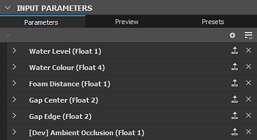

# Parâmetros de gráfico

Esta página descreve os parâmetros padrão do <b>gráfico de Substance</b>.

Um gráfico tem vários parâmetros que você pode modificar. Você pode localizá-los clicando em *espaço vazio* no gráfico ou selecionando o *item de gráfico* no painel <b>Explorador</b>. Os parâmetros serão então exibidos na visualização Parâmetros.

## Parâmetros básicos

<table>
<tr style="border: 0;">
<td style="border: 0;" valign="top">

Esta seção inclui parâmetros que afetam *todos os nós que ela contém*.

Certamente, todos os nós neste gráfico que têm parâmetros base definidos como o [método de herança](../../compositing-graphs/inheritance-compositing/inheritance-in-substance-compositing-graphs.md) &#39;Relativo ao pai&#39; obterão seus valores dos parâmetros base *graph&#39;s*.

Por sua vez, os valores dos parâmetros de base do gráfico dependerão do contexto em que o gráfico é usado.

</td>
<td style="border: 0;" valign="top">

{width="512px" zoomable="yes"}

</td>
</tr>
</table>

Por exemplo, quando o gráfico é usado em outro gráfico como um nó de instância, seus parâmetros base usam o método de herança &#39;Relativo à entrada&#39; por padrão. Isso significa que eles obterão seus valores do nó conectado à sua entrada principal. (A menos que tenham sido [substituídos](#input-parameters))

Na maioria dos casos, a herança desempenha um papel significativo na definição desses valores, bem como na alteração desses valores em todo o gráfico. Portanto, é altamente recomendável adquirir uma boa compreensão de [herança em gráficos de Substance](../../compositing-graphs/inheritance-compositing/inheritance-in-substance-compositing-graphs.md) antes de usar esses parâmetros.

|                      |                                                                                                                                                                                                                                                                                                                                                                                                                                     |
|:---------------------|:------------------------------------------------------------------------------------------------------------------------------------------------------------------------------------------------------------------------------------------------------------------------------------------------------------------------------------------------------------------------------------------------------------------------------------|
| <b>Tamanho da saída</b> | Este parâmetro permite escolher a *resolução base* das imagens no gráfico.  Use o 

 bloqueie o botão para que os valores de altura e largura correspondam e mantenham a imagem quadrada ao fazer ajustes de tamanho.  *Padrão: (0,0) - Relativo ao Pai* [Saiba mais](../../compositing-graphs/output-size/output-size.md) |
| <b>Formato de saída</b> | Permite escolher a *profundidade de bits base* no gráfico entre estas opções:<ul data-preserve-html="true"><li data-preserve-html="true">8 bits</li><li data-preserve-html="true">16 bits</li><li data-preserve-html="true">Baixa precisão HDR 16F (ponto flutuante de 16 bits)</li><li data-preserve-html="true">Alta precisão HDR 32F (ponto flutuante de 32 bits)</li></ul>*Padrão: 8 Bits por Canal - Em Relação ao Pai* |
| <b>Tamanho de pixel</b> | Define o tamanho do pixel. Recomendamos deixar os valores de **Largura** e **Height** definidos como **1**.*Padrão: (1,1) - Relativo ao Pai* |
| <b>Modo lado a lado</b> | Define o *modo de divisão em blocos gráficos* base destas opções:<ul data-preserve-html="true"> <li data-preserve-html="true">Sem revestimento</li> <li data-preserve-html="true">Revestimento horizontal</li> <li data-preserve-html="true">Revestimento vertical</li> <li data-preserve-html="true">Divisão em blocos gráficos H+V (horizontal e vertical)</li> </ul>*Padrão: Divisão em blocos gráficos H e V - Relativo ao Pai* |
| <b>Distribuição aleatória</b> | Define a *semente aleatória* base para o gráfico.  Use o 

 para atribuir um novo valor aleatório à semente aleatória.  *Padrão: 0 - Relativo ao Pai* |

<table>
<tr style="border: 0;">
<td width="100.00%" style="border: 0;" valign="top">

## Atributos

A seção <b>Atributos</b> contém *metadados* para o gráfico, que fornece informações para *identificar*, *categorizar* e *aplicar* o gráfico conforme projetado por seu autor.

</td>
<td width="33.33%" style="border: 0;" valign="top">

{zoomable="yes"}

</td>
</tr>
</table>

+++Lista de atributos

|                      |                                                                                                                                                                                                                                                                                                                                                                                                                                                                                                                                                                                                                                                                                                                                                                                                                                                                                                                                                                                                                                                                                                                                                                                                                                                                                                                                                                                                                                                                                             |
|:---------------------|:--------------------------------------------------------------------------------------------------------------------------------------------------------------------------------------------------------------------------------------------------------------------------------------------------------------------------------------------------------------------------------------------------------------------------------------------------------------------------------------------------------------------------------------------------------------------------------------------------------------------------------------------------------------------------------------------------------------------------------------------------------------------------------------------------------------------------------------------------------------------------------------------------------------------------------------------------------------------------------------------------------------------------------------------------------------------------------------------------------------------------------------------------------------------------------------------------------------------------------------------------------------------------------------------------------------------------------------------------------------------------------------------------------------------------------------------------------------------------------------------|
| **Identificador** | Este é o nome do gráfico e deve ser *exclusivo*. Não é possível ter dois ou mais gráficos com o mesmo <b>Identificador</b> no mesmo pacote. É usado como o *nome* do gráfico no painel do [Explorer](../../interface/the-explorer-window/the-explorer-window.md).  *Observação:* o identificador *não pode ser uma cadeia de caracteres vazia*. Cadeias de caracteres vazias são substituídas automaticamente por `_` ou `Substance_graph`. Você pode usar *somente* os seguintes caracteres para este valor: *`A-Z, 1-9, @$%[{]}_-`.* Caracteres não autorizados são substituídos automaticamente por `_`.  *Padrão: novo\_gráfico ou definido pelo usuário na criação do gráfico* |
| **Rótulo** | O <b>Rótulo</b> é usado em vez do <b>Identificador</b> para exibir o *nome* do gráfico para melhor legibilidade em cenários *voltados para o usuário* - por exemplo, a entrada [Biblioteca](../../interface/the-library/the-library.md) ou o rótulo [nó de instância](../creating-compositing-gra/graph-instances-sub-gra/graph-instances-sub-graphs.md).  Um rótulo pode ser *não exclusivo* e pode conter caracteres especiais.  *Dica:* se você renomear um gráfico - por exemplo, no [Explorer](../../interface/the-explorer-window/the-explorer-window.md) - talvez você também queira alterar seu rótulo!  *Padrão: vazio* |
| **Tipo** | O <b>Tipo</b> é usado para definir a finalidade pretendida de um [gráfico de Substance](../../compositing-graphs/substance-compositing-graphs.md). Destina-se principalmente ao recurso de interoperabilidade [&#39;Enviar&#39;](../../interface/the-explorer-window/send-to-interoperability/send-to-interoperability.md). |
| **Modelo de material** | Definir o modelo de material do gráfico garante que o sombreador apropriado seja usado na Exibição 3D, caso um sombreador *correspondente ao modelo* esteja disponível. Por exemplo: exibir um gráfico com o modo de material `OpenPBR v1.1` na Visualização 3D selecionará o sombreador `OpenPBR Surface` para o material de destino.  Se nenhum sombreador correspondente for encontrado ou o modelo do gráfico estiver definido como `Undefined`, o sombreador usado para o material de destino na Exibição 3D ficará *inalterado*. |
| **Tamanho físico** | Este valor especifica a dimensão da textura no *mundo físico*, em X (comprimento), Y (largura) e Z (height). É, portanto, inerentemente relacionado ao material que é produzido no gráfico. O tamanho físico pode ser usado, por exemplo, para exibir a textura em sua proporção correta na <b>Exibição 2D</b> e na <b>Exibição 3D</b>.  *Dica:* O tamanho físico de um gráfico de Substance pode ser recuperado como um valor Float3 em gráficos de função Substance aplicados a qualquer nó nesse gráfico, usando a variável interna $physicalsize [&#128279;](../../function-graphs/variables/system-variables/system-variables.md).  *Observação:* O valor **Z** é atualmente *não levado em conta* no **Exibição 3D**. Portanto, o valor de **Escala de Height** do material deve ser definido usando um nó **Saída** definido para o uso de **escala de altura** ou diretamente nas **Propriedades do material**.  *Padrão: (0,0,0)* |
| **Ícone** | Esta área permite definir um *ícone* que será usado pela <b>Biblioteca</b> para exibir a entrada deste gráfico, como um <b>SBS</b> e um <b>SBSAR</b>. O ícone também é usado em outras situações, como [Prateleira</b> do <b>Substance 3D Painter](https://www.adobe.com/br/products/substance3d-painter.html). A área oferece as seguintes opções:<ul data-preserve-html="true"> <li data-preserve-html="true"><b>Procurar</b>: permite que você procure nos arquivos do sistema a <i>imagem existente</i> que deve ser usada como um ícone</li> <li data-preserve-html="true"><b>Gerar</b>: isso gera um ícone usando uma <i>predefinição interna</i> do nó <b>Renderização PBR</b></li> <li data-preserve-html="true"><b>Colar</b>: permite colar os dados da imagem atualmente na <i>área de transferência</i> como um ícone</li> <li data-preserve-html="true"><b>Remover</b>: esta opção <i>remove</i> o ícone existente e deixa o slot de ícone <i>vazio</i></li> </ul>*Observação:* a opção **Gerar** usa o **Tamanho físico** para determinar a **Escala de Height** da **Renderização PBR** para seu efeito de deslocamento. Se um nó **Saída** definido para o uso **physicalsize** existir no gráfico, essa saída será usada. Se não existir tal saída, o valor dos **Atributos** do gráfico será usado *em seu lugar*. Se o valor do atributo for (0,0,0), o *valor predefinido* de 0.1 será usado.  *Observação:* quando *nenhum ícone* for definido, a *primeira saída de imagem* do gráfico será usada.  *Padrão: vazio* |
| **Pacote** | O nome de arquivo *absoluto* do **Pacote** ao qual este gráfico pertence.O botão **Pasta** pode permitir que você abra uma nova *janela do navegador de arquivos* do sistema neste local.*Padrão: nome de arquivo do pacote / Vazio se o pacote nunca tiver sido salvo* |
| **Exposto em SBSAR** | Isso controla se o gráfico e suas saídas podem ser *visualizados* no arquivo **SBSAR** publicado do **Pacote** do gráfico. Isso é útil se alguns gráficos no pacote forem usados apenas como *subgrafos* para o gráfico principal do pacote e *não devem aparecer* no **SBSAR**.*Padrão: Sim* |
| **Mostrar na Biblioteca** | Controla se o gráfico deve ser *visível* na **Biblioteca**, se o pacote estiver armazenado em um local que seja *observado* pela **Biblioteca**.*Padrão: definido na guia Biblioteca das Configurações do Projeto* |
| **Descrição** | Este é o *texto da descrição* do gráfico.Ela está visível na *dica de ferramenta* da entrada de gráfico na **Biblioteca**, em qualquer nó de **Instância** deste gráfico e em um software com uma **Integração de Substance** existente.*Padrão: vazio* |
| **Categoria** | Você pode usar este campo para definir uma *categoria* para este item de gráfico na **Biblioteca**.*Padrão: vazio* |
| **Autor** | Você pode usar este campo para colocar o *nome* do autor.*Padrão: vazio* |
| **URL do autor** | Este campo permite inserir uma *URL*, como o site do autor.*Padrão: vazio* |
| **Marcas** | Você pode usar este campo para adicionar suas próprias *marcas*, para melhorar a *capacidade de pesquisa* e a *capacidade de descoberta* do gráfico.*Padrão: vazio* |
| **Grupo** | Habilita o agrupamento de itens no menu Nó. Recursos como gráficos ou bitmaps que compartilham um valor de “Grupo” comum são agrupados em uma seção nomeada em homenagem ao grupo. *Padrão: vazio* |
| **Dados do usuário** | Você pode usar este campo para adicionar seus próprios dados adicionais. Isso é útil para integrações personalizadas em software de terceiros. O Substance 3D Painter e o Sampler usam esses dados de usuário para definir determinados comportamentos específicos.*Padrão: vazio* |
| **Dados do modelo** | Quando um gráfico de Substance é usado como modelo, esses atributos definem a categoria e o subtítulo do [modelo](../../compositing-graphs/creating-compositing-gra/creating-a-substance-compositing-graph.md). Eles são separados por mensagem: &lt;category>;&lt;subtitle>   *Default: Empty* |

+++

## Parâmetros de entrada

<table>
<tr style="border: 0;">
<td style="border: 0;" valign="top">

Todos os parâmetros específicos do gráfico, incluindo [parâmetros expostos](../../compositing-graphs/manage-parameters/exposing-a-parameter/exposing-a-parameter.md), são [gerenciados](../../compositing-graphs/manage-parameters/manage-parameters.md), editados e visualizados aqui.

[Predefinições de parâmetro](../../compositing-graphs/manage-parameters/parameter-presets/parameter-presets.md) também podem ser criadas para alguns ou todos os parâmetros.

</td>
<td style="border: 0;" valign="top">

{zoomable="yes"}

</td>
</tr>
</table>

+++Substituição de parâmetros base
Ao usar um gráfico em outro gráfico como um [nó de instância](../creating-compositing-gra/graph-instances-sub-gra/graph-instances-sub-graphs.md), você pode controlar o valor padrão de qualquer parâmetro base nesse novo nó de instância.

Abra o menu de opções na parte superior da seção “Parâmetros de entrada” e vá para o submenu “Substituir parâmetros básicos” para selecionar um parâmetro base para o qual você deseja definir um valor padrão arbitrário.

O editor do parâmetro selecionado aparecerá no topo da lista de parâmetros de entrada do gráfico. Em seguida, você poderá ajustar o valor e o [método de herança](../../compositing-graphs/inheritance-compositing/inheritance-in-substance-compositing-graphs.md) conforme desejado.

+++

>[!IMPORTANT]
>
> As guias <b>Visualização</b> e <b>Predefinições</b> são desabilitadas ao usar a [edição no contexto](../../interface/preferences-window/preferences-window.md).

## Entradas

<table>
<tr style="border: 0;">
<td style="border: 0;" valign="top">

Nesta parte, todos os nós de [entrada](../../compositing-graphs/nodes-reference-for-com/atomic-nodes/input/input.md) do gráfico são listados.

É possível reordená-los usando arrastar e soltar na alça na extremidade esquerda de cada item.

</td>
<td style="border: 0;" valign="top">

{zoomable="yes"}

</td>
</tr>
</table>

## Saídas

<table>
<tr style="border: 0;">
<td style="border: 0;" valign="top">

Nesta parte, todos os nós de [Saída](../../compositing-graphs/nodes-reference-for-com/atomic-nodes/output/output.md) do gráfico.

É possível reordená-los usando arrastar e soltar na alça na extremidade esquerda de cada item.

</td>
<td style="border: 0;" valign="top">

{zoomable="yes"}

</td>
</tr>
</table>
