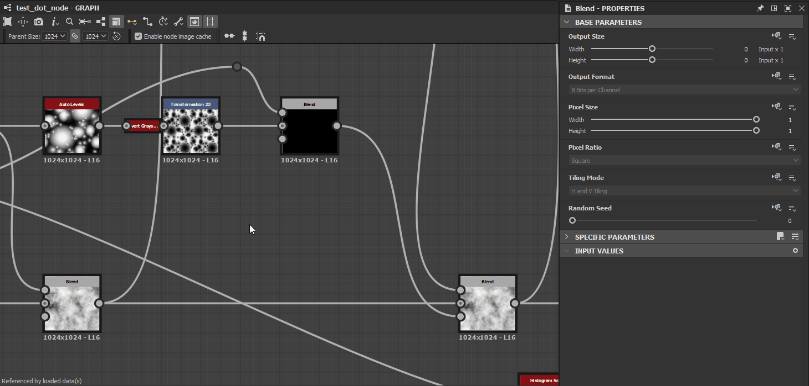
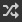

# Herança em gráficos do Substance

Esta página descreve como a herança é aplicada em [gráficos de Substance](../../compositing-graphs/substance-compositing-graphs.md) no [Substance 3D Designer](https://www.adobe.com/br/products/substance3d-designer.html) e o impacto que ela tem na saída do gráfico.

{width="1400px"}

## Visão geral

Todos os nós em um gráfico de Substance podem *herdar* o valor de alguns parâmetros de uma origem. Herança significa que a alteração do valor na origem *executará essa alteração* em todos os nós que herdam dele. Este é um dos conceitos fundamentais que sustentam o poder da Substance 3D Designer na geração de ativos paramétricos.

>[!NOTE]
>
> Um arquivo de projeto anotado que demonstra a herança está disponível na seção [Gráficos de Substance de exemplo](../../compositing-graphs/sample-compositing-graphs/sample-substance-compositing-graphs.md) desta documentação.

### Métodos de herança

<table>
<tr style="border: 0;">
<td style="border: 0;" valign="top">

{width="128px"}

<b>Absoluto</b>

Sem herança, o valor é definido *arbitrária e localmente* para o parâmetro

</td>
<td style="border: 0;" valign="top">

{width="128px"}

<b>Relativo à entrada</b>

O valor é herdado dos dados conectados à *Entrada primária* do nó

</td>
<td style="border: 0;" valign="top">

{width="128px"}

<b>Relativo ao pai</b>

O valor é herdado do *pai* do nó ou gráfico

</td>
</tr>
</table>

Os métodos de herança são aplicados aos [parâmetros base](../../compositing-graphs/graph-parameters/graph-parameters.md) de um nó, que é o conjunto de parâmetros comuns que todos os nós têm que controlam *aspectos fundamentais* de seu comportamento. Esses parâmetros incluem:

* **Tamanho da saída**
* **Formato de saída** (por exemplo, profundidade de bits)
* **Tamanho de pixel**
* **Proporção de pixels**
* **Modo Revestimento**
* **Propagação Aleatória**

Isso deve permitir que você aprecie como as alterações no nó *um* podem afetar a resolução, a precisão e o comportamento de divisão em blocos gráficos de *todos os nós downstream* dele.

>[!WARNING]
>
> Um lembrete importante para entender os conceitos discutidos nesta página: um *nó de instância* é um [nó que representa um gráfico em outro gráfico](../../compositing-graphs/creating-compositing-gra/graph-instances-sub-gra/graph-instances-sub-graphs.md), com seus *próprios valores de parâmetro discretos*, daí o termo *instância*.\
> Por exemplo, dois nós [Perlin noise](../../compositing-graphs/nodes-reference-for-com/node-library/texture-generators/noises/perlin-noise/perlin-noise.md) em um mesmo gráfico são representações de um gráfico de origem *igual* (`perlin_noise` em `noise_perlin_noise.sbs`) com seus *próprios conjuntos* de valores de parâmetro.

>[!NOTE]
>
> **Tamanho de saída:** use o botão de bloqueio  para que o valor de Height *corresponda* ao valor de Largura\
> **Distribuição aleatória:** use o botão  para atribuir um novo valor aleatório à distribuição aleatória.

## Fazendo alterações

### Alterando métodos de herança

No painel Propriedades, todos os parâmetros listados na seção [Parâmetros base](../../compositing-graphs/graph-parameters/graph-parameters.md) das propriedades de um nó têm um botão suspenso (ícone) <b>Definir método de herança</b> oposto ao seu rótulo.\
Este botão permite-lhe selecionar o método de herança que deverá ser usado para um parâmetro.

{width="512px"}

Na maioria dos casos, os parâmetros Base de um *nó* são definidos como *Relativo à entrada*, para aproveitar o comportamento processual de encadear nós juntos, enquanto os parâmetros Base de um *gráfico* são definidos como *Relativo ao pai*, para que os parâmetros globais possam se adaptar ao contexto em que o gráfico é usado.

### AJUSTES DE VALORES HERDADOS

Alguns parâmetros Base, como [Tamanho de Saída](../../compositing-graphs/output-size/output-size.md), Tamanho de Pixel ou Distribuição Aleatória, podem ser alterados *relativamente ao valor herdado*.

Por exemplo, quando o parâmetro Tamanho de Saída usa um método de herança *Relativo a...*, um valor ou `(1, -1)` significa uma potência de duas resoluções *acima* do valor herdado para X e uma potência de duas resoluções *abaixo* do valor herdado para Y, como:

* Valor herdado: `(9, 9)` que é `2^9, 2^9 = 512, 512`
* Valor relativo: `(1, -1)` que é `2^(9+1), 2^(9-1) = 256, 1024`

>[!NOTE]
>
> A página [Tamanho da Saída](../../compositing-graphs/output-size/output-size.md) se aprofunda nesse parâmetro Base crítico e é recomendada a leitura para entender como a resolução final de um nó é calculada.

Se uma função for aplicada a um parâmetro Base, o resultado da função também será interpretado usando o método de herança do parâmetro.\
Mantendo o exemplo de Tamanho de Saída em mente, uma função que visa aumentar a resolução herdada duas vezes em X e Y deve gerar o valor `(2, 2)` Integer2.

## Parentalidade para nós e gráficos

Ao usar o método de herança Relativo ao pai, você deve entender o que é exatamente esse pai em um contexto específico.

O pai de um nó é o *gráfico* em que ele existe.

O pai de um gráfico é o *contexto* em que ele existe:

* Se esse gráfico for um subgráfico instanciado em outro gráfico host como um *nó de instância*, o pai do subgráfico será o *nó de instância*. O pai desse nó de instância é o *gráfico de host*.
* Se esse gráfico é um gráfico raiz, o pai é o *aplicativo em si* e qualquer valor que o aplicativo tenha definido para um determinado parâmetro. Por exemplo, os gráficos herdarão do conjunto de parâmetros <b>Tamanho pai</b> na barra de ferramentas da exibição [Gráfico](../../interface/the-graph-view/the-graph-view.md).

>[!WARNING]
>
> A paternidade é *aplicada como está* quando um pacote é publicado em arquivos de ativos da Substance 3D (SBSAR). Isso significa que definir qualquer parâmetro para o método de herança *Absoluto* *bloqueará* esse parâmetro para seu valor atual no ativo publicado.\
> Embora isso seja desejável para nós [Bitmap](../../compositing-graphs/nodes-reference-for-com/atomic-nodes/bitmap/bitmap.md) ou [fins de otimização](../../best-practices/performance-optimization/performance-optimization-guidelines.md), por exemplo, *recomendamos enfaticamente* o uso de métodos de herança *Relativo a...* ao trabalhar em gráficos de Substance, a menos que haja uma *finalidade clara e deliberada* ao fazer o contrário.

### EDIÇÃO DO CONTEXTO INTERNO

Ao usar a [edição no contexto](../../compositing-graphs/creating-compositing-gra/graph-instances-sub-gra/graph-instances-sub-graphs.md) em um nó de instância de gráfico, o pai do gráfico é o *nó de instância*. Nesse caso, a configuração <b>Tamanho Pai</b> na barra de ferramentas da exibição de gráfico [&#x200B; está *desabilitada*, pois o gráfico herda os parâmetros base do nó da instância.](../../interface/the-graph-view/the-graph-view.md)

Esta característica é o *ponto* da edição do contexto e deve ser *fatorada* ao definir o método de herança e avaliar os valores atuais dos parâmetros Base de qualquer nó.

## Herança com várias entradas

Quando um gráfico tem várias entradas, cada entrada pode herdar de seus dados de entrada discretos ou do gráfico, dependendo de seu método de herança:

<table>
<tr style="border: 0;">
<td style="border: 0;" valign="top">

{width="128px"}

<b>Relativo à entrada</b>

A entrada herda de seus dados de entrada discretos, independentemente dos parâmetros Base do gráfico. Isso é muito útil para controlar dados por entrada.

</td>
<td style="border: 0;" valign="top">

{width="128px"}

<b>Relativo ao pai</b>

A entrada é herdada do gráfico e os dados recebidos são adaptados de acordo.

</td>
<td style="border: 0;" valign="top">

</td>
</tr>
</table>

### Entrada primária

<table>
<tr style="border: 0;">
<td style="border: 0;" valign="top">

<table>
<tr style="border: 0;">
<td style="border: 0;" valign="top">

{width="48px"}

</td>
<td style="border: 0;" valign="top">

{width="48px"}

</td>
<td style="border: 0;" valign="top">

{width="48px"}

</td>
</tr>
</table>

Uma das entradas pode ser definida como a **Entrada primária** do gráfico, clicando em **RMB** nesse nó de [Entrada](../../compositing-graphs/nodes-reference-for-com/atomic-nodes/input/input.md) e selecionando a opção **Definir como Entrada Primária** no menu contextual.

</td>
<td style="border: 0;" valign="top">

</td>
</tr>
</table>

Quando o gráfico é instanciado em outro gráfico como um nó de instância, todos os parâmetros Base do nó de instância que estão definidos como *Relativo à entrada* herdarão os dados conectados a *essa entrada*. A entrada Primária de um nó de instância pode ser identificada pelo pequeno ponto escuro em seu conector.

As outras entradas definidas como *Relativo ao pai* herdarão os mesmos valores de parâmetros Base, pois herdam do *gráfico* que herda do *nó da instância\**, que herda da entrada Primária.

\*: Isso é verdadeiro porque o gráfico usa o método de herança* Relativo ao pai*.

## Exemplos

Aqui estão alguns exemplos que abrangem diferentes casos de herança e a interação dos métodos de herança definidos nos seguintes atores, de cima para baixo:

1. Aplicativo
1. Gráfico de host
1. Nó da instância no gráfico do host
1. Subgráfico - ou seja, o gráfico referenciado pelo nó da instância
1. Nós no subgráfico

O *método de herança* definido para um ator é exibido em laranja logo acima dele. O *fluxo de herança* para sua origem é exibido com linhas laranjas.

As letras representam *conjuntos separados* de parâmetros Base e devem ajudar a seguir quais dados são herdados por qual ator.

<table>
<tr style="border: 0;">
<td style="border: 0;" valign="top">

**Exemplo A**

{zoomable="yes"}

</td>
<td style="border: 0;" valign="top">

**Exemplo B**

{zoomable="yes"}

</td>
</tr>
</table>

<table>
<tr style="border: 0;">
<td style="border: 0;" valign="top">

**Exemplo C**

{zoomable="yes"}

</td>
<td style="border: 0;" valign="top">

**Exemplo D**

{zoomable="yes"}

</td>
</tr>
</table>

## Solução de problemas de herança

À medida que você cria seu gráfico e aumenta sua complexidade, pode se deparar com resultados inesperados causados pela herança. Se a saída de um nó tiver uma resolução ou precisão incorreta (por exemplo, profundidade de bits), você deve ir *para cima na cadeia de herança* para localizar de onde esses valores vêm.

Um bom ponto de partida é verificar os dados exibidos logo abaixo de um nó: são a resolução, o formato de cores e a precisão da saída da imagem pela *primeira saída* do nó. Embora a compreensão da solução seja direta, vale a pena detalhar o segundo dado:

* O *prefixo de letra* refere-se ao formato de cor da imagem:
  * <b>L</b>: luminância (isto é, escala de cinza)
  * <b>C</b>: Cor
* O *número* refere-se à profundidade de bits da imagem, da mais baixa para a mais alta precisão:
  * <b>8</b>: inteiro de 8 bits (256 etapas em 0-1)
  * <b>16</b>: inteiro de 16 bits (65 536 etapas em 0-1)
  * <b>16F</b>: ponto flutuante de 16 bits (valores de baixa precisão além de 0-1, incluindo negativos)
  * <b>32F</b>: ponto flutuante de 32 bits (valores de alta precisão além de 0-1, incluindo negativos)

Se o nó tiver mais de uma saída, você poderá verificar sua resolução e precisão de duas maneiras fáceis:

* Clique duas vezes em <b>LMB</b> no *conector de saída* para exibir a imagem no [Visualização 2D](../../interface/2d-view/2d-view.md) e verifique as informações da imagem exibidas no *canto inferior esquerdo* do visor da Visualização 2D
* Crie um nó [Níveis](../../compositing-graphs/nodes-reference-for-com/atomic-nodes/levels/levels.md) ou [Transformação 2D](../../compositing-graphs/nodes-reference-for-com/atomic-nodes/transformation-2d/transformation-2d.md) e conecte sua entrada à saída que você deseja verificar. O nó *herdará da saída* por padrão, e você poderá verificar os valores abaixo do nó.

Agora você pode subir a cadeia de nós no gráfico e tentar localizar o *primeiro nó* onde os valores inesperados aparecem. Verifique o método de herança de seus parâmetros Base.

Se nada estiver errado e o nó for um nó de instância, você precisará ir mais fundo e abrir o gráfico referenciado por esse nó de instância. Repita o processo a partir dos nós de saída do gráfico e subindo.

### UM EXEMPLO COMUM

Em particular, o conceito de *Entrada primária* é facilmente *ignorado* e pode resultar em problemas de herança.

O nó [Combinar](../../compositing-graphs/nodes-reference-for-com/atomic-nodes/blend/blend.md) é muito susceptível a isso, pois é usado com muita frequência. Sua entrada <b>Background</b> é sua entrada Primária.

{width="512px"}

Você precisa prestar atenção à ordem na qual mescla as duas entradas: a entrada cuja resolução e precisão deseja manter no gráfico deve ser conectada à entrada de Plano de fundo, se o modo de mesclagem necessário tornar possível. Caso contrário, talvez seja necessário ajustar os parâmetros Base do nó do Combinar e o método de herança para compensar.
