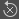

# Exposição de um parâmetro

A exposição de parâmetros é uma das ferramentas mais poderosas e é essencial para abrir seus gráficos para outros aplicativos, como Substance 3D Painter, Substance 3D Sampler e integrações Substance para o Maya e 3DS Max.

Esta página explica todos os conceitos necessários para começar a expor. É recomendável [que você saiba primeiro o que é uma Instância de Gráfico](../../../compositing-graphs/creating-compositing-gra/graph-instances-sub-gra/graph-instances-sub-graphs.md)antes de continuar nesta página. Também é bom ter uma ideia da[diferença entre Publish e Exportação, bem como dos tipos de arquivo envolvidos.](../../../getting-started/overview/overview.md)

*\*As linhas tracejadas e transparentes acima são uma representação abstrata da conexão\
de parâmetros expostos para Parâmetros de Gráfico.*

## Noções básicas sobre parâmetros e exposição

+++O que é um parâmetro?
*Um parâmetro é um valor simples, com um elemento de interface do usuário, que controla o comportamento de um gráfico.* Você os usa constantemente em todos os softwares de Substance: para mudar uma cor, definir o modo de mesclagem, escolher um valor de opacidade, etc... Sem parâmetros, o software Substance não permitiria nenhuma personalização.

Os parâmetros podem vir em muitas formas diferentes: controles deslizantes, mostradores, caixas de texto, menus suspensos, etc... Os valores que eles representam podem ser de muitos tipos diferentes: valores decimais, valores inteiros, valores booleanos (verdadeiro/falso) e até mesmo trechos de texto.

+++

+++O que é “expor”?
***Expor é o processo de disponibilizar um parâmetro para uso fora do Modo de Exibição de Gráfico atual.***  Ao criar um Gráfico, geralmente você seleciona um nó para alterar os parâmetros em suas propriedades; quando exposto, você *habilita o acesso a esse parâmetro de um painel de controle externo*. Esse “painel de controle externo” pode significar coisas diferentes com base no contexto: quando usado como uma instância de gráfico no Designer, ele apenas atua como outro nó. Quando usados no Substance 3D Painter, no Substance 3D Sampler ou em uma integração, esses parâmetros expostos serão *o único controle* que você tem sobre o gráfico.

+++

+++Por que a exposição é útil?
***Expor parâmetros é o que leva o Substance 3D Designer além de um editor de textura simples, permitindo que você crie ferramentas personalizáveis e dinâmicas de geração de textura*** **.** Sem a exposição, os materiais em Substance não seriam muito diferentes das texturas estáticas: você não teria como modificar suas saídas.

+++

+++Por que não expor todos os parâmetros automaticamente, o tempo todo?
<b> [gráficos de Substance](../../../compositing-graphs/substance-compositing-graphs.md) podem se tornar complicados e conter centenas de parâmetros de uma só vez. Não faz sentido mostrar sempre todos os parâmetros para um usuário, especialmente se você estiver criando gráficos com um objetivo simples, que não precisam de muitos parâmetros.</b> Ao expor parâmetros, você trabalha como designer de UI ou UX: acha que controles fazem sentido, quais valores são necessários e como facilitar o uso para você mesmo, para outros usuários on-line ou para seus colegas de trabalho.

+++

+++Tenho que saber matemática para expor? Devo entender os gráficos de função de Substance?
***O conhecimento matemático não é necessário para fazer bom uso dos Parâmetros de Exposição, nem para o uso de funções.***  Como usuário inicial, você pode evitar quase que completamente a necessidade de operações matemáticas em [Gráficos de função](../../../function-graphs/function-graphs.md). A única coisa altamente recomendada é um [conhecimento básico adequado dos diferentes tipos de dados, como Inteiro, Precisão decimal e Booleano.](../../../function-graphs/nodes-reference-for-fun/function-nodes-overview/function-nodes-overview.md)

+++

## Como expor

Atualmente, existem dois métodos principais para expor parâmetros. Um método é mais adequado para expor rapidamente um único parâmetro, o segundo método é mais adequado para expor vários parâmetros em uma varredura.

{width="512px"}

### MÉTODO DE EXPOSIÇÃO ÚNICA

1. Localize o parâmetro que você deseja expor no painel [Propriedades](../../../interface/properties/properties.md), na guia Parâmetros Específicos
1. Clique no botão de opções do menu suspenso 
1. Escolha  <b>Expor como nova entrada de gráfico</b> na lista suspensa, a primeira opção.
1. A caixa de diálogo <b>Expor parâmetro</b> é exibida; defina as propriedades do parâmetro conforme desejar.

   É recomendável alterar pelo menos o <b>Identificador</b> e o <b>Rótulo</b>
1. Pressione <b>OK</b> para confirmar
1. O nome do parâmetro fica *azul* e o \
   O botão <b> Editar função de parâmetro</b> aparece ao lado das opções suspensas para confirmar se o parâmetro está exposto

>[!NOTE]
>
> A maioria dos campos numéricos oferece suporte a *fórmulas matemáticas básicas* como entrada. Por exemplo, `17+3.5`, `7/3`, `(4+2)*3`. Pressione *Enter* para validar a fórmula e o resultado será inserido no campo. Se a fórmula for inválida, o campo reverterá para seu valor anterior.\
> Alguns campos numéricos em outras partes do aplicativo, como no encaixe [Propriedades](../../../interface/properties/properties.md), também oferecem suporte a esse recurso.

{width="512px"}

### Método de exposição em lote

Ao expor um parâmetro, esse método será um pouco mais lento do que o anterior. Ao expor vários parâmetros, é muito mais rápido.

1. Em vez de localizar um único parâmetro, localize o botão  <b>Várias exposições</b> no canto superior direito da guia <b>Parâmetros específicos</b>
1. Escolha <b>Parâmetros de exposição em lote...</b> no menu suspenso
1. A caixa de diálogo <b>Exposição em lote</b> é exibida, permitindo personalizar a exposição de todos os <b>parâmetros específicos</b> de um nó
1. Use <b>Todos</b>, <b>Nenhum</b> ou caixas de seleção específicas para decidir quais parâmetros expor
1. Clique em um nome de parâmetro na coluna <b>Identificador de entrada de gráfico</b> da lista para alterar seu nome.
1. Clique em um <b>Nome do grupo</b> na coluna <b>Grupo de entrada de gráfico</b> da lista para adicionar um (sub)grupo para um parâmetro específico
1. Use as caixas de inserção <b>Identificador de entrada de gráfico</b> e <b>Grupo de entrada de gráfico</b> na parte inferior para adicionar prefixo, sufixo e grupos de entrada a todos os parâmetros expostos de uma só vez. Todos esses valores são aplicados sobre as configurações por parâmetro.
1. Clique em <b>OK</b> para confirmar e expor todos os parâmetros selecionados. Os nomes dos parâmetros agora mostram *azul* para confirmar que os parâmetros estão expostos, bem como um botão de  <b>Editar função</b>.

## Limitações

Existem algumas limitações ligadas aos parâmetros de exposição, conforme listado na tabela abaixo.

| Tipo de parâmetro | Motivo |
| --- | --- |
| [Degradê](../../../compositing-graphs/nodes-reference-for-com/atomic-nodes/gradient-map/gradient-map.md), [Editor De Curvas](../../../compositing-graphs/nodes-reference-for-com/atomic-nodes/curve/curve.md), [Fonte](../../../compositing-graphs/nodes-reference-for-com/atomic-nodes/text/text.md), [Histograma De Níveis](../../../compositing-graphs/nodes-reference-for-com/atomic-nodes/levels/levels.md) | Requer widgets que não estão disponíveis para os parâmetros criados pelo usuário. |

Outra limitação significativa está relacionada a [parâmetros estáticos](../../../glossary/glossary.md). Não é possível alterá-los em um [ativo publicado do Substance 3D (SBSAR)](../../publishing-asset-files/publishing-substance-3d-asset-files-sbsar.md).

Parâmetros estáticos - em oposição aos parâmetros dinâmicos - *não podem ser editados dinamicamente* depois que o gráfico foi *cozido* - isto é, processado para executar seu algoritmo de forma rápida e eficiente. A cozinha ocorre no Designer sempre que o gráfico é *editado* ou *publicado*.

Portanto, os parâmetros estáticos são visíveis e editáveis no Designer, mas estão *ocultos* em um ativo publicado do Substance 3D. É possível usar o modo de visualização para ver as limitações em vigor antes de publicar em um ativo do Substance 3D: consulte &#39;Visualização de parâmetros&#39; abaixo.

Como solução alternativa, você pode usar um nó [Chave](../../../compositing-graphs/nodes-reference-for-com/node-library/filters/blending/switch/switch.md) ou [Chave Múltipla](../../../compositing-graphs/nodes-reference-for-com/node-library/filters/blending/multi-switch/multi-switch.md) e vários conjuntos lógicos para alternar entre diferentes valores/estados para esses parâmetros.

| Nó | Parâmetro |
| --- | --- |
| Todos os nós | Proporção de pixel no modo de divisão em blocos gráficos |
| [Cor uniforme](../../../compositing-graphs/nodes-reference-for-com/atomic-nodes/uniform-color/uniform-color.md) | Modo de cores |
| [Processador de pixels](../../../compositing-graphs/nodes-reference-for-com/atomic-nodes/pixel-processor/pixel-processor.md) | Modo de cores |
| [Mesclar](../../../compositing-graphs/nodes-reference-for-com/atomic-nodes/blend/blend.md) | Modo de mesclagem Alpha área de corte de mesclagem |
| [FX-Map](../../../compositing-graphs/nodes-reference-for-com/atomic-nodes/fx-map/fx-map.md) | Modo de mesclagem |
| [Quadrante](../../../function-graphs/fxmaps/the-quadrant-node/the-quadrant-node.md) | Filtragem de imagem de entrada alfa da imagem de entrada de padrão |

## Modificação de parâmetros expostos

Uma vez exposto, não é mais possível acessar um parâmetro como antes. Mudar o valor, renomear, organizar a interface e até mesmo remover o parâmetro acontecem no nível Propriedades do gráfico. Esta seção detalha como fazer isso.

Para alterar as opções de um parâmetro exposto:

1. Clique no botão de Opções da lista suspensa  ao lado do parâmetro já exposto
1. Escolha <b> Editar entrada de gráfico exposta</b>. Isso direciona o usuário à entrada relevante nas propriedades do gráfico
1. Clique duas vezes em uma área vazia do gráfico para obter as propriedades do gráfico e localize o parâmetro na lista de <b>Parâmetros de entrada</b>
1. Clique uma vez no seu gráfico no <b>Explorer</b> e encontre o parâmetro na lista de <b>Parâmetros de entrada</b>

{width="512px"}

### PARÂMETROS DE ENTRADA

Todos os Parâmetros expostos são listados na guia Parâmetros de entrada. As propriedades a seguir estão disponíveis para os casos mais comuns, como Flutuações e Inteiros com tipo de Editor padrão.

1. <b>Identificador</b>: identificador exclusivo para este parâmetro. Não pode conter espaços ou caracteres especiais.
1. <b>Rótulo</b>: rótulo somente de interface do usuário. Se nenhum rótulo for definido, o identificador será mostrado na interface do usuário. Pode conter espaços e caracteres especiais
1. <b>Grupo</b>: agrupe parâmetros em uma seção recolhível para manter longas listas de parâmetros limpas e gerenciáveis. Os parâmetros serão agrupados se compartilharem o mesmo nome de grupo *exato*. Use o caractere `/` para criar *subgrupos* - por exemplo, `My Group/My Sub-group`
1. <b>Descrição</b>: campo de texto para descrição, usado como dica de ferramenta.
1. <b>Tipo/Editor</b>: defina o tipo de dados e o tipo de editor de interface do usuário. Alguns editores estão disponíveis apenas para certos tipos de dados (como uma lista suspensa apenas para inteiros). *Alterar o Editor limpará, em muitos casos, os valores padrão.*
1. <b>Padrão</b>: valor padrão no qual o parâmetro começa. Esse também é o valor usado no gráfico durante a visualização dos nós. Tente usar um valor fácil e utilizável aqui, evite casos extremos.
1. <b>Mín</b>: valor mínimo para a interface do usuário
1. <b>Máx</b>: valor máximo para a interface do usuário
1. <b>Grampo</b>: defina se Mín e Máx são limites suaves ou rígidos (permitem que o usuário ultrapasse os limites).
1. <b>Etapa</b>:Set a precisão ou granularidade do valor.
1. <b>Dados do usuário: </b>dados de usuário personalizados, disponíveis para qualquer finalidade.
1. <b>Visível se</b>: sistema de expressão especial para mostrar ou ocultar parâmetros com base em condições externas. Consulte [Visível se: controle a visibilidade de entradas, saídas e parâmetros](../../../compositing-graphs/visible-control-vis/visible-if-control-visibility-of-inputs-outputs-and-parameters.md)

{width="512px"}

#### Lista suspensa

Um caso especial é a <b>Lista suspensa</b> para tipos Inteiros. Não há Padrão, Mín ou Máx, apenas uma configuração de Valor que permite definir uma lista de Itens.

* Cada Item corresponde a um Item na Lista Suspensa.
* O primeiro valor de um Item é o inteiro interno real usado pelo gráfico. Certifique-se de configurá-los corretamente para seu [Switch múltiplo](../../../compositing-graphs/nodes-reference-for-com/node-library/filters/blending/multi-switch/multi-switch.md), por exemplo (eles começam em 1, não em 0).
* O segundo valor é o Rótulo da interface do usuário mostrado ao usuário.
* A terceira caixa de seleção permite marcar um item como o item padrão selecionado.
* O X exclui um item, o + adiciona um item

{width="512px"}

#### Reordenar

A reordenação de Parâmetros pode ser feita facilmente arrastando e soltando as alças escuras listradas à esquerda do nome dos parâmetros de entrada na lista. Lembre-se de que os parâmetros de agrupamento podem afetar a ordem.

{width="512px"}

### VISUALIZANDO PARÂMETROS

Como a configuração de parâmetros pode ser difícil sem ver o resultado final, um <b>Modo de visualização</b> pode ser habilitado para verificar como a interface do usuário de parâmetros será exibida e se comportará externamente. Clique na guia <b>Visualizar</b> no meio superior da implantação de Parâmetros de Entrada.

Normalmente, todas as alterações feitas no <b>Modo de Visualização</b> são *descartadas*. No entanto, você pode usar o <b>botão Aplicar </b>ao lado do ícone de olho para definir os valores atuais do<b> Modo de visualização</b> como os *novos valores padrão*.

[O Modo de visualização também permite criar Predefinições incorporadas.](../../../compositing-graphs/manage-parameters/parameter-presets/parameter-presets.md)

>[!IMPORTANT]
>
> O Modo de Visualização é desabilitado ao usar a [edição do contexto](../../../interface/preferences-window/preferences-window.md).

>[!WARNING]
>
> O modo de visualização visa representar a experiência de um [ativo publicado do Substance 3D (SBSAR)](../../publishing-asset-files/publishing-substance-3d-asset-files-sbsar.md) da forma mais precisa possível. Portanto, as Limitações listadas nesta página serão aplicadas neste modo, como *ausência de parâmetros estáticos na lista*.

{width="512px"}

### COPIAR E COLAR PARÂMETROS

Os parâmetros podem ser copiados e colados entre gráficos.

Um único parâmetro pode ser copiado com o botão Copiar . Vários Parâmetros podem ser copiados pelo Menu de Parâmetros . Escolha Copiar Entradas para copiar todas as entradas.

Escolha Colar Entradas  no Menu de Parâmetros  para colar um ou mais parâmetros.

Se você deseja transferir valores, e não o parâmetro exposto real em si, [leia sobre Predefinições de Parâmetro.](../../../compositing-graphs/manage-parameters/parameter-presets/parameter-presets.md)

## Remoção e limpeza de parâmetros expostos

Devido à natureza dos parâmetros, onde você pode ter um Parâmetro de entrada controlando vários Nós ou onde os parâmetros de entrada podem existir sem controlar um nó, podem surgir problemas com parâmetros ausentes ou não usados. Os problemas comuns abaixo e suas soluções estão descritos.

{width="512px"}

### RASTREAR PARÂMETROS QUEBRADOS EM NÓS

Você pode rastrear qual parâmetro é usado por qual nó por meio da Ferramenta Localizador de Nós , que está localizada na barra superior da Exibição de Gráfico. Clique nele para que você possa localizar nós usando parâmetros específicos.

Se um nó tiver um problema real, ele exibirá um emblema de Aviso  no canto superior esquerdo. Passar o mouse sobre a medalha exibirá uma dica de ferramenta com mais informações.

Para redefinir e remover um problema, para o parâmetro que você deseja corrigir ou redefinir, clique no botão Suspenso  ao lado do botão Editar Função e selecione  <b>Redefinir. </b>Isso retorna um parâmetro ao seu estado anterior, não exposto. O nome azul ficará cinza novamente para refletir isso.

{width="512px"}

### LIMPANDO PARÂMETROS DE ENTRADA NÃO USADOS

Se você perdeu o controle dos Parâmetros de entrada e não sabe mais quais são usados, eles podem ser limpos usando uma pequena ferramenta. Clique no botão do menu Parâmetro de Entrada  e selecione <b>Limpar Entradas.</b>

Uma nova caixa de diálogo é exibida, listando todos os parâmetros não utilizados. Marque ou desmarque os parâmetros que deseja remover ou manter e clique em OK. Se nenhuma caixa de diálogo for exibida, não há parâmetros não utilizados para limpeza no momento.

{width="512px"}

### REMOVENDO PARÂMETROS

Para remover um parâmetro que está em uso, são necessárias duas etapas distintas.

1. No nó com o parâmetro exposto, clique na seta suspensa à direita do botão Função expor, que é colorido em azul: . Em seguida, escolha “Redefinir para o valor padrão”. Isso remove o uso do parâmetro nesse nó. repita para qualquer outro nó que use o mesmo parâmetro. “Redefinir para o valor padrão” também redefine o intervalo do widget de parâmetro para seu *intervalo suave*.
1. Na lista Parâmetros de entrada do gráfico, clique no X até a direita da entrada do parâmetro. Isso exclui o parâmetro completamente. Se algum nó tentar fazer uso desse parâmetro, um emblema de aviso aparecerá (veja acima).
