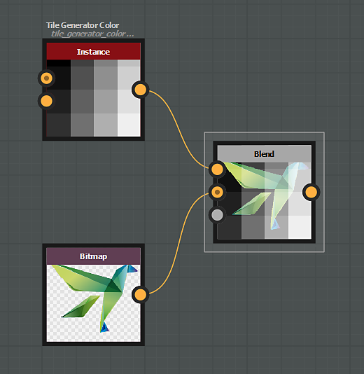

# Modos de mesclagem

O nó [Mesclagem](../../../../../compositing-graphs/nodes-reference-for-com/atomic-nodes/blend/blend.md) oferece os seguintes modos de mesclagem:

## Copiar

O modo de mesclagem de *Cópia* apenas colocará o primeiro plano sobre o plano de fundo.

{zoomable="yes"}

Para imagens coloridas, o canal alfa é considerado por padrão na opacidade.

Isso pode ser alterado usando o parâmetro &#39;Alpha blending&#39;.

"){zoomable="yes"}

## Adicionar (Subexposição linear)

O modo de mesclagem *Adicionar* adicionará o valor de entrada do primeiro plano a cada pixel correspondente no plano de fundo.

"){zoomable="yes"}

## Subtrair

O modo de mesclagem *Subtrair* subtrairá o valor de entrada do primeiro plano de cada pixel correspondente no plano de fundo.

Se o resultado da subtração for inferior a 0, o valor será limitado a 0, resultando em preto puro.

{zoomable="yes"}

## Multiplicar

O modo de mesclagem *Multiplicar* multiplicará o valor de entrada do plano de fundo por cada pixel correspondente no primeiro plano.

Como o valor de cada pixel está compreendido entre 0 e 1, o resultado é sempre igual ou menor (mais escuro) em comparação com o original.

{zoomable="yes"}

## Adicionar/subtrair

O modo de mesclagem *Adicionar Sub* funciona da seguinte maneira:

* Os pixels do primeiro plano com valor superior a 0,5 são adicionados aos respectivos pixels do plano de fundo.
* Os pixels do primeiro plano com valor inferior a 0,5 são subtraídos dos respectivos pixels do plano de fundo.

{zoomable="yes"}

## Max (Clarear)

O modo de mesclagem *Máx* escolherá o valor mais alto entre o plano de fundo e o primeiro plano.

"){zoomable="yes"}

## Min (escurecer)

O modo de mesclagem *Min* escolherá o valor mais baixo entre o plano de fundo e o primeiro plano.

"){zoomable="yes"}

## Alterar

O modo de mesclagem do *Switch* é semelhante ao modo de cópia, com uma diferença *crucial*:

* &#39;Opacidade&#39; definida como 0: o fluxo de nós conectados à entrada &#39;Primeiro Plano&#39; *não será computado*.
* &#39;Opacidade&#39; definida como 1: o fluxo de nós conectados à entrada &#39;Fundo&#39; *não será computado*.

Portanto, esse modo pode ser usado para melhorar o desempenho do seu gráfico.

Os nós [Chave](../../../../../compositing-graphs/nodes-reference-for-com/node-library/filters/blending/switch/switch.md) e [Chave em tons de cinza](../../../../../compositing-graphs/nodes-reference-for-com/node-library/filters/blending/switch/switch.md) estão configurados para usar os nós de mesclagem nessas configurações específicas.

{zoomable="yes"}

## Dividir

O modo de mesclagem *Dividir* dividirá o valor dos pixels de entrada do plano de fundo por cada pixel correspondente no primeiro plano.

{zoomable="yes"}

## Sobrepor

O modo de mesclagem *Sobreposição* combina os modos de mesclagem Multiplicação e Tela:

* 
  * Se o valor do pixel da camada inferior estiver abaixo de 0,5, a mesclagem de tipo *Multiplicar* será aplicada
  * Se o valor do pixel da camada inferior estiver acima de 0,5, uma mesclagem de tipo de *Tela* será aplicada

{zoomable="yes"}

## Tela

Com o modo de mesclagem Tela, os valores de pixels nas duas entradas são invertidos, multiplicados e, em seguida, invertidos novamente.

O resultado é o efeito oposto ao da multiplicação e é sempre igual ou maior (mais claro) em comparação com o original.

{zoomable="yes"}

## Luz indireta

O modo de mesclagem Luz Suave cria um resultado sutil mais claro ou mais escuro, dependendo do brilho da cor de primeiro plano.

A mesclagem de cores com mais de 50% de brilho clareia os pixels do plano de fundo, e as cores com menos de 50% de brilho escurecem os pixels do plano de fundo.

{zoomable="yes"}
