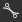
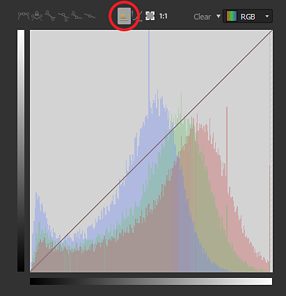

# Curva

<table>
<tr style="border: 0;">
<td width="33.33%" style="border: 0;" valign="top">

{width="200px"}

</td>
<td width="100.00%" style="border: 0;" valign="top">

Remapeia os valores em uma imagem usando uma curva personalizada.

O nó fornece uma interface para o remapeamento de tonalidade de imagem, semelhante a outros aplicativos de edição de imagem 2D. O usuário pode colocar pontos e ajustar curvas de Bézier para remapear a entrada, que pode ser em tons de cinza ou colorida.É especialmente útil quando usado com transições de gradiente para remapeá-los para um perfil de height específico; permite uma modelagem muito precisa de perfis de chanfro e semelhantes.

</td>
</tr>
</table>

Ao contrário da maioria dos outros nós, o nó Curva não tem uma interface padrão típica com controles deslizantes e parâmetros, mas em vez disso apresenta um editor de curva completo. Consulte a seção expansível abaixo sobre como usá-lo.

[No entanto, isso significa que nenhum dos parâmetros de um nó de Curva pode ser exposto a um subgrafo](../../../../compositing-graphs/manage-parameters/exposing-a-parameter/exposing-a-parameter.md). A única opção aqui é usar uma [Chave Múltipla](../../../../compositing-graphs/nodes-reference-for-com/node-library/filters/blending/multi-switch/multi-switch.md) para alternar entre diferentes perfis de curva.

<table>
<tr style="border: 0;">
<td width="100.00%" style="border: 0;" valign="top">

</td>
<td width="83.33%" style="border: 0;" valign="top">

</td>
<td width="100.00%" style="border: 0;" valign="top">

</td>
</tr>
</table>

<table>
<tr style="border: 0;">
<td style="border: 0;" valign="top">

## Parâmetros

### Editor de curva

</td>
<td style="border: 0;" valign="top">

### Conectores de entrada

### Conectores de saída

</td>
<td style="border: 0;" valign="top">

### Exemplos

</td>
</tr>
</table>

## Parâmetros

|  |  |
| --- | --- |
| <b>Aplicar/Expor curva</b> *Booleano* | Permite copiar a curva do usuário para a saída em vez de aplicá-la à imagem de entrada |
| <b>Endereçamento de curva</b> *Booleano* | Esse parâmetro determina como os pixels HDR fora do intervalo [0, 1] na entrada são tratados: apertados ou dobrados até [0, 1]. |
| <b>Curva</b> *Matriz de chaves curvas* | A curva personalizada usada para mapear os valores de tons de cinza de entrada.   Pode ser editado usando o [Editor de curvas](#curve-editor). |

## Editor de curva

### Criar e mover um ponto

Para criar um ponto, basta clicar duas vezes em qualquer lugar na Visualização de curva:

### Controle da influência do ponto

<table>
<tr style="border: 0;">
<td width="100.00%" style="border: 0;" valign="top">

Para obter resultados precisos, os nós curvos oferecem modos diferentes para cada ponto:

</td>
<td width="33.33%" style="border: 0;" valign="top">

</td>
</tr>
</table>

 Redefina o modo de ponto para o valor padrão.

 Bloqueie/desbloqueie os 2 manipuladores de bézier para que o usuário possa movê-los juntos ou independentemente.

 Ambos os lados do ponto são controlados por um manipulador de Bezier.

 O lado direito do ponto é controlado por um manipulador de Bezier enquanto o lado esquerdo permanece plano.

 O lado esquerdo do ponto é controlado por um manipulador de Bezier enquanto o lado direito permanece plano.

 Os lados do ponto permanecem planos

### Mostrar histograma de entrada

Você pode mostrar/ocultar o histograma de sua entrada apenas clicando em 

### Controle de cada canal individualmente (entrada de cores)

<table>
<tr style="border: 0;">
<td width="100.00%" style="border: 0;" valign="top">

Quando a entrada é um nó de cor, você pode ajustar a curva para cada canal:

Basta selecionar a curva que deseja ajustar na lista suspensa localizada na parte superior direita:

</td>
<td width="33.33%" style="border: 0;" valign="top">

</td>
</tr>
</table>

No modo de curva de RGB, você pode ocultar/mostrar as curvas de canais individuais pressionando/despressionando :

### Alinhamento, espelhamento e inversão

<table>
<tr style="border: 0;">
<td width="100.00%" style="border: 0;" valign="top">

Se você clicar com o botão direito do mouse na vista de curva, irá obter mais algumas opções.

<b>Alinhar parte superior:</b> alinhe os pontos selecionados horizontalmente com o mais alto.

<b>Alinhar ao meio:</b> alinhe os pontos selecionados horizontalmente ao height médio da seleção.

<b>Alinhar abaixo:</b> alinhe os pontos selecionados horizontalmente com o mais baixo.

</td>
<td width="50.00%" style="border: 0;" valign="top">

</td>
</tr>
</table>

<b>Distribuir horizontalmente/verticalmente:</b> Distribuir os pontos no eixo selecionado

<b>Virar horizontalmente/verticalmente:</b> vire os pontos selecionados de acordo com o eixo selecionado.

<b>Espelhar horizontalmente/verticalmente:</b> espelha a curva inteira, de acordo com o eixo selecionado

### Atalhos de teclado

<table>
<tr style="border: 0;">
<td style="border: 0;" valign="top">

<b>LMB + arrastar</b>

Desenhe uma caixa de seleção.

</td>
<td style="border: 0;" valign="top">

</td>
</tr>
</table>

<table>
<tr style="border: 0;">
<td style="border: 0;" valign="top">

<b>Shift + arrastar</b>

Restringir o movimento nos eixos X ou Y.

</td>
<td style="border: 0;" valign="top">

</td>
</tr>
</table>

<table>
<tr style="border: 0;">
<td style="border: 0;" valign="top">

<b>Alt + LMB + arrastar</b>

Quebre temporariamente as alças para movê-las de forma independente.

</td>
<td style="border: 0;" valign="top">

</td>
</tr>
</table>

### Ajustar o enquadramento da curva

Ao ajustar os manipuladores, você pode estar no caso em que um manipulador está passando sobre a visualização da curva.

Nesse caso, você pode usar o botão  para ajustar o tamanho ao conteúdo.

O botão  redefine o nível de zoom como 1

## Conectores de entrada

|  |  |
| --- | --- |
| <b>Entrada</b> *Tons de Cinza/Cor* PRIMÁRIO | A imagem a ser processada. |

## Conectores de saída

|  |  |
| --- | --- |
| <b>Saída</b> *Tons de cinza/Cor* |  |

## Exemplos

*Em breve.*
