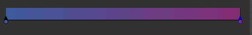
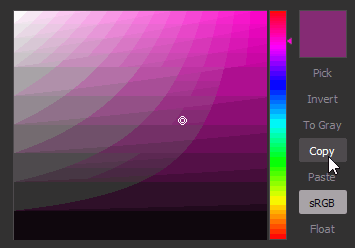

# Mapa de gradiente

<table>
<tr style="border: 0;">
<td width="33.33%" style="border: 0;" valign="top">

{width="200px"}

</td>
<td width="100.00%" style="border: 0;" valign="top">

Remapeia os valores em tons de cinza em uma imagem usando um gradiente personalizado.

Esse nó tem uma finalidade dupla: ele pode ser usado simplesmente como um nó de conversão de <b> </b>tons de cinza em cores, ou para colorir a entrada de tons de cinza, mapeando-a para uma rampa de cores personalizada.

</td>
</tr>
</table>

O nó oferece um editor de degradê avançado e repleto de recursos para mapear várias cores com precisão: acesse a seção [Editor de degradê](#gradient-editor) nesta página para saber mais.

<table>
<tr style="border: 0;">
<td width="100.00%" style="border: 0;" valign="top">

</td>
<td width="83.33%" style="border: 0;" valign="top">

</td>
<td width="100.00%" style="border: 0;" valign="top">

</td>
</tr>
</table>

## Exemplos

## Parâmetros

|  |  |
| --- | --- |
| <b>Modo de cores</b> *Booleano* | Define o modo de saída como Cor ou Tons de Cinza. |
| <b>Endereçamento de gradiente</b> *Booleano* | Define o gradiente para valores de repetição (lado a lado) ou de fixação que estejam fora do intervalo [0, 1]. |
| <b>Gradiente</b> *Matriz de chaves de gradiente* | O gradiente de gradiente personalizado usado para mapear os valores de tons de cinza de entrada.   Pode ser editado no local ou usando o [Editor de gradiente](#gradient-editor). |

## Editor de gradiente

Essa janela oferece controles para editar o gradiente de referência usado pelo nó Mapa de gradientes para mapear valores de tons de cinza para cores.

Ele pode ser aberto a partir das <b>Propriedades</b> do nó Mapa de Degradê das seguintes maneiras:

* Clique no LMB no botão <b>Editor de Degradê</b>;
* Clique duas vezes no LMB em um pino na barra de gradientes. O pino clicado será então selecionado automaticamente no Editor de Degradê para que você possa editar seus valores diretamente.

### Edição dos pinos de gradiente

As cores e suas posições ao longo do gradiente são controladas por pinos colocados ao longo da barra de gradientes.

Cada pino define uma cor em sua posição ao longo do gradiente.

As partes do gradiente antes e depois do primeiro e do último pinos são definidas para as cores desses pinos, respectivamente.

Os seguintes controles estão disponíveis para editar pinos:

<table>
<tr style="border: 0;">
<td style="border: 0;" valign="top">

<b>Adicionar pino</b>

Clique no LMB do gradiente ou logo abaixo para adicionar um pino na posição em que você clicou na barra de gradientes.

O novo pino será definido com a cor do gradiente nessa posição.

</td>
<td style="border: 0;" valign="top">

</td>
</tr>
</table>

<table>
<tr style="border: 0;">
<td style="border: 0;" valign="top">

<b>Mover pino</b>

Segure o LMB e arraste os pinos selecionados ao longo da barra de gradiente para movê-los.

Você também pode definir a posição de um pino com um valor numérico selecionando-o e usando o parâmetro <b>Posição</b>. A posição é um valor no intervalo [0;1] em que 0 é o início do gradiente e 1 é o seu fim.

</td>
<td style="border: 0;" valign="top">

</td>
</tr>
</table>

Quando vários pinos são selecionados, todos eles podem ser movidos *simultaneamente*. Quando um ou mais pinos alcançam e terminam o gradiente à medida que são movidos, dois comportamentos estão disponíveis dependendo do botão do mouse usado para se mover:

* <b>LMB:</b> os pinos permanecem no final, o que significa que serão empilhados nesse local à medida que chegarem e suas posições relativas forem alteradas;
* <b>MMB:</b> pinos fazem loop em volta da outra extremidade do gradiente, o que significa que suas posições relativas permanecem inalteradas.

<table>
<tr style="border: 0;">
<td style="border: 0;" valign="top">

<b>Excluir pino</b>

Selecione os pinos e pressione Excluir ou arraste os pinos para fora da barra de gradientes para excluí-los.

</td>
<td style="border: 0;" valign="top">

</td>
</tr>
</table>

<table>
<tr style="border: 0;">
<td style="border: 0;" valign="top">

<b>Inverter posições</b>

Espelha as posições dos pinos selecionados no gradiente.

</td>
<td style="border: 0;" valign="top">

</td>
</tr>
</table>

<table>
<tr style="border: 0;">
<td style="border: 0;" valign="top">

<b>Limpar tudo</b>

Remove todos os pinos da barra de gradientes.

</td>
<td style="border: 0;" valign="top">

</td>
</tr>
</table>

<b>Inverter cores</b>

Este botão alterna as cores dos pinos selecionados para o negativo.

<b>Remover Saturação</b>

Esse botão remove a saturação das cores definidas nos pinos selecionados.

### Modos de interpolação

Depois que os pinos são configurados, é possível controlar como as cores fazem a transição de um pino para o próximo usando os modos de interpolação disponíveis:

+++Linear
O modo de interpolação padrão: aplica uma interpolação linear simples entre cada pino, para que o gradiente progrida uniformemente.

+++

+++Tangentes planas
Ao pensar na transição entre gradientes como curvas de Bézier em que os pinos são pontos da curva, esse modo define esses pontos como tangentes horizontais.

Isso resulta em uma transição que evoca uma interpolação de passo suave.

Quando este modo é selecionado, o parâmetro <b>Ponto médio</b> é habilitado e permite que você desloque a posição horizontal do ponto médio vertical da curva entre os pontos. Isso efetivamente dá uma dica da escala entre as tangentes “out” e “in”.

+++

+++Suavização
Aplica suavização à curva de interpolação entre cada ponto.

Quando esse modo é selecionado, o parâmetro <b>Smoothness</b> é habilitado e permite ajustar a intensidade da suavização, onde o valor 0 é igual ao modo de interpolação <b>Linear</b>.

+++

+++Sem interpolação
A cor muda apenas no local de um pino e permanece constante até o próximo pino na barra de gradientes.

Isso resulta em etapas rígidas entre as cores, e apenas as cores definidas pelos pinos estão presentes no gradiente.

+++

### seletor de cores

O Seletor de cores permite definir uma cor de várias maneiras:

* <b>Barra de matiz e gradiente</b>

  <table>
  <tr style="border: 0;">
  <td style="border: 0;" valign="top">

  Ajuste as posições do cursor no gradiente e do entalhe na barra de matiz para definir uma cor.

  </td>
  <td style="border: 0;" valign="top">

  

  </td>
  </tr>
  </table>

* <b>Controles deslizantes de RGB, HSV e Alpha</b>

  <table>
  <tr style="border: 0;">
  <td width="100.00%" style="border: 0;" valign="top">

  Os controles deslizantes RGB, HSV e Alpha permitem definir uma cor com precisão, ajustando os controles deslizantes ou definindo diretamente seus valores numéricos.

  Como alternativa, use um hexcode no campo de entrada dedicado abaixo dos controles deslizantes.

  </td>
  <td width="33.33%" style="border: 0;" valign="top">

  

  </td>
  </tr>
  </table>

* <b>Selecionar na tela</b>

  <table>
  <tr style="border: 0;">
  <td style="border: 0;" valign="top">

  Use o botão <b>Escolher</b> e clique em LMB em qualquer lugar da tela para obter uma amostra da cor nesse local.

  </td>
  <td style="border: 0;" valign="top">

  

  </td>
  </tr>
  </table>

<table>
<tr style="border: 0;">
<td width="100.00%" style="border: 0;" valign="top">

A cor selecionada será visualizada na metade superior da miniatura de cor.\
A metade inferior exibe a cor usada anteriormente. Clique duas vezes no LMB para reverter a cor ajustada para ele.

</td>
<td width="16.67%" style="border: 0;" valign="top">

</td>
</tr>
</table>

Quando vários pinos são selecionados, os controles deslizantes de RGB, HSV e Alpha se transformam em controles deslizantes de delta (Δ), o que significa que eles são usados para compensar o valor de cada pino pela mesma quantidade.

<table>
<tr style="border: 0;">
<td width="100.00%" style="border: 0;" valign="top">

Além disso, os seguintes recursos estão disponíveis abaixo da miniatura de cor como botões:

<b>Inverter:</b> alterna a cor para o negativo;

<b>Para cinza:</b> reduz a saturação da cor;

<b>Copiar </b>*:* copia a cor atualmente selecionada para a área de transferência;

<b>Colar:</b> alterne para a cor atual na área de transferência;

<b>sRGB</b>: use o espaço de cores sRGB para exibir cores. Quando desativada, o espaço de cor linear é usado;

<b>Flutuante:</b> exibe os valores de RGB, HSV e Alpha no controle deslizante de ponto flutuante.

</td>
<td width="25.00%" style="border: 0;" valign="top">

</td>
</tr>
</table>

### Conta-gotas de gradiente

O Conta-gotas de gradiente é um dos recursos mais úteis que esse nó oferece, pois você pode criar gradientes complexos apenas desenhando uma linha em uma imagem de referência.

O controle deslizante <b>Precisão</b> ajudará você a ajustar o gradiente recém-criado aumentando ou diminuindo o número de teclas: quanto mais baixos forem os valores, mais preciso será o gradiente que corresponderá aos valores escolhidos.

## Conectores de entrada

|  |  |
| --- | --- |
| <b>Entrada</b> *Tons de cinza* PRIMÁRIO | A imagem em tons de cinza a ser processada. |

## Conectores de saída

|  |  |
| --- | --- |
| <b>Saída</b> *Tons de cinza* |  |

## Exemplos

*Em breve.*
