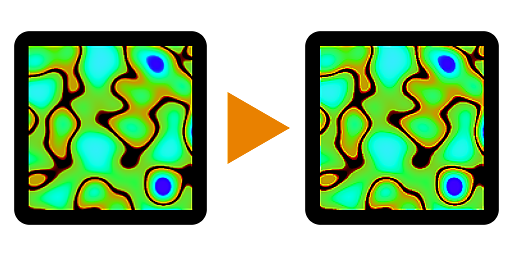

# Nitidez

<table>
<tr style="border: 0;">
<td width="33.33%" style="border: 0;" valign="top">

<b>Entrada:</b> Nós Atômicos

</td>
<td width="100.00%" style="border: 0;" valign="top">

## Descrição

O Nó de nitidez executa uma operação de nitidez em uma entrada. É um nó útil para aplicar aquele toque final de nitidez a uma imagem.

</td>
</tr>
</table>

É matematicamente muito semelhante à Máscara de nitidez da Photoshop, apesar do nome ser diferente. Funciona bem para coisas como um mapa de Basecolor, mas deve ser evitado em mapas como Mapas normais e mapas metálicos.

## Entradas

<b>Entrada</b> *Cores/Tons de Cinza* (Primário)\
A imagem que deve ter a nitidez ajustada.

## Parâmetros

<b>Intensidade</b> *Precisão decimal*\
Define a intensidade do efeito de nitidez.

<b>Alpha de perfuração</b> *Booleano* (Disponível quando uma imagem colorida está conectada à <b>Entrada</b>)\
Determina se o canal alfa da imagem deve ter a nitidez ajustada ou permanecer intacto.

## Exemplos

