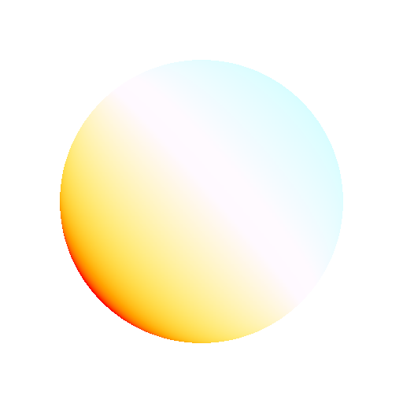

# Color temperature adjustment

<table>
<tr style="border: 0;">
<td width="33.33%" style="border: 0;" valign="top">

{width="250px"}

<b>Entrada:</b> Visualização 3D > Ferramenta HDRI

</td>
<td width="100.00%" style="border: 0;" valign="top">

## Descrição

Ajusta o equilíbrio de cores da imagem de entrada. Semelhante ao ajuste de Equilíbrio de branco na fotografia. Pode ser usado para aquecer ou esfriar imagens HDR que são off-key.

</td>
</tr>
</table>

## Parâmetros

|  |  |
|:---|:---|
| Temperatura <b>1</b> <i>-1.0 - 1.0</i> | Mude as cores entre quente e frio. |
| <b>Magenta-Verde</b> <i>-1.0 - 1.0</i> | Alterne o tom entre magenta e verde. |
| <b>Espaço de cores</b> <i>HDR (linear), LDR (sRGB)</i> | Determine como o espaço de cores da imagem de entrada é interpretado. |

## Exemplos

<table style="margin-top: 32px; margin-bottom: 32px">
    <tr style="border: 0">
        <td style="border: 0; background: transparent">
            
        </td>
    </tr>
</table>
