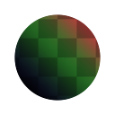

# Misturador de canais

<table>
<tr style="border: 0;">
<td width="33.33%" style="border: 0;" valign="top">

{width="128px"}

<b>Entrada:</b> Filtros > Ajustes

</td>
<td width="100.00%" style="border: 0;" valign="top">

## Descrição

Permite misturar, trocar e mesclar canais de RGB. Pode ser usado para mexer nos canais, fazer conversões em tons de cinza mais precisas e diferentes tipos de embalagem.

</td>
</tr>
</table>

## Parâmetros

|  |  |
|:---|:---|
| <b>Canal Vermelho</b> <i>-200.0 - 200.0</i> | Determina quanto dos canais de RGB de entrada entram no canal vermelho de saída. |
| <b>Canal Verde</b> <i>-200.0 - 200.0</i> | Determina quanto dos canais de RGB de entrada entram no canal verde de saída. |
| <b>Canal Azul</b> <i>-200.0 - 200.0</i> | Determina quanto dos canais de RGB de entrada entram no canal azul de saída. |
| <b>Monocromático</b> <i>Falso/Verdadeiro</i> | Saída para monocromático. Permite uma conversão de tons de cinza mais precisa. |

## Exemplos

<table style="margin-top: 32px; margin-bottom: 32px">
    <tr style="border: 0">
        <td style="border: 0; background: transparent">
            
        </td>
    </tr>
</table>
