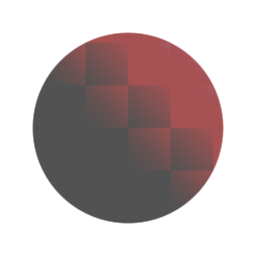

# Grampo

<table>
<tr style="border: 0;">
<td width="33.33%" style="border: 0;" valign="top">

{width="128px"}

{width="128px"}

<b>Entrada:</b> Filtros > Ajustes

</td>
<td width="100.00%" style="border: 0;" valign="top">

## Descrição

Restringe valores de entrada em limites definidos.

</td>
</tr>
</table>

## Parâmetros

|  |  |
|:---|:---|
| <b>Mín</b> <i>0.0 - 1.0</i> | Limite inferior da braçadeira. |
| <b>Máx</b> <i>0.0 - 1.0</i> | Limite superior da braçadeira. |
| <b>Aplicar ao Alpha</b> <i>Falso/Verdadeiro</i> (somente versão de cores) | Escolha se a fixação também será aplicada ao alfa. |

## Exemplos

<table style="margin-top: 32px; margin-bottom: 32px">
    <tr style="border: 0">
        <td style="border: 0; background: transparent">
            
        </td>
    </tr>
</table>
