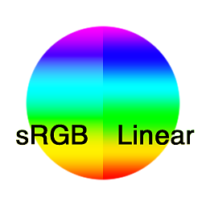

# Converter em linear

<table>
<tr style="border: 0;">
<td style="border: 0;" valign="top">

{width="128px"}

{width="128px"}

## Converter em linear (tons de cinza)

**Entrada:** *Filtros/Ajustes*

**Simples**

</td>
<td style="border: 0;" valign="top">

## Descrição

Converte uma imagem de espaço de cores sRGB em linear. Útil ao converter material de origem da foto, por exemplo.

## Parâmetros

*Nenhum parâmetro.*

## Imagens de exemplo

|  |
| --- |
| Não há imagens anexadas a esta página. |

</td>
</tr>
</table>
