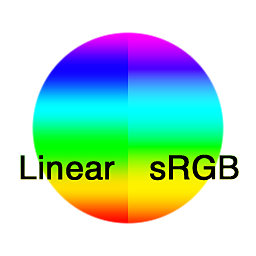

# Converter em sRGB

<table>
<tr style="border: 0;">
<td width="33.33%" style="border: 0;" valign="top">

{width="128px"}

{width="128px"}

<b>Entrada:</b> Filtros > Ajustes

</td>
<td width="100.00%" style="border: 0;" valign="top">

## Descrição

Converte uma entrada Linear em um espaço de cores sRGB. Útil ao trabalhar e converter com material de referência de foto, por exemplo.

</td>
</tr>
</table>
