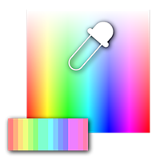

# Criar paleta de cores (16)

<table>
<tr style="border: 0;">
<td width="33.33%" style="border: 0;" valign="top">

{width="200px"}

<b>Entrada:</b> Filtros > Ajustes

</td>
<td width="100.00%" style="border: 0;" valign="top">

## Descrição

Cria uma lista ordenada de cores e a gera como uma paleta com um máximo de 16 cores.

O nó pode acrescentar novas cores a uma paleta existente, usando o conjunto de entradas da “Paleta”.

Este nó pode ser usado em combinação com os seguintes nós: [Quantificar cor](../../../../../../compositing-graphs/nodes-reference-for-com/node-library/filters/adjustments/quantize-color/quantize-color.md), [Aplicar paleta de cores](../../../../../../compositing-graphs/nodes-reference-for-com/node-library/filters/adjustments/apply-color-palette/apply-color-palette.md), [Modificar paleta de cores](../../../../../../compositing-graphs/nodes-reference-for-com/node-library/filters/adjustments/modify-color-palette/modify-color-palette.md), [Exibir paleta de cores](../../../../../../compositing-graphs/nodes-reference-for-com/node-library/filters/adjustments/view-color-palette/view-color-palette.md).

</td>
</tr>
</table>

## Entradas

|  |  |
|:---|:---|
| <b>Paleta</b> <i>Cor</i> PRIMÁRIA | Uma lista ordenada de cores de RGB codificadas como uma linha de pixels. A paleta pode conter no máximo 256 cores.   Essa entrada é opcional. Se usadas, as cores configuradas pelo nó serão anexadas a esta paleta.   A paleta pode ser visualizada com o nó [Exibir paleta de cores](../../../../../../compositing-graphs/nodes-reference-for-com/node-library/filters/adjustments/view-color-palette/view-color-palette.md). |
| <b>Quantidade de cores da paleta</b> <i>Inteiro</i> | A quantidade de cores armazenadas na paleta.   Se esse número não corresponder à quantidade real de cores na entrada da imagem da “Paleta”, a visualização poderá estar incompleta ou ter mais slots em branco do que o absolutamente necessário. |

## Saídas

|  |  |
|:---|:---|
| <b>Paleta</b> <i>Cor</i> | A paleta atualizada com as cores especificadas anexadas a ela. |
| <b>Quantidade de cores da paleta</b> <i>Inteiro</i> | A quantidade atualizada de cores armazenadas na paleta, com a quantidade especificada de cores adicionadas a ela. |

## Parâmetros

|  |  |
|:---|:---|
| <b>Quantidade de cores</b> *Inteiro* | A quantidade de cores que devem ser adicionadas à paleta. |
| <b>Cor #</b> *Precisão decimal 3* *Quantos parâmetros estão disponíveis como o valor &#39;Quantidade de cores&#39;* | Uma cor que deve ser adicionada à paleta.   As cores são adicionadas à paleta na mesma ordem da lista numerada. |

## Exemplos

<table>
<tr style="border: 0;">
<td style="border: 0;" valign="top">

{zoomable="yes"}

</td>
<td style="border: 0;" valign="top">

{zoomable="yes"}

</td>
</tr>
</table>

{zoomable="yes"}
