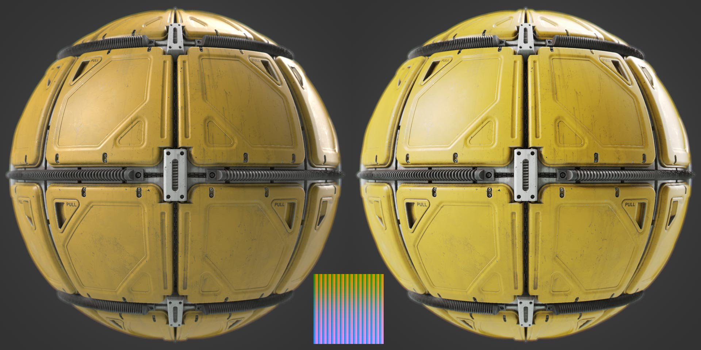

# Hald CLUT

<table>
<tr style="border: 0;">
<td width="33.33%" style="border: 0;" valign="top">

{width="128px"}

<b>Entrada:</b> Filtros > Ajustes

</td>
<td width="100.00%" style="border: 0;" valign="top">

## Descrição

Aplica uma LUT na imagem de entrada. A LUT deve estar no formato Hald na resolução 4096\*4096. Consulte <http://www.quelsolaar.com/technology/clut.html> para obter mais informações.

</td>
</tr>
</table>

## Entradas

|  |  |
|:---|:---|
| <b>entrada</b> <i>Entrada de cores</i> | Imagem na qual aplicar o LUT. |
| <b>lut</b> <i>Entrada de cores</i> | Slot de entrada Lut. Deve ser de 4096 x 4096. |

## Parâmetros

|  |  |
|:---|:---|
| <b>Intensidade LUT por Alpha</b> <i>Falso/Verdadeiro</i> | Define se o efeito LUT é ponderado pelo canal alfa. |

## Exemplos

<table style="margin-top: 32px; margin-bottom: 32px">
    <tr style="border: 0">
        <td style="border: 0; background: transparent">
            
        </td>
    </tr>
</table>
