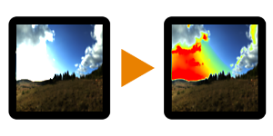

# Visualizador de intervalo HDR

<table>
<tr style="border: 0;">
<td width="33.33%" style="border: 0;" valign="top">

{width="128px"}

{width="128px"}

<b>Entrada:</b> Filtros > Ajustes

</td>
<td width="100.00%" style="border: 0;" valign="top">

## Descrição

Ferramenta de depuração para verificar áreas exatas com Intervalo dinâmico. As versões Cor e Tons de cinza existem.

</td>
</tr>
</table>

## Parâmetros

|  |  |
|:---|:---|
| <b>Intervalo Mínimo</b> <i>-2.0 - 0.0</i> | Intervalo mínimo para iniciar o realce. |
| <b>Intervalo Máximo</b> <i>1.0 - 3.0</i> | Intervalo máximo para realçar até. |

## Exemplos

<table style="margin-top: 32px; margin-bottom: 32px">
    <tr style="border: 0">
        <td style="border: 0; background: transparent">
            
        </td>
    </tr>
</table>
