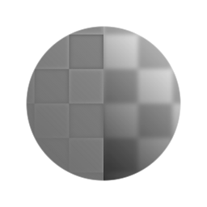

# Mapeador de frequências do mapa de altura

<table>
<tr style="border: 0;">
<td width="33.33%" style="border: 0;" valign="top">

{width="128px"}

<b>Entrada:</b> Filtros > Ajustes

</td>
<td width="100.00%" style="border: 0;" valign="top">

## Descrição

Separa as frequências de um mapa de altura em dois mapas separados: um com diferenças de grande escala e outro com diferenças de pequena escala.

</td>
</tr>
</table>

## Parâmetros

|  |  |
|:---|:---|
| <b>Relevo</b> <i>0.0 - 32.0</i> | Controla o tamanho dos detalhes da saída do Deslocamento. |

## Exemplos

<table style="margin-top: 32px; margin-bottom: 32px">
    <tr style="border: 0">
        <td style="border: 0; background: transparent">
            
        </td>
    </tr>
</table>
