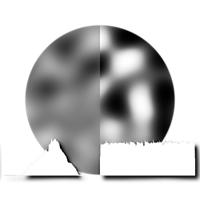
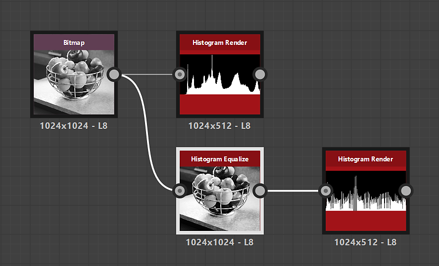

# Histograma equalizado

<table>
<tr style="border: 0;">
<td width="33.33%" style="border: 0;" valign="top">

{width="200px"}

<b>Entrada:</b> Filtros > Ajustes

</td>
<td width="100.00%" style="border: 0;" valign="top">

## Descrição

Equaliza o histograma para uma imagem em tons de cinza, ajustando efetivamente os valores da escala de cinza com o objetivo de obter uma distribuição igual.

</td>
</tr>
</table>

## Entradas

|  |  |
|:---|:---|
| <b>Entrada</b> <i>Tons de cinza</i> PRIMÁRIO | A imagem para a qual o histograma deve ser equalizado. |

## Saídas

|  |  |
|:---|:---|
| <b>Saída</b> <i>Tons de cinza</i> | A imagem resultante com a equalização do histograma aplicada. |

## Parâmetros

|  |  |
|:---|:---|
| <b>Resolução do histograma</b> *Inteiro* | A largura do histograma. Um valor mais alto permite uma melhor distribuição de valores.   As resoluções disponíveis são, em pixels: 256, 512, 1024, 2048, 4096 |
| <b>Suavização do histograma</b> *Flutuante* | O histograma pode ser suavizado redistribuindo os valores em tons de cinza da imagem para equalizar a *diferença* entre cada valor.   Esse parâmetro ajusta a intensidade dessa suavização. |

## Exemplos

<table>
  <tr>
    <td>
      
       <i>Antes</i>
    </td>
    <td>
      
       <i>Depois</i>
    </td>
  </tr>
</table>

{zoomable="yes"}

<table>
  <tr>
    <td>
      
       <i>Antes</i>
    </td>
    <td>
      
       <i>Depois</i>
    </td>
  </tr>
</table>

{zoomable="yes"}

<table>
  <tr>
    <td>
      
       <i>Antes</i>
    </td>
    <td>
      
       <i>Depois</i>
    </td>
  </tr>
</table>

{zoomable="yes"}
