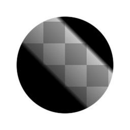

# Intervalo do histograma

<table>
<tr style="border: 0;">
<td style="border: 0;" valign="top">

{width="128px"}

## Intervalo do histograma

**Entrada:** *Filtros/Ajustes*

**Simples**

</td>
<td style="border: 0;" valign="top">

## Descrição

Reduza e/ou mova o intervalo de uma entrada em tons de cinza. Pode ser usado para remapear transições, semelhantes à [Luminosidade de contraste](../../../../../../compositing-graphs/nodes-reference-for-com/node-library/filters/adjustments/contrast-luminosity/contrast-luminosity.md), mas com diferentes controles que podem fazer mais sentido em algumas situações.\
Consulte também [Verificação de histograma](../../../../../../compositing-graphs/nodes-reference-for-com/node-library/filters/adjustments/histogram-scan/histogram-scan.md) para obter outra maneira mais útil de remapear o intervalo.

[Clique aqui para assistir a um vídeo do Substance Academy sobre a gama de histogramas.](https://www.youtube.com/watch?v=p9wcmJBFyGA&t=517s)

## Parâmetros

* **Intervalo**: *0.0 - 1.0* De quanto deve ser reduzido o intervalo. Isso é semelhante a mover os controles deslizantes Níveis mínimo e Máximo para dentro.
* **Posição**: *0.0 - 1.0* Deslocamento para a redução de intervalo, definindo um ponto médio diferente para a redução de intervalo.

## Imagens de exemplo

</td>
</tr>
</table>
