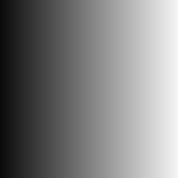

# Varredura de histograma

<table>
<tr style="border: 0;">
<td width="33.33%" style="border: 0;" valign="top">

{width="128px"}

<b>Entrada:</b> Filtros > Ajustes

</td>
<td width="100.00%" style="border: 0;" valign="top">

## Descrição

Nó muito simples, mas útil, que fornece uma maneira intuitiva de remapear o contraste e o brilho das imagens em tons de cinza de entrada. Pode ser usado para “aumentar” e “encolher” máscaras de maneiras dinâmicas.

[Clique aqui para assistir a um vídeo do Substance Academy sobre operações do histograma.](https://www.youtube.com/watch?v=p9wcmJBFyGA&t=427s)

</td>
</tr>
</table>

## Parâmetros

|  |  |
|:---|:---|
| <b>Posição</b> <i>0.0 - 1.0</i> | Semelhante a um controle de brilho, muda o ponto médio do resultado. Quando usado em uma entrada de gradiente, expande e encolhe o ponto de transição.  Importante: um valor padrão de 0 significa que o resultado final está sempre preto; portanto, tente começar com 0,5! |
| <b>Contraste</b> <i>0.0 - 1.0</i> | Ajusta o contraste do resultado. Pode ser usado para definir a rigidez da transição. |
| <b>Inverter Posição</b> <i>Falso/Verdadeiro</i> | Inverte o resultado final. |

## Exemplos

<table style="margin-top: 32px; margin-bottom: 32px">
    <tr style="border: 0">
        <td style="border: 0; background: transparent">
            
        </td>
        <td style="border: 0; background: transparent">
            
        </td>
        <td style="border: 0; background: transparent">
            
        </td>
    </tr>
</table>
