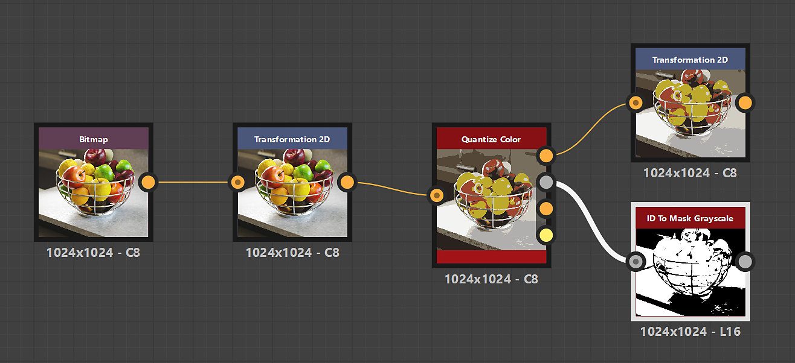

# ID para mascarar tons de cinza

<table>
<tr style="border: 0;">
<td width="33.33%" style="border: 0;" valign="top">

{width="200px"}

<b>Entrada:</b> Filtros > Ajustes

</td>
<td width="100.00%" style="border: 0;" valign="top">

## Descrição

Cria uma máscara a partir de um mapa de ID em que os pixels com os valores de pixel selecionados são brancos.

Um mapa de ID é uma imagem na qual os pixels que fazem parte de um todo (por exemplo, uma forma) têm o mesmo valor de identificação exclusivo. Nesse caso, o valor é um inteiro.

</td>
</tr>
</table>

## Entradas

|  |  |
|:---|:---|
| <b>ID</b> <i>Tons de cinza</i> PRIMÁRIO | O mapa de ID de entrada do qual uma máscara deve ser extraída. |

## Saídas

|  |  |
|:---|:---|
| <b>Saída</b> <i>Tons de cinza</i> | A máscara binária extraída do mapa de ID de entrada. |

## Parâmetros

|  |  |
|:---|:---|
| <b>Modo de seleção</b> *Inteiro* | O método de selecionar os valores de pixel no mapa de ID que devem ser brancos na máscara:<ul data-preserve-html="true"> <li data-preserve-html="true"><b>Isolar:</b> selecione um único valor de pixel</li> <li data-preserve-html="true"><b>Intervalo:</b> selecione um intervalo de valores de pixel</li> </ul> |
| <b>Inteiro de ID</b> *Inteiro* *Disponível quando o &#39;Modo de seleção&#39; está definido como &#39;Individual&#39;* | O valor de pixel no mapa de ID que deve ser branco na máscara de saída. |
| <b>Intervalo de ID</b> *Inteiro2* *Disponível quando o &#39;Modo de seleção&#39; está definido como &#39;Intervalo&#39;* | O intervalo de valores de pixel no mapa de ID, do início ao fim, que deve ser branco na máscara de saída. |

## Exemplos

<table>
  <tr>
    <td>
      
       <i>Antes</i>
    </td>
    <td>
      
       <i>Depois</i>
    </td>
  </tr>
</table>

<table>
<tr style="border: 0;">
<td style="border: 0;" valign="top">

{zoomable="yes"}

</td>
<td style="border: 0;" valign="top">

{zoomable="yes"}

</td>
</tr>
</table>
