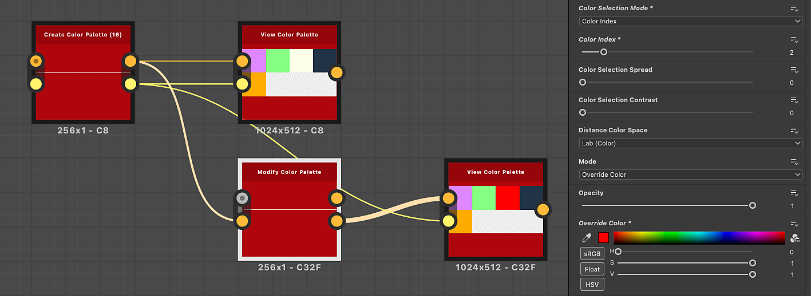

# Modificar paleta de cores

<table>
<tr style="border: 0;">
<td width="33.33%" style="border: 0;" valign="top">

{width="200px"}

<b>Entrada:</b> Filtros > Ajustes

</td>
<td width="100.00%" style="border: 0;" valign="top">

## Descrição

Modifica as cores em uma paleta ordenada e as aplica a uma imagem usando um mapa de ID.

As cores podem ser selecionadas fazendo a correspondência entre os índices no mapa de ID e os índices de cores da paleta.

Por exemplo, a cor #2 na paleta será aplicada a todos os pixels no mapa de ID com um valor de ID igual a 2.

Este nó pode ser usado em combinação com os seguintes nós: [Quantificar cor](../../../../../../compositing-graphs/nodes-reference-for-com/node-library/filters/adjustments/quantize-color/quantize-color.md), [Criar paleta de cores](../../../../../../compositing-graphs/nodes-reference-for-com/node-library/filters/adjustments/create-color-palette-16/create-color-palette-16.md), [Aplicar paleta de cores](../../../../../../compositing-graphs/nodes-reference-for-com/node-library/filters/adjustments/apply-color-palette/apply-color-palette.md), [Exibir paleta de cores](../../../../../../compositing-graphs/nodes-reference-for-com/node-library/filters/adjustments/view-color-palette/view-color-palette.md).

</td>
</tr>
</table>

## Entradas

|  |  |
|:---|:---|
| <b>ID</b> <i>Tons de cinza</i> PRIMÁRIO | O mapa de IDs de entrada usado para selecionar cores, para modificá-las e distribuí-las na saída.   Um mapa de ID é uma imagem na qual os pixels que fazem parte de um todo (por exemplo, uma forma) têm o mesmo valor de identificação exclusivo. Nesse caso, o valor é um inteiro.   Um mapa de ID pode ser produzido usando um nó [Quantizar Cor](../../../../../../compositing-graphs/nodes-reference-for-com/node-library/filters/adjustments/quantize-color/quantize-color.md). |
| <b>Paleta</b> <i>Cor</i> | Uma lista ordenada de cores de RGB codificadas como uma linha de pixels. A paleta pode conter no máximo 256 cores. Esta é a paleta que o nó modifica.   As paletas podem ser produzidas com os nós [Quantizar cor](../../../../../../compositing-graphs/nodes-reference-for-com/node-library/filters/adjustments/quantize-color/quantize-color.md) ou [Criar paleta de cores](../../../../../../compositing-graphs/nodes-reference-for-com/node-library/filters/adjustments/create-color-palette-16/create-color-palette-16.md). |

## Saídas

|  |  |
|:---|:---|
| <b>Saída</b> <i>Cor</i> | Resultado do mapeamento das cores da paleta modificada para os índices do mapa de ID. |
| <b>Paleta</b> <i>Cor</i> | A paleta atualizada com as modificações de cor especificadas aplicadas.   A paleta pode ser aplicada a outra imagem com o nó [Aplicar paleta de cores](../../../../../../compositing-graphs/nodes-reference-for-com/node-library/filters/adjustments/apply-color-palette/apply-color-palette.md) ou visualizada com o nó [Exibir paleta de cores](../../../../../../compositing-graphs/nodes-reference-for-com/node-library/filters/adjustments/view-color-palette/view-color-palette.md). |

## Parâmetros

|  |  |
|:---|:---|
| <b>Modo de seleção de cores</b> *Inteiro* | O método de seleção da cor de destino na paleta que deve ser modificada:<ul data-preserve-html="true"> <li data-preserve-html="true"><b>Índice de cores:</b> o índice da cor de destino</li> <li data-preserve-html="true"><b>Espaço da imagem:</b> a posição no mapa de ID onde o índice deve ser amostrado. Quando este modo é selecionado, um gizmo de posição fica disponível na Visualização 2D para facilitar a seleção</li> </ul> |
| <b>Posição da cor</b> *Precisão decimal 2* *Disponível quando o &#39;Modo de seleção de cores&#39; estiver definido como &#39;Espaço de imagem&#39;* | A posição no mapa de ID em que o índice deve ser amostrado.   Use o gizmo na Visualização 2D para selecionar facilmente um local na imagem.   Dica: você pode exibir a imagem quantizada da qual o mapa de ID é extraído e, em seguida, selecionar o nó Modificar paleta de cores para exibir o cursor. Isso torna a seleção de uma cor mais intuitiva para modificar. |
| <b>Índice de cores</b> *Inteiro* *Disponível quando o &#39;Modo de seleção de cores&#39; está definido como &#39;Índice de cores&#39;* | O índice da cor de destino.   As cores na paleta são ordenadas da esquerda para a direita, e o índice da primeira cor é 0. |
| <b>Propagação de seleção de cores</b> *Precisão decimal* | Controla a distância em que a seleção alcança as cores vizinhas.   As cores são organizadas em um *cubo*, cuja largura, height e profundidade são um gradiente em que cada componente de uma cor aumenta de 0 a 1 (por exemplo, vermelho, verde e azul em RGB).   Esse parâmetro ajusta a distância em torno da cor selecionada no cubo em que outras cores também podem ser modificadas, onde 1 é a largura total do cubo. |
| <b>Contraste da seleção de cores</b> *Precisão decimal* | Controla o gradiente de declínio da seleção em relação às cores vizinhas.   As cores são organizadas em um *cubo*, cuja largura, height e profundidade são um gradiente em que um componente de uma cor aumenta de 0 a 1 (por exemplo, vermelho, verde e azul em RGB).   Esse parâmetro ajusta a queda da seleção sobre outras cores no cubo em torno da cor selecionada, onde 0 é um gradiente suave da cor selecionada para a mais distante e 1 é um corte de totalmente incluído para não incluído. |
| <b>Espaço de cores à distância</b> *Inteiro* | As cores são organizadas em um *cubo*, cuja largura, height e profundidade são um gradiente em que um componente de uma cor aumenta de 0 a 1 (por exemplo, vermelho, verde e azul em RGB).   Esse parâmetro permite selecionar o espaço de cor usado para distribuir as cores no cubo, que altera as cores vizinhas.   Você pode selecionar o espaço de cores que se ajusta ao seu caso de uso:<ul data-preserve-html="true"> <li data-preserve-html="true"><b>Lab (Cor):</b> um espaço de cores perceptual padronizado, que distribui cores de forma que as cores que &#39;parecem&#39; próximas estejam realmente próximas no cubo. Isso é adequado para imagens que podem ser visualizadas em telas.</li> <li data-preserve-html="true"><b>RGB (Dados):</b> a cor é dividida em Vermelho, Verde e Azul e distribuída ao longo desses eixos, sem considerar a percepção humana. Isso é adequado para imagens que contêm dados brutos, como mapas normais.</li> </ul> |
| <b>Modo</b> *Inteiro* | O método de modificação da cor de destino:<ul data-preserve-html="true"> <li data-preserve-html="true"><b>Substituir cor:</b> substitua a cor por outra</li> <li data-preserve-html="true"><b>HSL:</b> ajuste a cor usando os deslocamentos de matiz, saturação e luminosidade</li> </ul> |
| <b>Opacidade</b> *Precisão decimal* | Controla a interpolação entre as cores originais e modificadas, onde 1 significa que a cor modificada substitui totalmente a cor original. |
| <b>Substituir cor</b> *Precisão decimal 3* *Disponível quando o &#39;Modo&#39; estiver definido como &#39;Substituir cor&#39;* | Especifica a cor que deve substituir a cor original. |
| <b>HSL</b> *Precisão decimal 3* *Disponível quando o &#39;Modo&#39; estiver definido como &#39;HSL&#39;* | Controla os deslocamentos de matiz, saturação e luminosidade aplicados à cor original. |

## Exemplos

{zoomable="yes"}

{zoomable="yes"}

<table>
  <tr>
    <td>
      
       <i>Antes</i>
    </td>
    <td>
      
       <i>Depois</i>
    </td>
  </tr>
</table>
