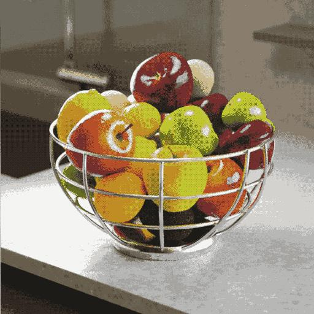

# Quantificar cor

<table>
<tr style="border: 0;">
<td width="33.33%" style="border: 0;" valign="top">

{width="200px"}

<b>Entrada:</b> Filtros > Ajustes

</td>
<td width="100.00%" style="border: 0;" valign="top">

## Descrição

Reduz a quantidade de cores em uma imagem colorida, nivelando efetivamente os gradientes.

Além da imagem processada, o nó também extrai o seguinte:

* Uma <b>paleta</b> das cores restantes, que pode ser usada para colorir outras imagens
* Um <b>mapa de ID</b> das áreas quantizadas, que pode ser usado para recolorir a imagem processada usando uma paleta diferente
* O <b>valor</b> das cores restantes como um valor inteiro bruto

</td>
</tr>
</table>

Se o parâmetro “Ignorar alfa” estiver definido como “Falso”, o canal alfa da imagem original será usado para selecionar as áreas da imagem das quais as cores devem ser extraídas para o processo de quantificação, enquanto as cores em áreas transparentes são ignoradas.

Isso fornece algum controle sobre as cores extraídas.

Este nó pode ser usado em combinação com os seguintes nós: [Criar paleta de cores](../../../../../../compositing-graphs/nodes-reference-for-com/node-library/filters/adjustments/create-color-palette-16/create-color-palette-16.md), [Aplicar paleta de cores](../../../../../../compositing-graphs/nodes-reference-for-com/node-library/filters/adjustments/apply-color-palette/apply-color-palette.md), [Modificar paleta de cores](../../../../../../compositing-graphs/nodes-reference-for-com/node-library/filters/adjustments/modify-color-palette/modify-color-palette.md), [Exibir paleta de cores](../../../../../../compositing-graphs/nodes-reference-for-com/node-library/filters/adjustments/view-color-palette/view-color-palette.md).

<table>
<tr style="border: 0;">
<td style="border: 0;" valign="top">

</td>
<td style="border: 0;" valign="top">

### Conectores de saída

</td>
<td style="border: 0;" valign="top">

### Parâmetros

</td>
</tr>
</table>

## Conectores de entrada

|  |  |
| --- | --- |
| <b>Entrada</b> *Cor* PRIMÁRIA | A imagem colorida que deve ser quantizada. |

## Conectores de saída

|  |  |
| --- | --- |
| <b>Saída</b> *Cor* | A imagem colorida quantizada. |
| <b>ID</b> *Tons de cinza* | Um mapa onde cada cor quantizada recebe um identificador de número inteiro exclusivo.   Isso pode ser usado para:<ul data-preserve-html="true"> <li data-preserve-html="true"><b>Extraia uma máscara</b> de algumas áreas quantizadas com o nó [ID para máscara](../../../../../../compositing-graphs/nodes-reference-for-com/node-library/filters/adjustments/id-to-mask/id-to-mask.md)</li> <li data-preserve-html="true"><b>Recolorir</b> a imagem quantificada com os nós [Aplicar paleta de cores](../../../../../../compositing-graphs/nodes-reference-for-com/node-library/filters/adjustments/apply-color-palette/apply-color-palette.md) ou [Modificar paleta de cores](../../../../../../compositing-graphs/nodes-reference-for-com/node-library/filters/adjustments/modify-color-palette/modify-color-palette.md)</li> </ul> |
| <b>Paleta</b> *Cor* | A paleta extraída da imagem, mantendo as cores restantes após a quantização.   A imagem é uma lista ordenada de cores de RGB codificadas como uma linha de pixels e pode conter um máximo de 256 cores.   A paleta pode ser visualizada com o nó [Exibir paleta de cores](../../../../../../compositing-graphs/nodes-reference-for-com/node-library/filters/adjustments/view-color-palette/view-color-palette.md). |
| <b>Valor de cores da paleta</b> *Inteiro* | A quantidade de cores armazenadas na paleta. |

## Parâmetros

|  |  |
| --- | --- |
| <b>Máx. quantidade de cores</b> *Inteiro* | A quantidade máxima de cores que deve ser usada na imagem quantizada.   Esse valor é o mesmo usado na Paleta extraída da imagem.   “Máximo” significa que este montante pode não ser respeitado devido à técnica de quantificação utilizada. Verifique a saída da “Quantidade de cores da paleta” para a quantidade real de cores extraídas. |
| <b>Suavização do contorno</b> *Flutuante* | Controla o raio de um efeito de suavização aplicado à imagem de entrada, usado para simplificar a imagem quantificada em formas mais sólidas e coesas.   Observação: Essa suavização requer cálculos intensos, aumentando esse valor visivelmente o tempo de computação do nó. |
| <b>Pontilhamento</b> *Flutuante* | Aplica um padrão de pontilhamento para recriar os gradientes e misturas de cores na imagem original, ainda usando apenas as cores restantes após a quantização.   Certifique-se de usar um valor de “Suavização do contorno” igual a 0 para produzir o efeito de pontilhamento esperado. |
| <b>Padrão de pontilhamento</b> *Inteiro* | O padrão de pontilhamento usado para recriar os gradientes e misturas de cores na imagem original:<ul data-preserve-html="true"> <li data-preserve-html="true">Ruído de azul</li> <li data-preserve-html="true">Bayer</li> </ul> |
| <b>Ignorar alfa</b> *Booleano* | Por padrão, o canal alfa da imagem original é usado para selecionar as áreas da imagem das quais as cores devem ser extraídas para o processo de quantificação, enquanto as cores em áreas transparentes são ignoradas. Isso fornece algum controle sobre as cores extraídas.   Na verdade, você pode desejar usar apenas as cores nas partes visíveis da imagem para o processo de quantificação.   Essa alternância permite desabilitar esse mascaramento e usar a imagem *cheia*, independentemente da transparência. |
| <b>Espaço de cores à distância</b> *Inteiro* | As cores são organizadas em um *cubo*, cuja largura, height e profundidade são um gradiente em que cada componente de uma cor aumenta de 0 a 1 (por exemplo, vermelho, verde e azul em RGB).   O processo de quantização envolve selecionar as *cores definidas* em uma imagem e, em seguida, localizar as cores mais próximas a elas no cubo e substituí-las por essa cor de definição.   Esse parâmetro permite selecionar o espaço de cores usado para distribuir as cores no cubo, o que altera o resultado da quantização alterando os critérios para detecção de uma cor definida e reorganização de cores vizinhas.   Você pode selecionar o espaço de cores que se ajusta ao seu caso de uso:<ul data-preserve-html="true"> <li data-preserve-html="true"><b>Lab (Cor):</b> um espaço de cores perceptual padronizado, que distribui cores de forma que as cores que &#39;parecem&#39; próximas estejam realmente próximas no cubo. Isso é adequado para imagens que podem ser visualizadas em telas</li> <li data-preserve-html="true"><b>RGB (Dados):</b> a cor é dividida em Vermelho, Verde e Azul e distribuída ao longo desses eixos, sem considerar a percepção humana. Isso é adequado para imagens que contêm dados brutos, como mapas normais</li> </ul> |
| <b>Modo de classificação de ID</b> *Inteiro* | As cores são organizadas em um *cubo* em que a largura, o height e a profundidade são um gradiente em que cada componente de uma cor aumenta de 0 a 1 (por exemplo, vermelho, verde e azul em RGB).   Esse parâmetro seleciona o método usado para ordenar a lista de cores na paleta extraída e os índices nas áreas do mapa de ID extraído:<ul data-preserve-html="true"> <li data-preserve-html="true"><b>Curva Z:</b> as cores são classificadas por próximo encontrado no cubo de cores usando uma curva Z, de branco a preto</li> <li data-preserve-html="true"><b>Matiz:</b> cores são classificadas por matiz mais próximo</li> <li data-preserve-html="true"><b>Representatividade:</b> as cores são classificadas da maioria para a menos usada na imagem quantificada</li> </ul> |
| <b>Filtragem de downscale</b> *Inteiro* | O processo de quantização de cores envolve calcular um histograma de uma imagem em um tamanho reduzido (ou seja, em escala reduzida), a fim de classificar suas cores por importância. Esse parâmetro controla o método de filtragem da imagem reduzida antes de calcular seu histograma:<ul data-preserve-html="true"> <li data-preserve-html="true"><b>Bilinear:</b> aplica uma filtragem bilinear à imagem, resultando em um histograma com cores interpoladas que podem não fazer parte da imagem original, diluindo algumas das cores originais. Isso ajuda com imagens que usam muitas cores.</li> <li data-preserve-html="true"><b>Mais próximo:</b> faz a amostragem da cor do pixel mais próximo sem filtragem, resultando em um histograma usando exclusivamente cores da imagem original. Isso é adequado para imagens que usam poucas cores.</li> </ul> |

## Exemplos

<table>
  <tr>
    <td>
      
       <i>Antes</i>
    </td>
    <td>
      
       <i>Depois</i>
    </td>
  </tr>
</table>

<table>
  <tr>
    <td>
      
       <i>Antes</i>
    </td>
    <td>
      
       <i>Depois</i>
    </td>
  </tr>
</table>

<table>
  <tr>
    <td>
      
       <i>Antes</i>
    </td>
    <td>
      
       <i>Depois</i>
    </td>
  </tr>
</table>

<table>
  <tr>
    <td>
      
       <i>Antes</i>
    </td>
    <td>
      
       <i>Depois</i>
    </td>
  </tr>
</table>

<table>
  <tr>
    <td>
      
       <i>Antes</i>
    </td>
    <td>
      
       <i>Depois</i>
    </td>
  </tr>
</table>
