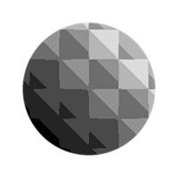

# Quantificar escala de cinza

<table>
<tr style="border: 0;">
<td width="33.33%" style="border: 0;" valign="top">

{width="200px"}

<b>Entrada:</b> Filtros > Ajustes

</td>
<td width="100.00%" style="border: 0;" valign="top">

## Descrição

Gera uma única spline na forma de um círculo.

</td>
</tr>
</table>

## Parâmetros

|  |  |
|:---|:---|
| <b>Etapas</b> *Inteiro* | O número de valores separados para os quais o intervalo de entrada deve ser aproximado. |
| <b>Deslocamento</b> *Flutuante* | Aplica um deslocamento ao intervalo de entrada, que *desloca* os resultados ao longo do intervalo. |
| <b>Inclinação</b> *Flutuante* | Aplica um gradiente de inclinação às *transições* entre valores aproximados, até o *intervalo completo de uma etapa*. |
| <b>Curva de Inclinação</b> *Inteiro* | Define o método de aquisição da curva para a inclinação definida pelo parâmetro <b>Inclinação</b>:<ul data-preserve-html="true"> <li data-preserve-html="true">*Linear*: aplica uma curva linear, resultando em uma inclinação reta</li> <li data-preserve-html="true">*Etapa suave*: aplica uma curva de etapa suave, resultando em uma inclinação suave</li> <li data-preserve-html="true">*Entrada de curva*: aplica a curva descrita pelo mapa de entrada <b>Entrada de curva</b>. Você pode usar um nó [Curva](../../../../../../compositing-graphs/nodes-reference-for-com/atomic-nodes/curve/curve.md) para descrever esta curva com uma grande quantidade de controle.</li> </ul> |

## Exemplos

