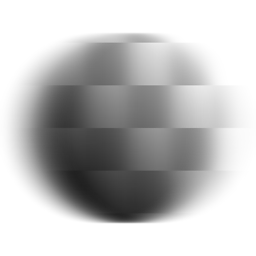

# Desfoque anisotrópico

<table>
<tr style="border: 0;">
<td width="33.33%" style="border: 0;" valign="top">

{width="128px"}

{width="128px"}

<b>Entrada:</b> Filtros > Desfoques

</td>
<td width="100.00%" style="border: 0;" valign="top">

## Descrição

Executa um [desfoque direcional](../../../../../../compositing-graphs/nodes-reference-for-com/atomic-nodes/directional-blur/directional-blur.md) de alta qualidade, com algumas configurações para personalizar a aparência. Também conhecido como “desfoque de movimento”.

Importante: certifique-se de usar a versão apropriada para sua entrada! Use “Desfoque anisotrópico” para entradas de Cor ou “Desfoque anisotrópico em escala de cinza” para entradas de Escala de cinza.

</td>
</tr>
</table>

## Parâmetros

|  |  |
|:---|:---|
| <b>Intensidade</b> <i>0.0 - 16.0</i> | Intensidade (Raio) do desfoque. Quanto maior for esse valor, mais o desfoque alcançará. |
| <b>Anisotropia</b> <i>0.0 - 1.0</i> | Direção do desfoque. Defini-lo como 0.0 é o mesmo que executar um desfoque regular. |
| <b>Ângulo</b> <i>0.0 - 1.0</i> | Define o ângulo para a direção do desfoque. |
| Qualidade <b>1</b> <i>0 - 1</i> | Alterna internamente entre um [desfoque de caixa](../../../../../../compositing-graphs/nodes-reference-for-com/atomic-nodes/blur/blur.md) e um desfoque de matriz. Negociações em velocidade para a qualidade. |

## Exemplos

<table style="margin-top: 32px; margin-bottom: 32px">
    <tr style="border: 0">
        <td style="border: 0; background: transparent">
            
        </td>
    </tr>
</table>
