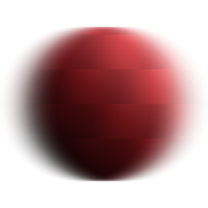

# Desfoque anisotrópico

<table>
<tr style="border: 0;">
<td style="border: 0;" valign="top">

{width="128px"}

{width="128px"}

## Desfoque anisotrópico (tons de cinza)

**Entrada:** *Filtros/Desfoques*

**Simples**

</td>
<td style="border: 0;" valign="top">

## Descrição

Executa um [desfoque direcional](../../../../../../compositing-graphs/nodes-reference-for-com/atomic-nodes/directional-blur/directional-blur.md) de alta qualidade, com algumas configurações para personalizar a aparência. Também conhecido como “desfoque de movimento”.

Importante: certifique-se de usar a versão apropriada para sua entrada! Use “Desfoque anisotrópico” para entradas de Cor ou “Desfoque anisotrópico em escala de cinza” para entradas de Escala de cinza.

## Parâmetros

* **Intensidade**: *0.0 - 16.0* Intensidade (Raio) do desfoque. Quanto maior for esse valor, mais o desfoque alcançará.
* **Anisotropia**: *0.0 - 1.0* Direção do desfoque. Defini-lo como 0.0 é o mesmo que executar um desfoque regular.
* **Ângulo**: *0.0 - 1.0* Define o ângulo para a direção do desfoque.
* **Qualidade**: *0 - 1* Alterna internamente entre um[desfoque de caixa](../../../../../../compositing-graphs/nodes-reference-for-com/atomic-nodes/blur/blur.md) e um desfoque de matriz. Negociações em velocidade para a qualidade.

## Imagens de exemplo

</td>
</tr>
</table>
