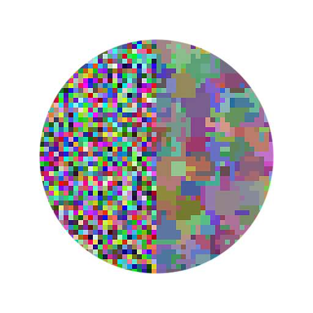

# Cor do filtro mediano

<table>
<tr style="border: 0;">
<td width="33.33%" style="border: 0;" valign="top">

<b>Entrada:</b> Filtros > Desfoques

</td>
<td width="100.00%" style="border: 0;" valign="top">

## Descrição

Esse filtro suaviza o ruído em uma imagem preservando as arestas.

Para cada pixel, o nó calcula um valor de cor de acordo com o valor mediano dos vizinhos do pixel.

</td>
</tr>
</table>

>[!NOTE]
>
> Consulte também [Escala de cinza do filtro Mediana](../../../../../../compositing-graphs/nodes-reference-for-com/node-library/filters/blurs/median-filter-grayscale/median-filter-grayscale.md).

## Conectores de entrada

<b>Cor </b>*de entrada* A imagem colorida à qual o filtro deve ser aplicado.

## Conectores de saída

<b>Saída</b> *Cor* A imagem colorida calculada com a aplicação do filtro à imagem colorida de entrada.

## Parâmetros

<b>Tamanho do kernel</b> *Inteiro* Um kernel é um grupo específico de valores usados nos cálculos de um filtro. Nesse contexto, são os valores dos pixels vizinhos.\
Para cada pixel, o filtro considera todos os vizinhos ao redor desse pixel em um kernel quadrado e calcula o valor mediano de todos os vizinhos.\
Esse parâmetro controla o tamanho do núcleo quadrado, em pixels. Um núcleo maior resulta em um efeito de suavização mais forte e de maior alcance, ao custo de alguns detalhes.\
*- 3x3:* um kernel com 3 pixels de largura e 3 pixels de altura, totalizando 8 pixels vizinhos.\
*- 5x5:* um kernel com 5 pixels de largura e 5 pixels de altura, totalizando 24 pixels vizinhos.

<b>Tipo de filtro</b> *Inteiro* O cálculo aplicado aos vizinhos amostrados no kernel.\
*- Mediana:* Use o valor mediano de todos os vizinhos diretamente.\
*- MLMAD:* significa &#39;Mediana do Desvio Absoluto da Menor Mediana&#39;. O desvio explica o quão diferente um valor é da mediana. Em vez de usar diretamente o valor mediano que pode ser distorcido por um pixel de exceção com alto desvio, o método MLMAD usa a mediana de todos os desvios. Esse método resulta em um efeito de suavização mais forte, que pode nivelar as áreas de acordo com o tamanho do núcleo.

<b>Afetar alfa</b> *Booleano* Controla se o filtro deve ser aplicado ao canal alfa da imagem. Quando *Verdadeiro*, o canal alfa não é alterado.

## Exemplos

<table>
  <tr>
    <td>
      
       <i>Antes</i>
    </td>
    <td>
      
       <i>Depois</i>
    </td>
  </tr>
</table>

<table>
  <tr>
    <td>
      
       <i>Antes</i>
    </td>
    <td>
      
       <i>Depois</i>
    </td>
  </tr>
</table>
