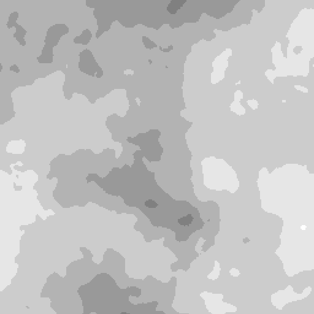

# Tons de cinza do filtro mediano

<table>
<tr style="border: 0;">
<td width="33.33%" style="border: 0;" valign="top">

<b>Entrada:</b> Filtros > Desfoques

</td>
<td width="100.00%" style="border: 0;" valign="top">

## Descrição

Esse filtro suaviza o ruído em uma imagem preservando as arestas.

Para cada pixel, o nó calcula um valor de tons de cinza de acordo com o valor mediano dos vizinhos do pixel.

</td>
</tr>
</table>

>[!NOTE]
>
> Consulte também [Cor do filtro mediano](../../../../../../compositing-graphs/nodes-reference-for-com/node-library/filters/blurs/median-filter-color/median-filter-color.md).

## Entradas

|  |  |
|:---|:---|
| <b>Entrada</b> <i>Tons de cinza</i> | A imagem em tons de cinza à qual o filtro deve ser aplicado. |

## Saídas

|  |  |
|:---|:---|
| <b>Saída</b> <i>Tons de cinza</i> | A imagem em tons de cinza calculada aplicando-se o filtro à imagem em tons de cinza de entrada. |

## Parâmetros

|  |  |
|:---|:---|
| <b>Tamanho do kernel</b> *Inteiro* | Um kernel é um grupo específico de valores usados nos cálculos de um filtro. Nesse contexto, são os valores dos pixels vizinhos.  Para cada pixel, o filtro pega todos os vizinhos ao redor desse pixel em um kernel quadrado e calcula o valor mediano de todos os vizinhos.  Este parâmetro controla o tamanho desse kernel quadrado, em pixels. Um kernel maior resulta em um efeito de suavização mais forte e de maior alcance, ao custo de alguns detalhes.  *- 3x3:* um kernel com 3 pixels de largura e 3 pixels de altura, totalizando 8 pixels vizinhos. *- 5x5:* um kernel com 5 pixels de largura e 5 pixels de altura, totalizando 24 pixels vizinhos. |
| <b>Tipo de filtro</b> *Inteiro* | O cálculo aplicado aos vizinhos amostrados no kernel.  *- Mediana:* Use o valor mediano de todos os vizinhos diretamente. *- MLMAD:* Representa &#39;Mediana do Menor Desvio Absoluto Mediano&#39;. O desvio explica o quão diferente um valor é da mediana. Em vez de usar diretamente o valor mediano que pode ser distorcido por um pixel de exceção com alto desvio, o método MLMAD usa a mediana de todos os desvios. Esse método resulta em um efeito de suavização mais forte, que pode nivelar as áreas de acordo com o tamanho do núcleo. |

## Exemplos

<table>
  <tr>
    <td>
      
       <i>Antes</i>
    </td>
    <td>
      
       <i>Depois</i>
    </td>
  </tr>
</table>

<table>
  <tr>
    <td>
      
       <i>Antes</i>
    </td>
    <td>
      
       <i>Depois</i>
    </td>
  </tr>
</table>

<table>
  <tr>
    <td>
      
       <i>Antes</i>
    </td>
    <td>
      
       <i>Depois</i>
    </td>
  </tr>
</table>
