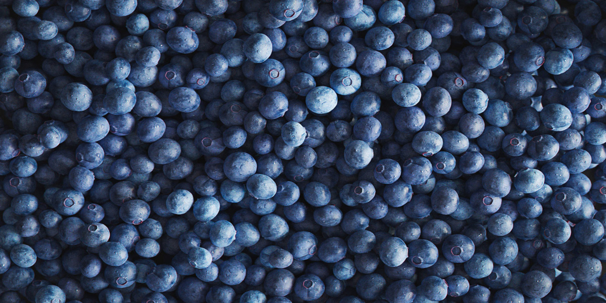

# Cor MLV

<table>
<tr style="border: 0;">
<td width="33.33%" style="border: 0;" valign="top">

<b>Entrada:</b> Filtros > Desfoques

</td>
<td width="100.00%" style="border: 0;" valign="top">

## Descrição

MLV significa <b>&#39;Média da Menor Variação&#39;</b>. Esse filtro melhora as arestas e suaviza o ruído em uma imagem.

O filtro localiza áreas estruturantes em uma imagem e as usa para aumentar a nitidez e o nivelamento. Em alguns casos, isso pode resultar em degraus ao longo de gradientes mais largos do que as áreas de estruturação.

</td>
</tr>
</table>

>[!NOTE]
>
> Consulte também [Escala de cinza MLV](../../../../../../compositing-graphs/nodes-reference-for-com/node-library/filters/blurs/mlv-grayscale/mlv-grayscale.md).

## Entradas

|  |  |
|:---|:---|
| <b>Entrada</b> <i>Cor</i> | A imagem colorida que deve ser processada. |

## Saídas

|  |  |
|:---|:---|
| <b>Saída</b> <i>Cor</i> | A imagem colorida filtrada. |

## Parâmetros

|  |  |
|:---|:---|
| <b>Intensidade</b> *Precisão decimal* | A intensidade da filtragem aplicada à imagem.  Valores mais altos resultam em mais suavização de detalhes e ruído em áreas mais planas. |
| <b>Smoothness</b> *Precisão decimal* | A intensidade do alisamento aplicado nas áreas de estruturação, que resulta em áreas mais redondas e diminui o efeito de passo, que pode ocorrer em intensidades de filtragem mais altas. |
| <b>Critério</b> *Inteiro* | O critério usado para selecionar os valores que definirão as áreas de estruturação na imagem.  Em outras palavras, como os pixels devem ser *agrupados* em áreas que devem ser suavizadas.  *- Variação:* selecione valores com a menor dispersão ao redor da média, o que resulta em clusters de pixels semelhantes uns aos outros  *- Coeficiente de variação:* selecione valores considerando a média, o que resulta em menos variação de áreas mais brilhantes de forma inversa |
| <b>Gaussiano</b> *Booleano* | Use uma distribuição Gaussiana para agrupar pixels em áreas de estruturação.  Quando &#39;Verdadeiro&#39;, isso resulta em áreas mais suaves e um efeito de nivelamento reduzido. |
| <b>Afetar alfa</b> *Booleano* | Quando &#39;Verdadeiro&#39;, a filtragem também é aplicada no canal alfa da imagem.  Quando &#39;Falso&#39;, o canal alfa é totalmente ignorado e deixado como está na saída. |
| <b>Iterações</b> *Inteiro* | O número de vezes que o filtro é executado, onde cada iteração é aplicada no resultado da anterior.  Mais iterações resultam em áreas de estruturação mais planas e nítidas. |

## Exemplos

<table>
  <tr>
    <td>
      
       <i>Antes</i>
    </td>
    <td>
      
       <i>Depois</i>
    </td>
  </tr>
</table>

<table>
  <tr>
    <td>
      
       <i>Antes</i>
    </td>
    <td>
      
       <i>Depois</i>
    </td>
  </tr>
</table>

<table>
  <tr>
    <td>
      
       <i>Antes</i>
    </td>
    <td>
      
       <i>Depois</i>
    </td>
  </tr>
</table>
