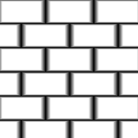

# Desfoque de inclinação

<table>
<tr style="border: 0;">
<td style="border: 0;" valign="top">

{width="128px"}

{width="128px"}

## Desfoque de inclinação (Tons de cinza)

**Entrada:** *Filtros/Desfoques*

**Intermediário**

</td>
<td style="border: 0;" valign="top">

## Descrição

Executa um desfoque avançado de Alta Qualidade em que a Anisotropia/Direção é orientada por um “Mapa de Inclinação” em Tons de Cinza. Imagine-o como o efeito Desfoque de Inclinação seguindo as inclinações do seu Mapa de Inclinação como se ele fosse um Heightmap, semelhante à [Distorção direcional](../../../../../../compositing-graphs/nodes-reference-for-com/atomic-nodes/directional-warp/directional-warp.md) (na qual ele se baseia internamente).

Este é um dos desfoques mais interessantes e poderosos do Designer. Ele pode ser usado para obter alguns efeitos muito interessantes e inesperados, como lascas e bordas de intemperismo ou manchas e vazamento de dirt ou ferrugem.

Importante: certifique-se de usar a versão apropriada para sua entrada! Use “Desfoque de Inclinação” para entradas de Cor ou “Desfoque de Inclinação em Tons de Cinza” para entradas de Tons de Cinza.

## Parâmetros

### Entradas

* **Inclinação**: *Entrada em tons de cinza* Inclinação o mapa para o ângulo de unidade da anisotropia. O ideal é conter gradientes em declive; transições ásperas e nítidas não funcionarão bem!

### Parâmetros

* **Amostras**: *0 - 32* A quantidade de amostras afeta a qualidade em detrimento da velocidade.
* **Intensidade**: *0.0 - 16.0*\
  Quantidade ou intensidade de desfoque.
* **Modo**: *Desfoque, Mín, Máx*|\
  Modo de mesclagem para passagens de desfoque subsequentes. “Desfoque” se comporta mais como um [Desfoque anisotrópico](../../../../../../compositing-graphs/nodes-reference-for-com/node-library/filters/blurs/anisotropic-blur/anisotropic-blur.md) padrão, enquanto Min “corroerá” as áreas existentes e Max “manchará” as áreas brancas.

## Imagens de exemplo

</td>
</tr>
</table>
