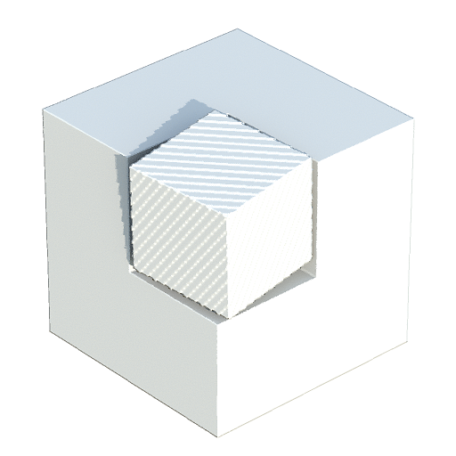
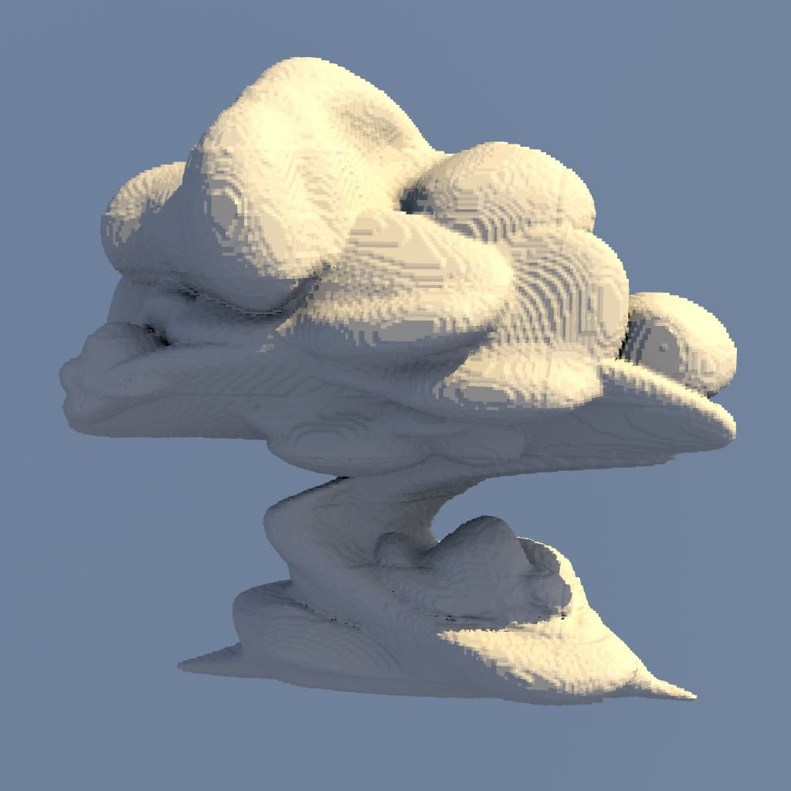

# Renderização de superfície de textura 3D

<table>
<tr style="border: 0;">
<td width="41.60%" style="border: 0;" valign="top">

{width="200px"}

**Entrada:** *Filtro/Efeito*

**Simples**

</td>
<td width="58.30%" style="border: 0;" valign="top">

## Descrição

O nó **Renderização de superfície de textura 3D** renderiza a superfície de uma forma descrita por uma *textura 3D*, usando seu *campo de distância* correspondente da entrada de imagem do **Campo de distância 3D**.

A superfície é representada dentro dos limites de um *cubo de unidade*. A iluminação é calculada usando a imagem de entrada **Ambiente** mapeada para uma esfera infinita.

>[!NOTE]
>
> O campo de distância deve ser uma textura **4096x4096** que descreve a forma com uma grade **16x16** de 256 fatias.\
> Você pode usar o nó [SDF](../../../../../../compositing-graphs/nodes-reference-for-com/node-library/filters/effects/3d-texture-sdf/3d-texture-sdf.md) de Textura 3D para calcular o campo de distância para uma textura 3D de 256 fatias.

</td>
</tr>
</table>

## Parâmetros

### Entradas

* **Campo de distância 3D** *Tons de cinza*\
  A imagem 4096x4096 que representa as 256 *fatias* do *campo de distância* de uma forma, organizadas em uma grade de 16x16.\
  Você pode usar o nó [SDF](../../../../../../compositing-graphs/nodes-reference-for-com/node-library/filters/effects/3d-texture-sdf/3d-texture-sdf.md) de Textura 3D para calcular o campo de distância para uma textura 3D de 256 fatias.
* **Ambiente** *Cor*\
  A imagem que representa o *ambiente*, que deve ser mapeado para uma esfera infinita na renderização e usado para computar a *iluminação*.\
  A imagem também é usada para renderizar o plano de fundo da cena quando o parâmetro **Modo do Plano de Fundo** está definido como *Ambiente* ou *Ambiente*.

### Parâmetros

* **Resolução de Saída** *Inteiro2*\
  A resolução da imagem de saída em **X** e **Y**, expressa como uma *potência de dois*.
* **Posição da Câmera** *Flutuante2*\
  A posição da câmera ao redor da forma.\
  Quando o nó for selecionado, você poderá usar o gizmo de posição na **Exibição 2D** para *orbitar* a câmera.
* **Distância da Câmera** *Flutuante*\
  A distância da câmera até a forma.
* **CDV de câmera** *Flutuante*\
  O campo de visualização da câmera em *graus*.
* **Albedo** *Flutuante3*\
  A cor do albedo da superfície da forma.
* **Modo de plano de fundo** *Inteiro*\
  O método de representar o plano de fundo da cena renderizada:
  * *Irradiância do solo*: a irradiância calculada do plano do solo
  * *Ambiente*: a cor ambiente da entrada de imagem do **Ambiente** mapeada para uma esfera infinita, o que é semelhante a uma versão fortemente desfocada da imagem
  * *Cor uniforme*: preencha de maneira uniforme o plano de fundo com uma cor especificada
  * *Ambiente*: a entrada de imagem do **Ambiente** foi mapeada para uma esfera infinita
* **Cor do plano de fundo** *Flutuante4*\
  A cor usada para preencher uniformemente o plano de fundo da cena renderizada.\
  *Observação*: este parâmetro só está disponível quando o parâmetro **Modo de Plano de Fundo** está definido como *Cor Uniforme*.
* **Habilitar Plano Terrestre** *Booleano*\
  Quando *Verdadeiro*, renderiza um plano terrestre. O *cubo de unidade* que inclui a forma está neste plano.
* **Plano infinito** *Booleano*\
  Define o plano do solo para *se estender infinitamente* para o horizonte.\
  *Observação*: este parâmetro só está disponível quando o parâmetro **Habilitar plano horizontal** está definido como *Verdadeiro*.
* **Tamanho do plano do solo** *Flutuante2* Ajusta o tamanho do plano do solo.\
  *Observação*: este parâmetro só está disponível quando o parâmetro **Habilitar Plano Terrestre** está definido como *Verdadeiro* e o parâmetro **Plano Infinito** está definido como *Falso*.

## Imagens de exemplo

<table>
<tr style="border: 0;">
<td style="border: 0;" valign="top">

{width="256px"}

</td>
<td style="border: 0;" valign="top">

{width="256px"}

</td>
<td style="border: 0;" valign="top">

{width="256px"}

</td>
<td style="border: 0;" valign="top">

{width="256px"}

</td>
<td style="border: 0;" valign="top">

{width="512px"}

</td>
</tr>
</table>
