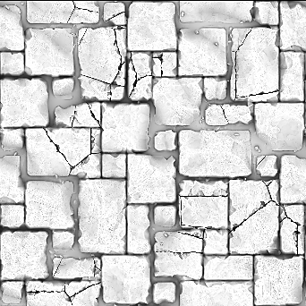

# Oclusão ambiente (HBAO) (nó de filtro)

<table>
<tr style="border: 0;">
<td width="33.33%" style="border: 0;" valign="top">

{width="128px"}

<b>Entrada:</b> Filtros > Efeitos

</td>
<td width="100.00%" style="border: 0;" valign="top">

## Descrição

Utiliza um Heightmap como entrada e gera um mapa de Oclusão Ambiente a partir dele. Ele usa a Oclusão ambiente baseada em Horizon, um algoritmo originalmente destinado para a geração AO em tempo real de espaço de tela. Muito útil para criar mapas de AO de procedimento a partir de Heightmaps de procedimento.

Para uma versão alternativa mais avançada, mas mais lenta, do AO, consulte [Oclusão ambiente (RTAO)](../../../../../../compositing-graphs/nodes-reference-for-com/node-library/filters/effects/ambient-occlusion-rtao/ambient-occlusion-rtao.md)

</td>
</tr>
</table>

## Parâmetros

|  |  |
|:---|:---|
| <b>Usar Unidades Mundiais</b> <i>Falso/Verdadeiro</i> | Alterna o uso de unidades de mundo ou espaço de tela. Habilita parâmetros extras que permitem um controle mais preciso. |
| <b>Profundidade DE Height</b> <i>0.0 - 1.0</i> | Usado somente quando Unidades Mundiais está definido como Falso. Controla o dimensionamento global. |
| <b>Tamanho da superfície</b> <i>0.0 - 1000.0</i> | Usado somente quando Unidades Mundiais está definido como Verdadeiro. Controla o dimensionamento global. |
| <b>Escala do Height (cm)</b> <i>0.0 - 1000.0</i> | Usado somente quando Unidades Mundiais está definido como Verdadeiro. Controla o dimensionamento global. |
| <b>Raio</b> <i>0.0 - 1.0</i> | Controla a propagação do AO. |
| Qualidade <b>1</b> <i>4 amostras, 8 amostras, 16 amostras</i> | Define o nível de Qualidade determinando a quantidade de amostras usada para cálculo. |
| <b>Otimização de GPU</b> <i>Falso/Verdadeiro</i> | Permite a otimização interna da GPU, acelera o processamento. |

## Exemplos

<table style="margin-top: 32px; margin-bottom: 32px">
    <tr style="border: 0">
        <td style="border: 0; background: transparent">
            
        </td>
        <td style="border: 0; background: transparent">
            
        </td>
    </tr>
</table>
