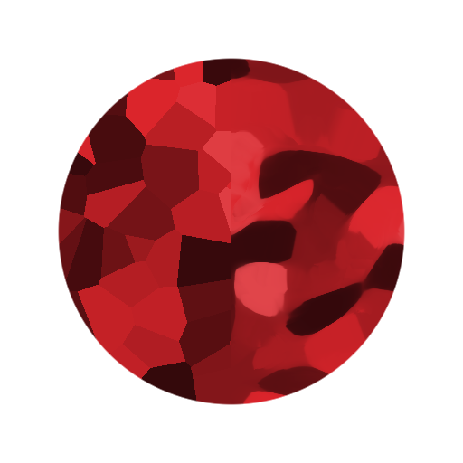
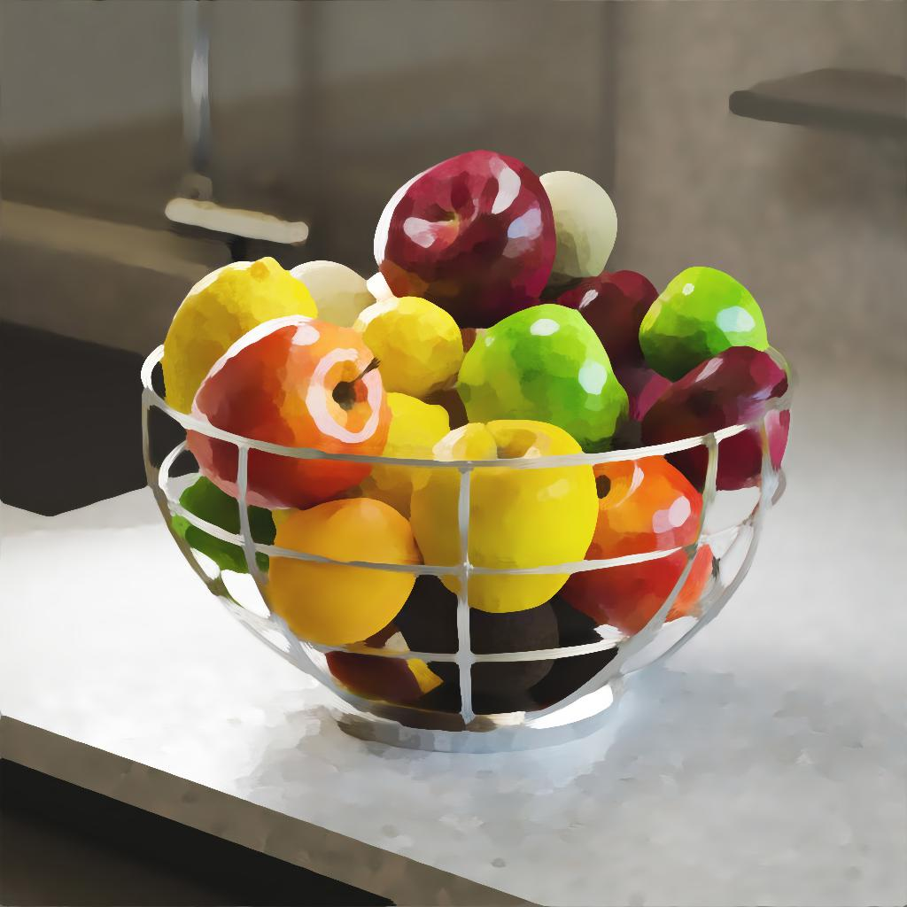
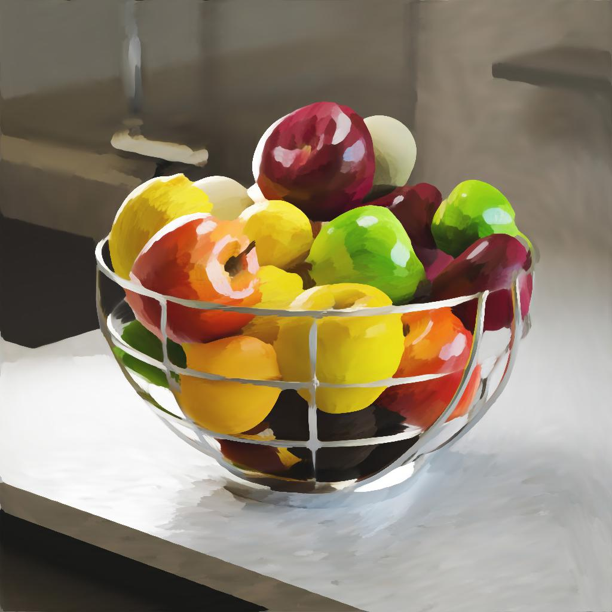
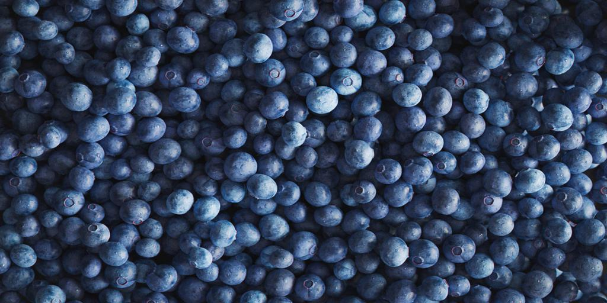
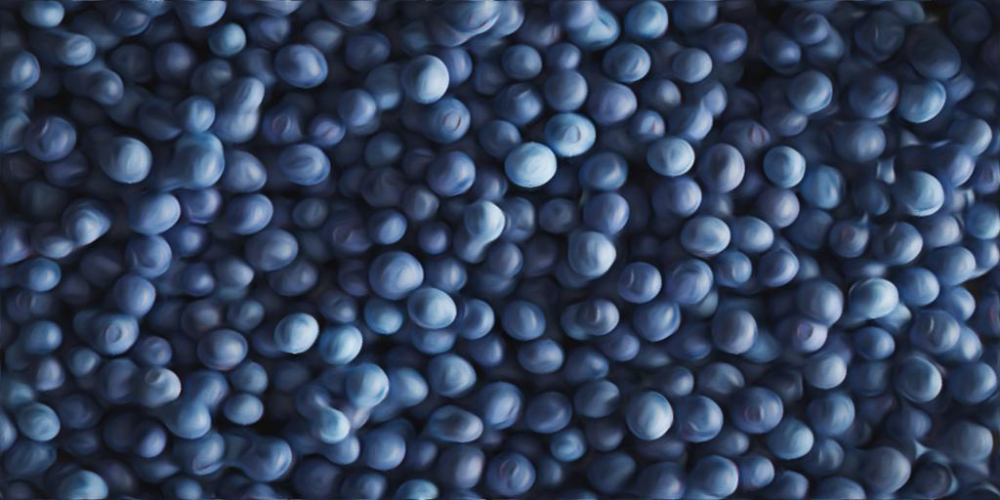
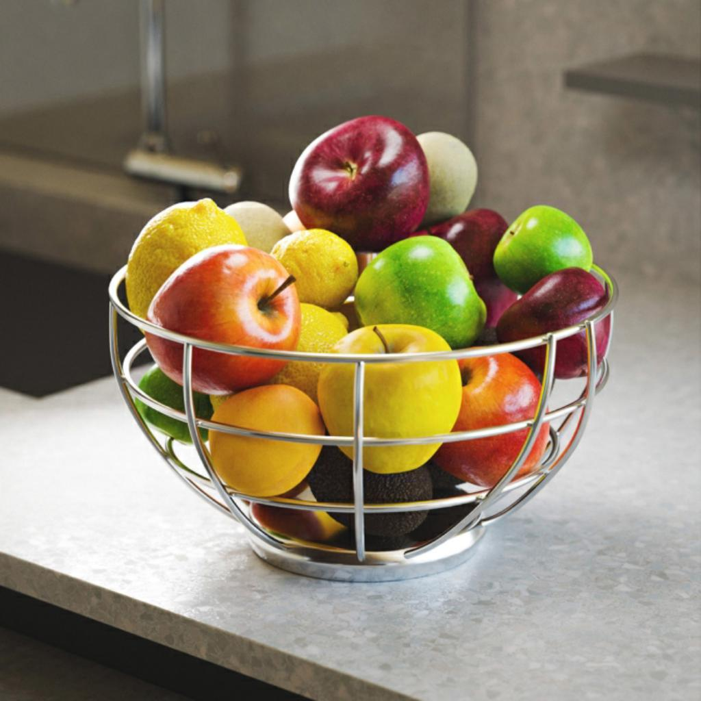
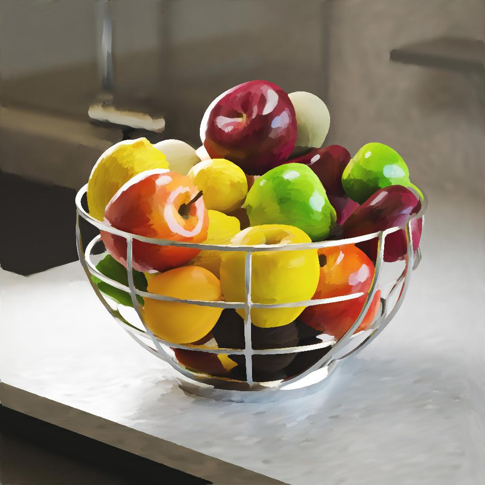
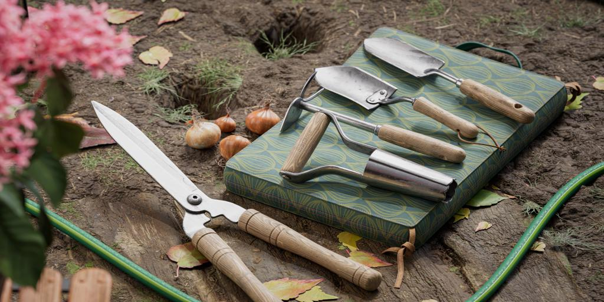
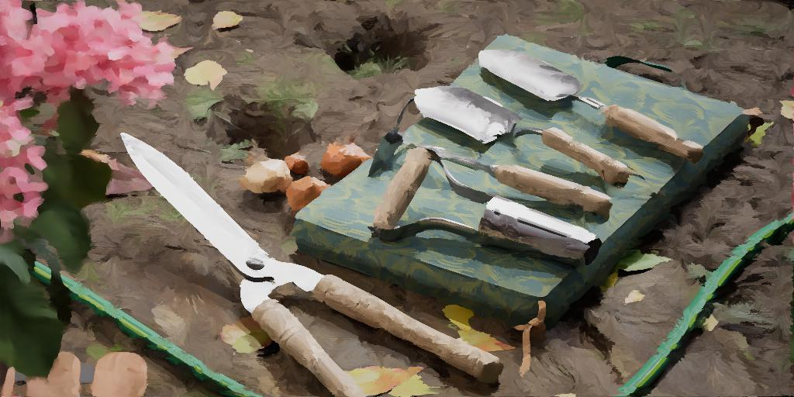

# Cor Kuwahara anisotrópica

<table>
<tr style="border: 0;">
<td width="33.33%" style="border: 0;" valign="top">

{width="200px"}

<b>Entrada:</b> Filtros > Efeitos

</td>
<td width="100.00%" style="border: 0;" valign="top">

## Descrição

Aplica um desfoque direcional anisotrópico que está em conformidade com os detalhes da imagem. O resultado é uma imagem que parece *fluir* na direção das formas dentro.

Este desfoque ajustável computa ou recebe um *mapa de orientação* para determinar esse fluxo, que pode ter sua nitidez ajustada em áreas mais planas e mais claramente definidas.

Veja também: [Escala de cinza Anisotrópica Kuwahara](../anisotropic-kuwahara-gra/anisotropic-kuwahara-grayscale.md)

</td>
</tr>
</table>

O fluxo também pode ser quebrado girando a direção na qual o desfoque é aplicado. Da mesma forma, um mapa de orientação personalizado pode ser usado para substituir o que foi calculado a partir da imagem.

Esse filtro pode produzir um efeito de pintura e é útil para estilização.

+++ Anisotropia

A intensidade do fluxo é controlada principalmente pelo parâmetro [Anisotropia](#parameters), conforme demonstrado na imagem abaixo.

Esquerda: Anisotropia 0.0 / Direita: Anisotropia 1.0

<table>
<tr style="border: 0;">
<td style="border: 0;" valign="top">

{zoomable="yes"}

</td>
<td style="border: 0;" valign="top">

{zoomable="yes"}

</td>
</tr>
</table>

+++

## Entradas

|                                                   |                                                                                                                                                                                                                                                                                                                         |
|---------------------------------------------------|-------------------------------------------------------------------------------------------------------------------------------------------------------------------------------------------------------------------------------------------------------------------------------------------------------------------------|
| <b>Entrada</b> <i>Cor</i> <code>PRIMÁRIA</code> | A imagem colorida que deve ser processada. |
| <b>Mapa de ângulo de Anisotropia</b> <i>Tons de cinza</i> | A imagem em tons de cinza que descreve a rotação adicional aplicada à direção calculada, em que o valor da escala de cinza é um número de voltas.   O mapa ainda tem um efeito quando o parâmetro &#39;Anisotropia&#39; é definido como 0, uma vez que afeta a rotação do núcleo usado pelo filtro Kuwahara. |
| <b>Inclinação mapa</b> <i>Tons de cinza</i> | O mapa que representa as inclinações às quais o mapa de orientação tem conformidade, de acordo com o valor do parâmetro &#39;Inclinação Map Input Multiplier&#39;. |
| <b>Mapa de raio (opcional)</b> <i>Tons de cinza</i> | Quando conectado, o &#39;Raio&#39; de desfoque é multiplicado em relação à imagem de entrada. |
| <b>Mapa de orientação</b> <i>Cor</i> | O mapa que descreve a direção usada pelo núcleo do filtro anisotrópico.   O mapa ainda tem um efeito quando o parâmetro &#39;Anisotropia&#39; é definido como 0, uma vez que afeta a rotação do núcleo usado pelo filtro Kuwahara.   Observação: esta entrada é usada somente quando o parâmetro &#39;Usar Mapa de orientação de Entrada&#39; está definido como &#39;True&#39;. |

## Saídas

|                                   |                                                                                                                                                                                                                                      |
|-----------------------------------|--------------------------------------------------------------------------------------------------------------------------------------------------------------------------------------------------------------------------------------|
| <b>Saída</b> <i>Cor</i> | O resultado do desfoque anisotrópico aplicado pelo nó na imagem de entrada. |
| <b>Mapa de orientação</b> <i>Cor</i> | O mapa de orientação calculado a partir da imagem de entrada e usado para orientar o desfoque anisotrópico.   Se o parâmetro &#39;Usar Mapa de orientação de Entrada&#39; for definido como &#39;Verdadeiro&#39;, a imagem fornecida para a entrada &#39;Mapa de orientação&#39; será usada e a saída será exibida como está. |

## Parâmetros

|                                                                                                                              |                                                                                                                                                                                                                                                                               |
|------------------------------------------------------------------------------------------------------------------------------|-------------------------------------------------------------------------------------------------------------------------------------------------------------------------------------------------------------------------------------------------------------------------------|
| <b>Raio</b> <i>Flutuante</i> | O raio de desfoque, em que um valor mais alto resulta em um efeito de desfoque mais intenso.   O valor máximo é 32. |
| <b>Smoothness</b> <i>Flutuante</i> | Ajusta a quantidade de mesclagem de cores na direção calculada.   Quando esse valor é 0, as cores são deslocadas principalmente nessa direção e ocorre pouca mesclagem. |
| <b>Nitidez</b> <i>Flutuante</i> | Aumenta o contraste nas áreas desfocadas, fazendo com que pareçam mais planas e definidas com mais clareza. |
| <b>Anisotropia</b> <i>Flutuante</i> | Ajusta a contribuição do mapa de orientação no desfoque.   O mapa de orientação e todos os seus modificadores (tanto os parâmetros como os mapas de entrada) ainda têm efeito quando este valor de parâmetro é 0, já que o mapa de orientação é usado no kernel do filtro Kuwahara. |
| <b>Usar mapa de orientação de entrada</b> <i>Booleano</i> | Quando &#39;Verdadeiro&#39;, nenhum mapa de orientação é calculado a partir da imagem de entrada, e a imagem conectada à entrada &#39;Mapa de orientação&#39; é usada para orientar o desfoque anisotrópico. |
| <b>smoothness de sensor</b> <i>Precisão decimal</i>  <i>Disponível quando &#39;Usar mapa de orientação de entrada&#39; estiver definido como &#39;Falso&#39;</i> | Ajusta a intensidade do desfoque aplicada às direções computadas a partir da imagem e armazenadas na mapa de orientação.   Aumentar esse valor garante um resultado mais suave quando a imagem tem muitos detalhes de alta frequência. |
| <b>Ângulo de Anisotropia</b> <i>Precisão decimal</i>  <i>Disponível quando &#39;Usar mapa de orientação de entrada&#39; estiver definido como &#39;Falso&#39;</i> | Adiciona uma rotação ao mapa de orientação, em número de rotações.   Esta rotação adicional é *cumulativa* com a especificada pela entrada &#39;Mapa de Ângulo de Anisotropia&#39;. |
| <b>Multiplicador de mapa de ângulo de Anisotropia</b> <i>Precisão decimal</i>  <i>Disponível quando &#39;Usar mapa de orientação de entrada&#39; estiver definido como &#39;Falso&#39;</i> | Ajusta a intensidade dos valores na entrada “Mapa de ângulo de Anisotropia”, que são então adicionados sobre a rotação aplicada ao mapa de orientação, em número de voltas.   Esta rotação adicional é *cumulativa* com a especificada pelo parâmetro &#39;Ângulo de Anisotropia&#39;. |
| <b>Multiplicador de entrada do mapa de Inclinação</b> <i>Precisão decimal</i>  <i>Disponível quando &#39;Usar mapa de orientação de entrada&#39; estiver definido como &#39;Falso&#39;</i> | Ajusta a intensidade com que o mapa de orientação está de acordo com as inclinações fornecidas pela entrada &#39;Mapa de Inclinação&#39;. |
| <b>Ignorar alfa</b> <i>Booleano</i> | Quando &#39;Verdadeiro&#39;, o canal alfa da imagem não é afetado pelo filtro.   Quando &#39;Falso&#39;, o filtro também é aplicado ao canal alfa. |

## Exemplos

<table>
  <tr>
    <td>
      
       <i>Antes</i>
    </td>
    <td>
      
       <i>Depois</i>
    </td>
  </tr>
</table>

<table>
  <tr>
    <td>
      
       <i>Antes</i>
    </td>
    <td>
      
       <i>Depois</i>
    </td>
  </tr>
</table>

<table>
  <tr>
    <td>
      
       <i>Antes</i>
    </td>
    <td>
      
       <i>Depois</i>
    </td>
  </tr>
</table>
