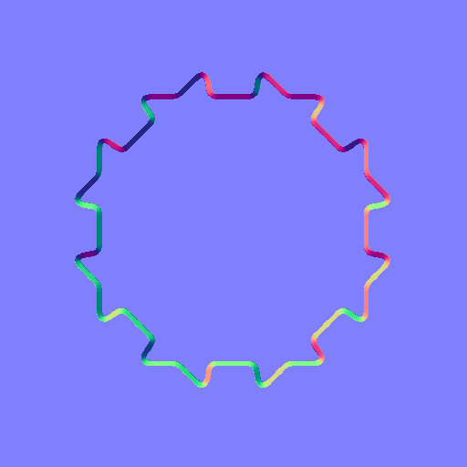
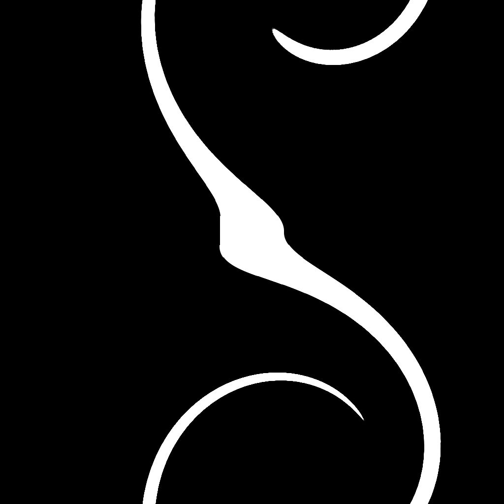
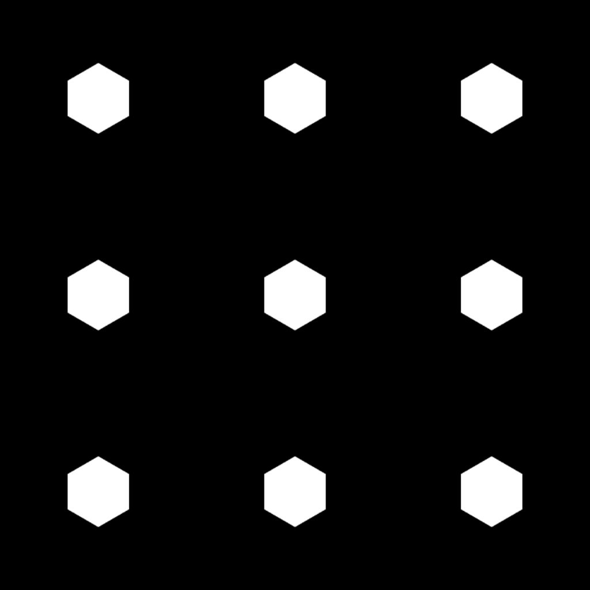
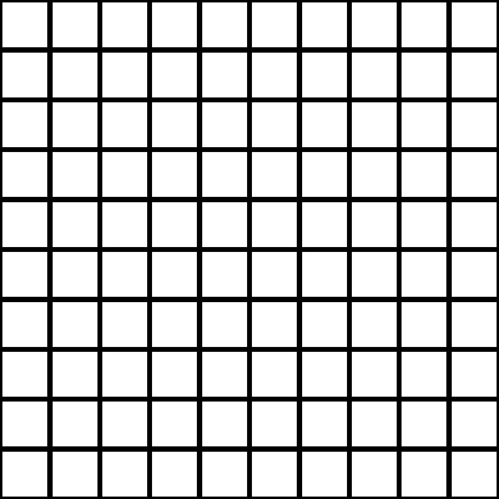

# Suavização de chanfro

<table>
<tr style="border: 0;">
<td width="33.33%" style="border: 0;" valign="top">

{width="200px"}

<b>Entrada:</b> Filtros > Efeitos

</td>
<td width="100.00%" style="border: 0;" valign="top">

## Descrição

Desenha um gradiente ou uma cor plana das bordas de uma máscara para fora, para dentro ou para ambos.

Os gradientes sobrepostos são classificados por distância normalizada invertida para que a distância até a borda mais próxima seja desenhada.

A distância do gradiente pode ser ajustada dinamicamente ao longo da borda usando um mapa de distância.

</td>
</tr>
</table>

>[!TIP]
>
> O nó [Distância direcional](../../../../../../compositing-graphs/nodes-reference-for-com/node-library/filters/effects/directional-distance/directional-distance.md) oferece recursos semelhantes, em que a dilatação é executada em uma direção específica.

## Entradas

|  |  |
|:---|:---|
| <b>Entrada de máscara</b> <i>Tons de cinza</i> PRIMÁRIO | A imagem da qual a máscara deve ser extraída.   Todos os valores acima do valor “Limite da máscara” são brancos nessa máscara. |
| <b>Entrada de origem</b> <i>Tons de cinza</i> | Uma entrada opcional é usada somente quando o parâmetro &#39;Output Mode&#39; está definido como &#39;Dilation&#39;.   Nesse caso, essa imagem é sobreposta às áreas brancas da máscara, e os valores de tons de cinza nas bordas são dilatados. |
| <b>Mapa de distância</b> <i>Tons de cinza</i> | Uma entrada opcional usada quando o valor do parâmetro &#39;Mapa de distância Multiplier&#39; é maior que 0.   É usado para ajustar a distância de chanfro/dilatação ao longo das bordas da máscara, onde um valor mais escuro resulta em uma distância mais curta. |

## Saídas

|  |  |
|:---|:---|
| <b>Saída</b> <i>Tons de cinza</i> | A imagem resultante, de acordo com o &#39;Modo de saída&#39; selecionado. |
| <b>UV</b> <i>Cor</i> | Um mapa de UV em que os UVs são dilatados ao longo das bordas da máscara.   Isso pode ser conectado a um nó [Mapeador UV](../../../../../../compositing-graphs/nodes-reference-for-com/node-library/spline-paths-tools/spline-tools/uv-mapper-color/uv-mapper-color.md) para mapear qualquer outra imagem usando esses UVs dilatados. |

## Parâmetros

|  |  |
|:---|:---|
| <b>Modo de saída</b> *Inteiro* | O método de dilatação das bordas da máscara:<ul data-preserve-html="true"> <li data-preserve-html="true"><b>Chanfro:</b> desenhe um gradiente de 1 a 0, onde 0 é atingido na &#39;Distância&#39; máxima</li> <li data-preserve-html="true"><b>Dilatação:</b> desenhe uma cor sólida até a &#39;Distância máxima&#39;. Esta cor é branca ou a cor da imagem de “Entrada de origem” na borda da máscara, se conectada</li> <li data-preserve-html="true"><b>Distância:</b> a distância bruta da borda da máscara mais próxima, no espaço de imagem normalizado em que 1 é o comprimento do lado mais curto da imagem</li> </ul> |
| <b>Direção</b> *Inteiro* *Disponível quando o &#39;Modo de saída&#39; está definido como &#39;Chanfro&#39; ou &#39;Dilatação&#39;* | O lado da borda da máscara que deve ser dilatado:<ul data-preserve-html="true"> <li data-preserve-html="true"><b>Em:</b> desenhe em direção ao interior da máscara</li> <li data-preserve-html="true"><b>Fora:</b> desenhe em direção ao exterior da máscara</li> <li data-preserve-html="true"><b>Entrada/saída:</b> desenhe em direção ao interior e ao exterior da máscara</li> </ul> |
| <b>Distância máxima</b> *Flutuante* | A distância de dilatação, no espaço normalizado da imagem, em que 1 é o comprimento do lado mais curto da imagem de entrada. |
| <b>smoothness de máscaras</b> *Flutuante* | A intensidade da suavização aplicada à máscara.   O valor é o raio do desfoque e 1 unidade é 1/256 da imagem. |
| <b>Deslocamento da máscara</b> *Flutuante* | Move as bordas da máscara para dentro ou para fora. |
| <b>Limite de máscara</b> *Flutuante* | O valor usado para detectar as bordas da máscara na imagem “Entrada de máscara”.   Os valores acima desse limite são o *interior* das formas de máscara, enquanto os valores abaixo são o *exterior*. |
| <b>Escala</b> *Flutuante2* | Ajusta a distância horizontal (X) e vertical (Y) da dilatação.   Esses valores são multiplicadores para o valor do parâmetro &#39;Distância máxima&#39;. |
| <b>Multiplicador de Mapa de distância</b> *Inteiro* | Ajusta o impacto do &#39;Mapa de distância&#39; sobre a &#39;Distância máxima&#39;. |

## Exemplos

<table>
<tr style="border: 0;">
<td style="border: 0;" valign="top">

{width="1024px" zoomable="yes"}

</td>
<td style="border: 0;" valign="top">

{width="1024px" zoomable="yes"}

</td>
</tr>
</table>

<table>
<tr style="border: 0;">
<td style="border: 0;" valign="top">

<table>
  <tr>
    <td>
      
       <i>Antes</i>
    </td>
    <td>
      
       <i>Depois</i>
    </td>
  </tr>
</table>

</td>
<td style="border: 0;" valign="top">

<table>
  <tr>
    <td>
      
       <i>Antes</i>
    </td>
    <td>
      
       <i>Depois</i>
    </td>
  </tr>
</table>

</td>
</tr>
</table>

<table>
<tr style="border: 0;">
<td style="border: 0;" valign="top">

<table>
  <tr>
    <td>
      
       <i>Antes</i>
    </td>
    <td>
      
       <i>Depois</i>
    </td>
  </tr>
</table>

</td>
<td style="border: 0;" valign="top">

<table>
  <tr>
    <td>
      
       <i>Antes</i>
    </td>
    <td>
      
       <i>Depois</i>
    </td>
  </tr>
</table>

</td>
</tr>
</table>

<table>
  <tr>
    <td>
      
       <i>Antes</i>
    </td>
    <td>
      
       <i>Depois</i>
    </td>
  </tr>
</table>
