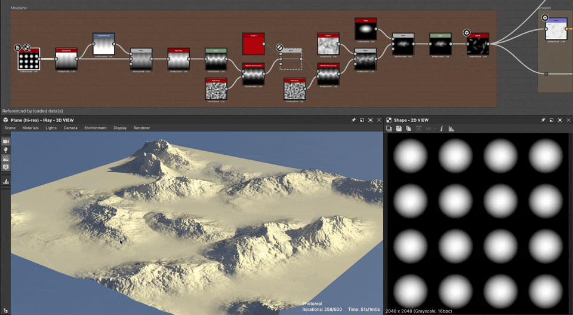

# Seção transversal

<table>
<tr style="border: 0;">
<td width="33.33%" style="border: 0;" valign="top">

Ícone do nó {width="200px"}

<b>Entrada:</b> Filtros > Efeitos

</td>
<td width="100.00%" style="border: 0;" valign="top">

## Descrição

Desenha um perfil de seção cruzada de uma entrada. Pode ser ajustado para fazer fatias na vertical ou na horizontal e tem controles para estilo de desenho e deslocamento e dimensionamento do gráfico.

</td>
</tr>
</table>

Esse nó é especialmente útil para depuração e análise de mapas de altura. oferecendo uma visualização de perfil com pixels perfeitos, sem a necessidade de nós complexos ou de uma configuração longa e menos precisa no Visualização 3D.

Como alternativa, pode ser usada para criar formas e silhuetas 2D difíceis de alcançar de outra forma. Combinado com um [nó de curva](../../../../../../compositing-graphs/nodes-reference-for-com/atomic-nodes/curve/curve.md)ele pode visualizar diretamente o perfil de curva aplicado a um gradiente linear.

## Parâmetros

|  |  |
|:---|:---|
| <b>Coordenada de seção transversal</b> *Flutuante* | Defina em qual coordenada obter amostra da fatia. Pode ser uma coordenada X ou Y, dependendo do Eixo da seção. |
| <b>Eixo da seção</b> *Inteiro* | Defina se a fatia é vertical ou horizontal. |
| <b>Mostrar auxiliar</b> *Booleano* | Habilita uma sobreposição que exibe a posição da seção sobre a imagem de entrada. |
| <b>Configurações do auxiliar</b> |  |
| <b>Escala auxiliar</b> *Flutuante* | O tamanho da sobreposição expresso como um múltiplo, onde 1.0 é a imagem inteira. |
| <b>Posição do auxiliar</b> *Flutuante2* | A posição (X, Y) da sobreposição na imagem de saída, onde (0,0, 0,0) é a parte superior esquerda e (1,0, 1,0) é a parte inferior direita. |
| <b>Escala de Height</b> *Flutuante* | Reduz o gráfico inteiro. Útil para exibição HDR. |
| <b>Deslocamento de Height</b> *Flutuante* | Move o gráfico inteiro para cima ou para baixo. Útil para exibição HDR. |
| <b>Estilo de desenho</b> *Inteiro* | Alternar entre preenchimento sólido e desenho de linha. |
| <b>Inverter gradiente</b> *Booleano* | Se o Estilo de desenho estiver definido como *Gradiente* ou *Gradiente espelhado*, você poderá inverter esse gradiente sem afetar o fundo.  *Observação:* disponível somente quando o &#39;Estilo de desenho&#39; estiver definido como &#39;Gradiente&#39; ou &#39;Gradiente espelhado&#39;. |
| <b>Suave/Poligonal</b> *Booleano* | Alterna a forma entre perfil suave perfeito ou poligonal irregular.  *Observação:* disponível somente quando o &#39;Estilo de desenho&#39; está definido como &#39;Sólido&#39;, &#39;Gradiente&#39; ou &#39;Gradiente espelhado&#39;. |
| <b>Valor do segmento</b> *Inteiro* | Define a quantidade de segmentos usados para desenhar no Estilo Poligonal ou no Estilo de Linha.  *Observação:* disponível somente quando &#39;Suave / Poligonal&#39; está definido como &#39;Poligonal&#39; ou quando &#39;Estilo de Desenho&#39; está definido como &#39;Linha&#39;. |
| <b>thickness de linha</b> *Flutuante* | Define o thickness da linha.  *Observação:* disponível somente quando &#39;Estilo de desenho&#39; está definido como &#39;Linha. |
| <b>Estilo de linha</b> *Inteiro* | Permite escolher a cor e a borda da linha.  *Observação:* disponível somente quando &#39;Estilo de desenho&#39; estiver definido como &#39;Linha&#39;. |
| <b>smoothness de linha</b> *Flutuante* | Define a queda de gradiente da linha.  *Observação:* disponível somente quando &#39;Estilo de desenho&#39; está definido como &#39;Linha. |
| <b>Cor</b> *Flutuante* | Cor em tons de cinza da linha ou forma.  *Observação:* disponível somente quando &#39;Estilo de desenho&#39; está definido como &#39;Sólido&#39; ou &#39;Linha&#39; e &#39;Estilo de linha&#39; está definido como &#39;Suave&#39; ou &#39;Sólido&#39;. |
| <b>Cor do plano de fundo</b> *Flutuante* | Cor em tons de cinza do plano de fundo.  *Observação:* não disponível quando &#39;Estilo de desenho&#39; está definido como &#39;Linha&#39; e &#39;Estilo de linha&#39; está definido como &#39;ID de segmento&#39; ou &#39;Gradiente ao longo da linha&#39;. |

## Exemplos

