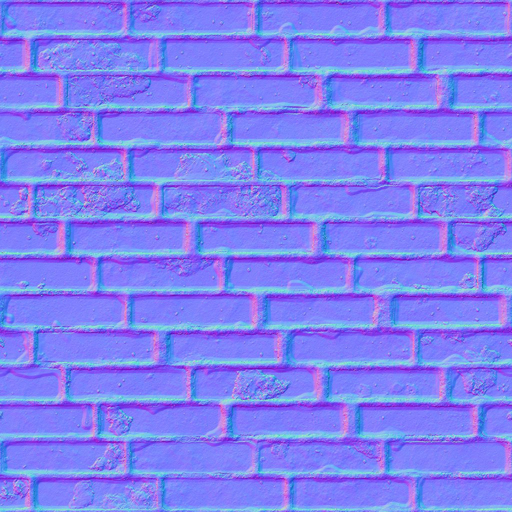

# Suavização de curvatura

<table>
<tr style="border: 0;">
<td width="33.33%" style="border: 0;" valign="top">

{width="200px"}

<b>Entrada:</b> Filtros > Efeitos

</td>
<td width="100.00%" style="border: 0;" valign="top">

## Descrição

Calcula a curvatura de uma superfície descrita por um mapa normal.

Um mapa de curvatura representa as áreas côncavas e convexas de uma superfície.\
As áreas planas são 50% cinza. As áreas convexas são mais brilhantes, enquanto as áreas côncavas são mais escuras.

</td>
</tr>
</table>

As áreas côncavas e convexas também são divididas em suas próprias saídas, para facilitar a seleção ou mascaramento de áreas com base nessas características.

>[!TIP]
>
> Procure uma versão mais nítida na [Curvatura](../../../../../../compositing-graphs/nodes-reference-for-com/node-library/filters/effects/curvature-filter-node/curvature-filter-node.md) ou na [Curvatura Sobel](../../../../../../compositing-graphs/nodes-reference-for-com/node-library/filters/effects/curvature-sobel/curvature-sobel.md) se precisar de mais opções.

## Entradas

|  |  |
|:---|:---|
| <b>Normal</b> <i>Cor</i> <b>PRIMÁRIO</b> | O mapa normal que descreve a superfície cuja curvatura deve ser calculada. |

## Saídas

|  |  |
|:---|:---|
| <b>Curvatura</b> <i>Tons de cinza</i> | O mapa de curvatura calculado do mapa normal de entrada.   As áreas planas são 50% cinza. As áreas convexas são mais brilhantes, enquanto as áreas côncavas são mais escuras. |
| <b>Convexidade</b> <i>Tons de cinza</i> | O mapa de convexidade foi calculado a partir do mapa normal de entrada.   Quanto mais convexa for uma área, mais brilhante ela ficará no mapa.  As áreas planas ou côncavas são pretas. |
| <b>Concavidade</b> <i>Tons de cinza</i> | O mapa de concavidade calculado a partir do mapa normal de entrada.   Quanto mais côncava uma área, mais brilhante ela fica no mapa.  As áreas planas ou convexas são pretas. |

## Parâmetros

|  |  |
|:---|:---|
| <b>Formato normal</b> *Inteiro* | O formato do mapa normal de entrada. Inverte efetivamente o canal de verde.<ul data-preserve-html="true"> <li data-preserve-html="true"><b>DirectX:</b> o eixo Y aponta para cima</li> <li data-preserve-html="true"><b style="">OpenGL:</b> o eixo Y aponta para baixo</li> </ul> |

## Exemplos

<table>
  <tr>
    <td>
      
       <i>Antes</i>
    </td>
    <td>
      
       <i>Depois</i>
    </td>
  </tr>
</table>

<table>
<tr style="border: 0;">
<td style="border: 0;" valign="top">

{zoomable="yes"}

</td>
<td style="border: 0;" valign="top">

{zoomable="yes"}

</td>
</tr>
</table>

<table>
  <tr>
    <td>
      
       <i>Antes</i>
    </td>
    <td>
      
       <i>Depois</i>
    </td>
  </tr>
</table>

<table>
<tr style="border: 0;">
<td style="border: 0;" valign="top">

{zoomable="yes"}

</td>
<td style="border: 0;" valign="top">

{zoomable="yes"}

</td>
</tr>
</table>
