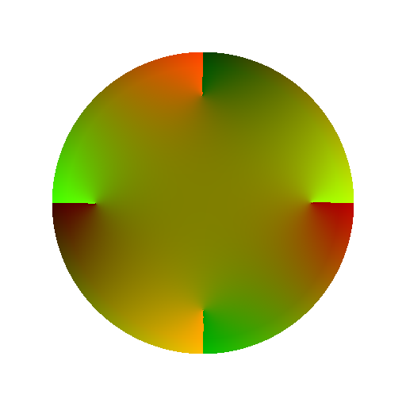

# Difusão UV

<table>
<tr style="border: 0;">
<td width="33.33%" style="border: 0;" valign="top">

{width="200px"}

<b>Entrada:</b> Filtros > Efeitos

</td>
<td width="100.00%" style="border: 0;" valign="top">

## Descrição

Aplique um processo de difusão às coordenadas UV na entrada de imagem **Origem** de acordo com a entrada de imagem **Máscara** fornecida, interpolando coordenadas entre valores da **Origem**.

Apenas UVs de pixels correspondentes à máscara são difundidos; outros pixels não participam do resultado.

Observe que a divisão em blocos gráficos é tratada de uma maneira especial: quando a divisão em blocos gráficos está *habilitada* (o que é o caso por padrão), as coordenadas vizinhas podem ser calculadas em média através do limite de 0/1.

Por exemplo, se o valor da coordenada U for 0,1 em um pixel e 0,8 em outro, o valor médio será 0,95 em vez de 0,45, porque *a divisão lado a lado das coordenadas é assumida*. Isso é independente da posição real do pixel: os valores de coordenadas são tratados da mesma maneira em toda a imagem.

Isso pode levar a resultados indesejados ao usar este filtro para *deformação de textura*. Se isso acontecer, certifique-se de que sua máscara defina “controlar curvas/pontos” com não mais de *metade de um comprimento de textura de um ponto a outro*.

</td>
</tr>
</table>

## Entradas

|  |  |
|:---|:---|
| <b>Origem</b> <i>Cor</i> | Os UVs se difundem. Observe que a divisão em blocos gráficos é tratada de maneira especial neste filtro (consulte <i>Descrição</i>). |
| <b>Máscara</b> <i>Tons de cinza</i> | A máscara de difusão: os pixels brancos são amostrados em <i>Origem</i> e difundidos em pixels pretos. A imagem deve ser preta e branca. Se a máscara incluir gradientes, o valor de corte será 0,5. |

## Parâmetros

|  |  |
|:---|:---|
| <b>Iterações</b> <i>0.0 - 64.0</i> | O número de iterações de difusão a serem executadas (maior é melhor, mas mais lento). Os valores úteis estão no intervalo [8, 48]. Observe que, se você não estiver procurando correção matemática, os valores baixos serão ótimos ou até melhores. |

## Exemplos

<table style="margin-top: 32px; margin-bottom: 32px">
    <tr style="border: 0">
        <td style="border: 0; background: transparent">
            
        </td>
        <td style="border: 0; background: transparent">
            
        </td>
    </tr>
    <tr style="border: 0">
        <td style="border: 0; background: transparent">
            
        </td>
        <td style="border: 0; background: transparent">
            
        </td>
    </tr>
</table>
