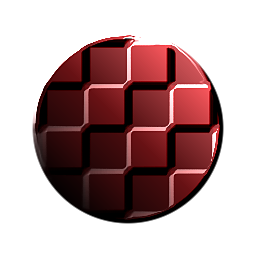

# Entalhe Com Brilho

<table>
<tr style="border: 0;">
<td style="border: 0;" valign="top">

{width="128px"}

## Entalhe Com Brilho

**Entrada:** *Filtros/Efeitos*

**Intermediário**

</td>
<td style="border: 0;" valign="top">

## Descrição

Executa um efeito de entalhe com brilho (reflexo de specular) adicionado em uma entrada de cor e height. Essencialmente, adiciona iluminação artificial e artificial a uma imagem com base em informações do height. Útil para alguns estilos de texturização que exigem iluminação inserida nas texturas.

Para uma versão com mais opções, consulte [Entalhe de número](../../../../../../compositing-graphs/nodes-reference-for-com/node-library/filters/effects/uber-emboss/uber-emboss.md). Há também a versão atômica mais simples do [Entalhe](../../../../../../compositing-graphs/nodes-reference-for-com/atomic-nodes/emboss/emboss.md).

## Parâmetros

### Entradas

* **Cor**: *Entrada de cores*
* **Height**: *Entrada em Tons de Cinza*

### Parâmetros

* **Cor de realce**: *(valor da cor)*Cor do realce do specular.
* **Cor da sombra**: *(valor da cor)*Cor usada em áreas sombreadas/não iluminadas.
* **Brilho**: *0.0 - 0,5* Tamanho de realce reluzente.
* **Intensidade**: *0.0 - 10.0* Intensidade do realce.
* **Ângulo de Luz**: *0.0 - 1.0*\
  Ângulo de incidência da luz (simulada).

## Imagens de exemplo

|  |
| --- |
| Não há imagens anexadas a esta página. |

</td>
</tr>
</table>
