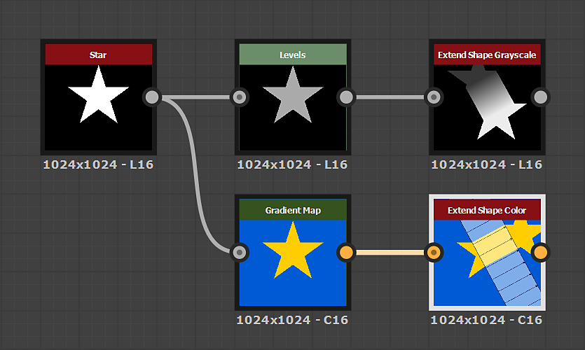

# Extend Shape

<table>
<tr style="border: 0;">
<td width="41.60%" style="border: 0;" valign="top">

<table>
<tr style="border: 0;">
<td style="border: 0;" valign="top">

{width="200px"}

</td>
<td style="border: 0;" valign="top">

{width="200px"}

</td>
</tr>
</table>

**Em:** Filtros*/Efeitos*

**Simples**

</td>
<td width="58.30%" style="border: 0;" valign="top">

## Descrição

O nó **Extend Shape** estende uma *seção* da **entrada** sobre uma direção e distância definidas.

O parâmetro **Mostrar auxiliar** permite visualizar a direção da seção estendida e da extensão.

</td>
</tr>
</table>

## Parâmetros

* **Modo** *Inteiro* Define os *parâmetros* usados para aplicar a extensão:
  * *Bidirecional*: a seção da **Entrada** especificada pela **Posição da Extensão** e pelo **Ângulo de Extensão** é estendida sobre a **Distância de Extensão** em *direções opostas*
  * *Unidirecional*: a seção da **Entrada** especificada pela **Posição da Extensão** e pelo **Ângulo de Extensão** é estendida ao longo da **Distância de Extensão** em uma *única direção*
  * *Posições de Início/Término*: um *vetor* de extensão é definido por **Posição de Início** e **Posição de Término**. A seção *perpendicular* da **Entrada** na **Posição inicial** é estendida *sobre este vetor* até a **Posição final**
* **Distância de Extensão** *Flutuante* A distância sobre a qual a seção especificada pela **Posição de Extensão** e pelo **Ângulo de Extensão** deve ser estendida. A distância é expressa como uma *proporção* da extensão da imagem.
* **Posição da Extensão** *Flutuante* A posição na imagem da seção que deve ser estendida. O valor é expresso como um *deslocamento do centro*.
* **Ângulo de Extensão** *Flutuar* O ângulo da seção que deve ser estendido, considerando que o ponto inicial é uma *seção vertical*.
* **Posição inicial** *Flutuante2* A posição inicial do *vetor de extensão*.
* **Posição final** *Flutuante2* A posição final do *vetor de extensão*.
* **Deslocamento da luminância de início** *Flutuante* Aplica um deslocamento de luminância à área da imagem *anterior* à seção estendida. Esse deslocamento de luminância é *interpolado ao longo da seção* para a luminância da área da imagem após a seção.\
  *Observação*: este parâmetro só está disponível na versão **Tons de Cinza** do nó.
* **Deslocamento da luminância final** *Flutuante* Aplica um deslocamento de luminância à área da imagem *após* a seção estendida. Esse deslocamento de luminância é *interpolado ao longo da seção* para a luminância da área da imagem anterior à seção.\
  *Observação*: este parâmetro só está disponível na versão **Tons de Cinza** do nó.
* **Ameixa. O Deslocamento ignora pixels pretos** *booliano* Quando definido como *Verdadeiro*, os deslocamentos de luminância especificados em *ambos* **Deslocamento da luminância inicial** e **Deslocamento da luminância final** são aplicados apenas a *pixels não pretos*, ou seja, pixels com valor superior a 0.\
  *Observação*: este parâmetro só está disponível na versão **Tons de Cinza** do nó.
* **Modo de Filtragem** *Inteiro* Define como tratar os resultados de amostra ao *interpolar* entre pixels:
  * *Mais próximo*: fará uma amostra exatamente do valor *igual* (mais rápido)
  * *Bilinear*: aplicará um filtro bilinear no resultado para uma aparência *mais suave*
* **Mostrar auxiliar** *Booleano* Visualize a *seção estendida* como uma sobreposição com setas que mostram a *direção* da extensão.

## Imagens de exemplo

<table>
<tr style="border: 0;">
<td style="border: 0;" valign="top">

{width="512px"}

</td>
<td style="border: 0;" valign="top">

{width="256px"}

</td>
<td style="border: 0;" valign="top">

{width="256px"}

</td>
<td style="border: 0;" valign="top">

{width="360px"}

</td>
</tr>
</table>
