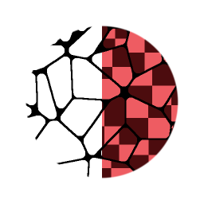

# Mapeador de Flood Fill

<table>
<tr style="border: 0;">
<td style="border: 0;" valign="top">

## Mapeador de Flood Fill (tons de cinza)

**Entrada:** *Filtros/Efeitos*

**Complexo**

</td>
<td style="border: 0;" valign="top">

## Descrição

O Mapeador de Flood Fill permite o remapeamento de um Padrão ou Textura existente em cada célula de um [Flood Fill](../../../../../../compositing-graphs/nodes-reference-for-com/node-library/filters/effects/flood-fill/flood-fill.md). É diferente de outras conversões de Flood Fill, como [Escala de cinza aleatória](../../../../../../compositing-graphs/nodes-reference-for-com/node-library/filters/effects/flood-fill-random-gra/flood-fill-to-random-grayscale.md) ou [Gradiente](../../../../../../compositing-graphs/nodes-reference-for-com/node-library/filters/effects/flood-fill-to-gradient/flood-fill-to-gradient.md), pois não gera cores ou valores sólidos, mas permite que você use seus próprios mapas de entrada. Ele pode ser visto como uma espécie de combinação de [Flood Fill](../../../../../../compositing-graphs/nodes-reference-for-com/node-library/filters/effects/flood-fill/flood-fill.md) e [Tile Sampler](../../../../../../compositing-graphs/nodes-reference-for-com/node-library/texture-generators/patterns/tile-sampler/tile-sampler.md) ou [Mapeador de formas](../../../../../../compositing-graphs/nodes-reference-for-com/node-library/texture-generators/patterns/shape-mapper/shape-mapper.md), pois fornece alguns controles e interfaces semelhantes.

A versão Cor tem controles adicionais para trabalhar com Mapas Normais, onde pode [compensar rotações de Mapa de Normap do espaço tangente](../../../../../../compositing-graphs/nodes-reference-for-com/node-library/filters/normal-map/normal-vector-rotation/normal-vector-rotation.md).

## Parâmetros

### Entradas

* **Flood Fill Bbox**: *Entrada de cores* Entrada de Flood Fill padrão, necessária.
* **Entrada de Padrão 1-8**: *Entrada em Tons de Cinza/Cores*\
  Entrada de imagem de padrão personalizado.
* **Mapa de Distribuição de Padrões**: *Entrada em Tons de Cinza* Mapa de ID para determinar qual padrão vai para qual célula. Pode vir de outro Mapa de Flood Fill, como Flood Fill para Índice.
* **Mapa de Escala**: *Entrada em Tons de Cinza* Mapeie para determinar a Escala por célula.
* **Mapa de rotação**: *Entrada em tons de cinza* Mapeie para determinar a Rotação por Célula.
* **Mapa de deslocamento de luminância**: *Entrada em tons de cinza* Mapa para definir a luminância por célula

### Parâmetros

* **Modo de divisão em blocos gráficos**: *Não há divisão em blocos gráficos, H+V* Defina se deseja usar divisão em blocos gráficos ou não. Visível apenas se Tamanho ou Escala estiverem definidos abaixo de 1.
* **Padrão**
  * **Número de Entrada do Padrão**: *1 - 8* Defina a quantidade de Entradas do Padrão Personalizado a ser usada.
  * **Modo de Distribuição de Padrão**: *Aleatório, Tamanho da Forma, Entrada do Mapa de Distribuição* Defina o método para determinar qual Padrão é mostrado em uma Célula.
  * **Tremulação de Distribuição de Padrão**: *0.0 - 1.0* Permite uma ligeira variação ou Deslocamento na distribuição de Padrão sem alterar tudo através da Distribuição Aleatória.
* **Tamanho**
  * **Modo de Tamanho**: *Em relação à Textura, em relação à Forma BSphere, em relação à Forma Maior, em relação à Forma Menor, Ajustar Caixa de Forma* Defina como o tamanho do padrão em cada célula é determinado.
  * **Tamanho**: *0.0 - 1.0* Permite o dimensionamento não uniforme do Padrão.
  * **Escala**: *0.0 - 1.0*\
    Defina a escala global (uniforme) do efeito.
  * **Multiplicador de Mapa de Escala**: *0.0 - 1.0* Defina a influência do Mapa de Escala opcional.
  * **Escala aleatória**: *-1.0 - 1.0* Defina a quantidade de variação aleatória dentro da escala de padrão.
* **Rotação**
  * **Rotação**: *0.0 - 1.0* Defina a rotação global e uniforme para cada célula.
  * **Multiplicador de Mapas de rotação**: *0.0 - 1.0* Defina a influência do Mapa de rotação opcional.
  * **Rotação aleatória**: *0.0 - 1.0* Defina a quantidade de rotação aleatória para cada célula.
  * **Autoescala da Rotação**: *Falso/Verdadeiro* Defina se um padrão deve ajustar sua escala para caber em uma célula quando girado.
* **Posição**
  * **Deslocamento de Posição**: *0.0 - 1.0* Defina o deslocamento de Posição global para cada célula.
  * **Alinhamento do deslocamento da posição**: *Textura, Padrão* Defina para alinhar o deslocamento de 0 ponto à célula Padrão ou à textura.
  * **Deslocamento de posição aleatório**: *0.0 - 1.0* Defina a quantidade de deslocamento de posição aleatório por célula.
* **Cor** (Somente para a versão em tons de cinza)
  * **Intervalo de luminância**: *0.0 - 1.0* Define o contraste global na textura, onde 0 se torna cinza médio.
  * **Intervalo de luminância aleatório**: *0.0 - 1.0* Define a quantidade de aleatoriedade para o Intervalo de luminância.
  * **Deslocamento de luminância**: *-1.0 - 1.0* Define o deslocamento para a Luminância, trabalhando como um controle de brilho.
  * **Deslocamento de luminância aleatório**: *0.0 - 1.0* Define a quantidade de aleatoriedade para o Deslocamento de luminância.
  * **Multiplicador de Mapa de Deslocamento de Luminância**: *0.0 - 1.0* Define a influência do mapa de Deslocamento de Luminância opcional.
  * **Cor do plano de fundo**: *(valor de tons de cinza)*Define a cor do plano de fundo na qual as texturas são mescladas.
* **Cor** (Somente para a versão Colorida)
  * **É um Mapa Normal**: *Falso/Verdadeiro* Defina para interpretar a Entrada de Padrão como um Mapa Normal. Compensará e corrigirá a rotação de espaço Tangente Normal.
  * **Formato Normal**: *DirectX, OpenGL*\
    Alternar entre Formatos de mapa normais diferentes (inverte o canal verde). Somente ativo quando Is Normal Map é verdadeiro.
  * **Ajuste de HSL**: *-1.0 - 1.0* Ajustar HSL globalmente.
  * **Aleatório HSL**: *-1.0 - 1.0* Definir aleatório HSL por célula.
  * **Ajuste de Alpha**: *-1.0 - 1.0* Defina o ajuste de Alpha global, reduz o contraste de Alpha.
  * **Alpha Aleatório**: *-1.0 - 1.0* Definir aleatório de ajuste de Alpha por célula.
  * **Cor do plano de fundo**: *(valor da cor)*Define a cor do plano de fundo na qual as texturas são mescladas.

.

## Imagens de exemplo

</td>
</tr>
</table>
