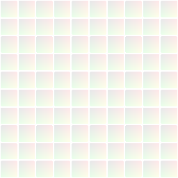

# Flood Fill

<table>
<tr style="border: 0;">
<td width="33.33%" style="border: 0;" valign="top">

{width="128px"}

<b>Entrada:</b> Filtros > Efeitos

</td>
<td width="100.00%" style="border: 0;" valign="top">

## Descrição

O Flood Fill faz parte de um conjunto avançado de efeitos que permitem adicionar muito mais variação a uma textura básica de ladrilhos binários. Não é destinado a ser usado por si só: em vez disso, é mais um ponto de partida para Outros efeitos de Flood Fill. Esses dados separados e divididos permitem um fluxo de trabalho mais dinâmico, mais otimizado e menos destrutivo.

Os outros efeitos de Flood Fill são [Flood Fill para Gradiente](../../../../../../compositing-graphs/nodes-reference-for-com/node-library/filters/effects/flood-fill-to-gradient/flood-fill-to-gradient.md), [Flood Fill para Cor/Tons de Cinza](../../../../../../compositing-graphs/nodes-reference-for-com/node-library/filters/effects/flood-fill-grayscale-col/flood-fill-to-grayscale-color.md), [Flood Fill para Tons de Cinza Aleatórios](../../../../../../compositing-graphs/nodes-reference-for-com/node-library/filters/effects/flood-fill-random-gra/flood-fill-to-random-grayscale.md), [Flood Fill para Cor Aleatória](../../../../../../compositing-graphs/nodes-reference-for-com/node-library/filters/effects/flood-fill-random-color/flood-fill-to-random-color.md), [Flood Fill para Tamanho da Caixa](../../../../../../compositing-graphs/nodes-reference-for-com/node-library/filters/effects/flood-fill-to-bbox-size/flood-fill-to-bbox-size.md), [Flood Fill para Posição](../../../../../../compositing-graphs/nodes-reference-for-com/node-library/filters/effects/flood-fill-to-position/flood-fill-to-position.md), [Flood Fill Mapper](../../../../../../compositing-graphs/nodes-reference-for-com/node-library/filters/effects/flood-fill-mapper/flood-fill-mapper.md) e [Flood Fill para Índice](../../../../../../compositing-graphs/nodes-reference-for-com/node-library/filters/effects/flood-fill-to-index/flood-fill-to-index.md)

>[!WARNING]
>
> O mapa de entrada precisa ser adequado para o Flood Fill funcionar. Idealmente, é um mapa binário (apenas preto/branco, sem escala de cinza) onde cada ladrilho é separado das outras linhas por uma borda que é totalmente preta (0,0,0) para cada pixel. Um exemplo de candidato perfeito para isso é o [Tile Generator](../../../../../../compositing-graphs/nodes-reference-for-com/node-library/texture-generators/patterns/tile-generator/tile-generator.md).
> 
> Surgem problemas se os ladrilhos não são separados por pixels totalmente pretos, geralmente quando são usados valores de inclinação em tons de cinza. Você pode identificar isso pela falta geral de valores vermelhos no resultado e, possivelmente, por linhas artificiais estranhas. Nesses casos, ajuste o contraste no mapa de entrada ou desative o mapa de entrada. Certifique-se de alterar a configuração de trade-off de Segurança/Velocidade para ver se algo melhora.

</td>
</tr>
</table>

## Parâmetros

|  |  |
|:---|:---|
| <b>Compromisso de segurança/velocidade</b> <i>Formas simples ou pequenas, Formas complexas ou grandes, Modo sem falha.</i> | Defina o modo de cálculo para melhor se adequar às formas de entrada. Permite resultados muito mais precisos se o modo correto for escolhido. |
| <b>Opções avançadas</b> <i>Exibir Parâmetros Avançados e Saída/Ocultar Parâmetros e Saída Avançados</i> |  |
| <b>Substituir compromisso de Segurança/Velocidade</b> <i>-1 - 100</i> | Somente visível com Opções avançadas ativadas. Permite substituir recursos internos. Muito avançado, serve para criar seus próprios efeitos ou depuração. |

## Exemplos

<table style="margin-top: 32px; margin-bottom: 32px">
    <tr style="border: 0">
        <td style="border: 0; background: transparent">
            
        </td>
        <td style="border: 0; background: transparent">
            
        </td>
    </tr>
</table>

Bons e maus exemplos de resultados de Flood Fill.
