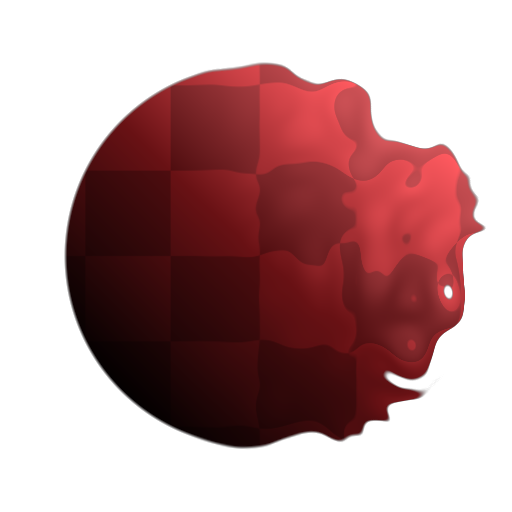

# Non Uniform Directional Warp

<table>
<tr style="border: 0;">
<td width="33.33%" style="border: 0;" valign="top">

<b>Entrada:</b> Filtros > Efeitos

</td>
<td width="100.00%" style="border: 0;" valign="top">

## Descrição

A Distorção de Direção Não Uniforme é uma versão avançada da [Distorção Direcional](../../../../../../compositing-graphs/nodes-reference-for-com/atomic-nodes/directional-warp/directional-warp.md) que permite que a intensidade e a direção da distorção sejam determinadas por uma entrada de imagem. Permite muito mais controle e pode criar uma distorção de imagem muito útil e interessante, em vão igual ao [Desfoque de Inclinação](../../../../../../compositing-graphs/nodes-reference-for-com/node-library/filters/blurs/slope-blur/slope-blur.md).

É diferente de [Distorção Multidirecional](../../../../../../compositing-graphs/nodes-reference-for-com/node-library/filters/effects/multi-directional-warp/multi-directional-warp.md), pois permite o controle sobre o Ângulo por meio de uma entrada de Mapa personalizada, enquanto a Distorção Multidirecional só permite o controle da Direção por meio de parâmetros. Isso significa que você pode criar efeitos avançados de curva e de direita que, de outra forma, não seriam possíveis.

</td>
</tr>
</table>

## Entradas

|  |  |
|:---|:---|
| <b>Entrada</b> <i>Entrada em tons de cinza</i> | Mapa base ao qual a distorção será aplicada. |
| <b>Entrada de Intensidade</b> <i>Entrada em tons de cinza</i> | O mapa de máscara obrigatório que direciona a intensidade do efeito de distorção deve ser em tons de cinza. |
| <b>Entrada de Ângulo de Distorção</b> <i>Entrada em tons de cinza</i> | O mapa de máscara obrigatório que orienta o Ângulo do efeito de distorção deve ser em tons de cinza. |

## Parâmetros

|  |  |
|:---|:---|
| <b>Intensidade</b> <i>0.0 - 20.0</i> | Define a intensidade do efeito de distorção, em que distância os pixels devem ser empurrados para fora. |
| <b>Ângulo de distorção</b> <i>0.0 - 1.0</i> | Define o Ângulo ou a direção na qual aplicar o efeito Distorcer. |
| <b>Multiplicador de Entrada de Ângulo de Distorção</b> <i>0.0 - 1.0</i> | Define o efeito do Mapa de entrada do Ângulo de distorção. O mapa de entrada Ângulo de distorção será usado para interpolar de 0 ao valor desse parâmetro. |
| <b>Modo de Rastreamento</b> <i>Mín., Máx., Média</i> | Define como as Trilhas são mescladas. |
| <b>Comprimento da Trilha</b> <i>0.0 - 1.0</i> | Define o comprimento das trilhas. |
| <b>Desvanecimento da Trilha</b> <i>0.0 - 1.0</i> | Define o quanto cada Trilha deve desvanecer-se |
| <b>Curva de Trilha</b> <i>-1.0 - 1.0</i> | Só tem efeito se o Desvanecimento da trilha não for 0. Define o comportamento do efeito de esmaecimento. |
