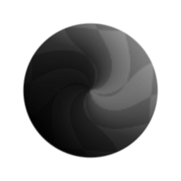

# Distorção de vetor

<table>
<tr style="border: 0;">
<td width="33.33%" style="border: 0;" valign="top">

{width="128px"}

{width="128px"}

<b>Entrada:</b> Filtros > Efeitos

</td>
<td width="100.00%" style="border: 0;" valign="top">

## Descrição

A Distorção de vetor é um efeito de distorção avançado, semelhante a [Distorção](../../../../../../compositing-graphs/nodes-reference-for-com/atomic-nodes/warp/warp.md) e [Distorção direcional](../../../../../../compositing-graphs/nodes-reference-for-com/atomic-nodes/directional-warp/directional-warp.md), com a principal diferença sendo que ela é orientada por um bitmap vetorial (colorido) em vez de um mapa em tons de cinza. Isso significa que ele é mais poderoso e versátil do que seus primos de nó atômico.

O Mapa vetorial é semelhante a um Mapa normal, mas não precisa ser normalizado e apenas os canais R e Verde (X e Y) são usados. Os canais azul e Alpha podem ficar pretos, se desejar. Construir um bom Mapa Vetorial pode ser o maior desafio ao usar este nó; você pode [converter mapas em tons de cinza em Normal](../../../../../../compositing-graphs/nodes-reference-for-com/atomic-nodes/normal/normal.md) ou construir o mapa combinando canais com[Mesclagem de RGBA.](../../../../../../compositing-graphs/nodes-reference-for-com/node-library/filters/channels/rgba-merge/rgba-merge.md) Como alternativa, um [”Mapa de Fluxo”](https://experienceleague.adobe.com/pt-br/docs/substance-3d-painter/using/painting/advanced-channel-painting/flow-map-painting) também é utilizável.

Esse nó pode ser útil quando você deseja realizar distorções muito específicas com direções variadas, em que os nós de distorção padrão não o cortam.

</td>
</tr>
</table>

## Entradas

|  |  |
|:---|:---|
| <b>Entrada</b> <i>Entrada de cores</i> | Mapeie para distorcer. |
| <b>Mapa vetorial</b> <i>Entrada de cores</i> | Distorção mapa de driver. Os canais de cores Vermelho e Azul são usados. |

## Parâmetros

|  |  |
|:---|:---|
| <b>Intensidade</b> <i>0.0 - 1.0</i> | Multiplicador de intensidade do Mapa de Vetor. |
| <b>Formato de vetor</b> <i>DirectX, OpenGL</i> | Alterna o canal Verde entre as interpretações Para Cima e Para Baixo. |

## Exemplos

<table style="margin-top: 32px; margin-bottom: 32px">
    <tr style="border: 0">
        <td style="border: 0; background: transparent">
            
        </td>
    </tr>
</table>
