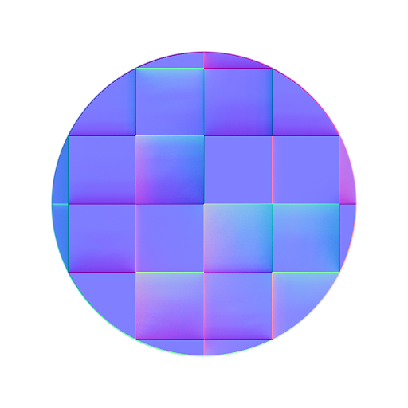

# Dobra normal

<table>
<tr style="border: 0;">
<td width="33.33%" style="border: 0;" valign="top">

<b>Entrada:</b> Filtros > Mapa normal

</td>
<td width="100.00%" style="border: 0;" valign="top">

## Descrição

Gera um Mapa normal torto com base em uma entrada de mapa de altura. Um Mapa normal torto é uma versão especial do [Normal](../../../../../../compositing-graphs/nodes-reference-for-com/atomic-nodes/normal/normal.md) e da [Oclusão de ambiente (RTAO)](../../../../../../compositing-graphs/nodes-reference-for-com/node-library/filters/effects/ambient-occlusion-rtao/ambient-occlusion-rtao.md), gerando um mapa normal com oclusão de ambiente incorporada.\
Isso pode ser usado em motores em tempo real para ter Oclusão de ambiente feita bake no mapa normal, por exemplo, para reflexões de oclusão mais precisas em metais.

Este nó não deve ser usado em combinação com o mecanismo da CPU (SSE) devido ao tempo de computação.

</td>
</tr>
</table>

## Parâmetros

|  |  |
|:---|:---|
| <b>Usar Tamanho físico</b> <i>Booleano</i> | Alterne para usar as configurações de Tamanho físico para determinar a escala do height. |
| <b>Tamanho físico</b> <i>Flutuante3</i> | (Disponível quando a opção <b>Usar Tamanho físico</b> estiver definida como <i>Verdadeiro</i>) Ajusta a escala do height com base no tamanho físico real da superfície. |
| <b>Amostras</b> <i>Inteiro</i> | Número de raios usados para calcular o normal curvo. Um valor mais alto fornece um resultado mais suave e preciso às custas do desempenho. |
| <b>Escala de Height</b> <i>Flutuante</i> | (Disponível quando Usar Tamanho físico estiver definido como Falso) Multiplicador da intensidade da entrada do mapa de altura. |
| <b>Distribuição</b> <i>Inteiro</i> | Define o método de distribuição. Afeta a queda em direção a áreas sombreadas. |
| <b>Distância Máxima</b> <i>Flutuante</i> | Define a distância máxima que os raios podem percorrer para serem ocultados. |
| <b>Ângulo de Propagação</b> <i>Flutuante</i> | Define o ângulo de propagação para os raios em que serão disparados. Um valor de 1 é um hemisfério completo. |
| <b>Formato Normal</b> <i>Inteiro</i> | Inverte o canal verde da saída. |

## Exemplos

<table style="margin-top: 32px; margin-bottom: 32px">
    <tr style="border: 0">
        <td style="border: 0; background: transparent">
            
        </td>
    </tr>
</table>
