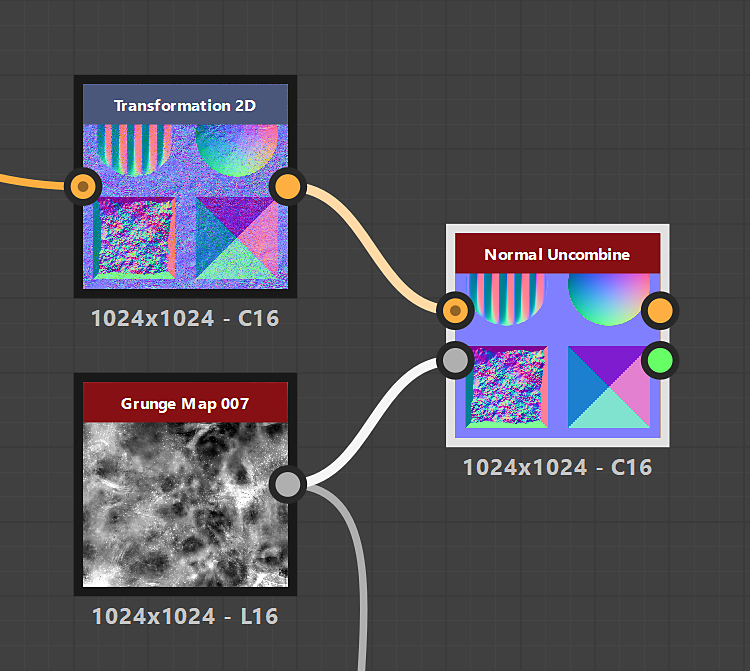

# Não Combinar Normal

<table>
<tr style="border: 0;">
<td width="33.33%" style="border: 0;" valign="top">

{width="200px"}

<b>Entrada:</b> Filtros > Mapa normal

</td>
<td width="100.00%" style="border: 0;" valign="top">

## Descrição

Remove de um mapa normal os detalhes da superfície descritos por um mapa de height.

</td>
</tr>
</table>

## Entradas

|  |  |
|:---|:---|
| <b>Combinado normal</b> <i>Cor</i> PRIMÁRIA | O mapa normal do qual os detalhes devem ser removidos. |
| <b>Height</b> <i>Tons de cinza</i> | O mapa de heights que representa os detalhes da superfície que devem ser removidos do mapa normal combinado. |

## Saídas

|  |  |
|:---|:---|
| <b>Não combinado normal</b> <i>Cor</i> | O mapa normal onde os detalhes da superfície descritos pelo mapa de height de entrada foram removidos. |
| <b>Intensidade estimada</b> <i>Flutuante</i> | Uma estimativa da intensidade que deve ser definida para um nó [Normal](../../../../../../compositing-graphs/nodes-reference-for-com/atomic-nodes/normal/normal.md) conectado ao mapa de height de entrada, para corresponder à intensidade do mapa normal de entrada. |

## Parâmetros

|  |  |
|:---|:---|
| <b>Formato normal</b> *Inteiro* | O formato do mapa normal de entrada. Inverte efetivamente o canal de verde.<ul data-preserve-html="true"> <li data-preserve-html="true"><b>DirectX:</b> o eixo Y aponta para cima</li> <li data-preserve-html="true"><b>OpenGL:</b> o eixo Y aponta para baixo</li> </ul> |

## Exemplos

<table>
  <tr>
    <td>
      
       <i>Antes</i>
    </td>
    <td>
      
       <i>Depois</i>
    </td>
  </tr>
</table>

{zoomable="yes"}

<table>
  <tr>
    <td>
      
       <i>Antes</i>
    </td>
    <td>
      
       <i>Depois</i>
    </td>
  </tr>
</table>

{zoomable="yes"}

<table>
  <tr>
    <td>
      
       <i>Antes</i>
    </td>
    <td>
      
       <i>Depois</i>
    </td>
  </tr>
</table>

{zoomable="yes"}
