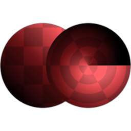

# Cartesiano para Polar

<table>
<tr style="border: 0;">
<td style="border: 0;" valign="top">

{width="128px"}

{width="128px"}

## Cartesiano para Polar (Tons de Cinza)

**Entrada:** *Filtros/Transformações*

**Simples**

</td>
<td style="border: 0;" valign="top">

## Descrição

Converte uma entrada com coordenadas cartesianas (X&amp;Y) em coordenadas polares (Ângulo e raio). O inverso é possível com [Polar para Cartesiano](../../../../../../compositing-graphs/nodes-reference-for-com/node-library/filters/transforms/polar-to-cartesian/polar-to-cartesian.md).

## Parâmetros

*Nenhum Parâmetro.*

## Imagens de exemplo

| 

 |
| --- |
|  |

</td>
</tr>
</table>
