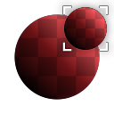

# Transformação segura

<table>
<tr style="border: 0;">
<td width="33.33%" style="border: 0;" valign="top">

<b>Entrada:</b> Filtros > Transformas

</td>
<td width="100.00%" style="border: 0;" valign="top">

## Descrição

Versão lado a lado de [Transformar 2D](../../../../../../compositing-graphs/nodes-reference-for-com/atomic-nodes/transformation-2d/transformation-2d.md). Permite dimensionar, girar e deslocar sem quebrar a divisão em blocos gráficos e sem perder os detalhes de pixels (perda de nitidez) devido a pequenos deslocamentos e rotações.

Útil para transformar o ruído quando o controle máximo ou a nitidez perfeita são necessários.

</td>
</tr>
</table>

## Parâmetros

|  |  |
|:---|:---|
| <b>Bloco</b> <i>1 - 16</i> | Reduz a entrada colocando-a lado a lado. |
| <b>Modo de Deslocamento</b> <i>Manual, Aleatório</i> | Alterna para um deslocamento aleatório em vez de um definido manualmente. |
| <b>Deslocamento</b> <i>0.0 - 1.0</i> | Move ou traduz o resultado. Verifica se os pixels são encaixados e não interpolados. |
| <b>Rotação</b> <i>0.0 - 1.0</i> | Gira a entrada na horizontal. |
| <b>Rotação Segura de Blocos</b> <i>Falso/Verdadeiro</i> | Determina o comportamento da Rotação, se ela deve aderir a valores seguros que não desfocam nenhum pixel. |
| <b>Simetria</b> <i>nenhum, X, Y, X+Y</i> |  |
| <b>Cor do plano de fundo</b> <i>(Valor da cor) (Somente Versão da Cor)</i> |  |
| <b>Modo Mipmap</b> <i>Automático, Manual</i> | Determina o modo mipmapping. Defini-lo como Manual leva a resultados mais nítidos. |
| <b>Nível do mipmap</b> <i>0 - 10</i> | Quando o modo Mipmap está definido como Manual, isso permite escolher um Mipmap diferente. |
