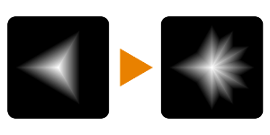

# Fatia de simetria

<table>
<tr style="border: 0;">
<td width="33.33%" style="border: 0;" valign="top">

{width="128px"}

<b>Entrada:</b> Filtros > Transformas

</td>
<td width="100.00%" style="border: 0;" valign="top">

## Descrição

Nó de operação de Simetria/espelhamento complexo. Permite uma grande variedade de operações geométricas com controle total, mas requer alguns experimentos.

Comparado ao [Espelho](../../../../../../compositing-graphs/nodes-reference-for-com/node-library/filters/transforms/mirror-filter-node/mirror-filter-node.md) e à [Simetria](../../../../../../compositing-graphs/nodes-reference-for-com/node-library/filters/transforms/symmetry/symmetry.md), este nó tem muito mais opções.

</td>
</tr>
</table>

## Parâmetros

|  |  |
|:---|:---|
| <b>Modo de Simetria</b> <i>0 - 6</i> | Escolha simetria linha de geometria/espelho. As opções são Horizontal, Vertical, Diagonal esquerda-direita, Diagonal direita-esquerda, Vertical Invert, Corner e Diagonal Corner. |
| <b>Modo de Transferência</b> <i>0 - 6</i> | modo Combinar. As opções são: |
| <b>Mesclar</b> <i>0.0 - 1.0</i> | Combinar a imagem original de volta ao resultado. |
| <b>Virar Lado</b> <i>Falso/Verdadeiro</i> | Inverte a origem, o que significa que o lado de origem da operação é invertido. A simetria da esquerda para a direita, por exemplo, torna-se da direita para a esquerda. |
| <b>Virar Lado2</b> <i>Falso/Verdadeiro</i> | Usado somente quando o Modo de Simetria é 5 ou 6. Inverter origem do canto. |

## Exemplos

<table style="margin-top: 32px; margin-bottom: 32px">
    <tr style="border: 0">
        <td style="border: 0; background: transparent">
            
        </td>
    </tr>
</table>
